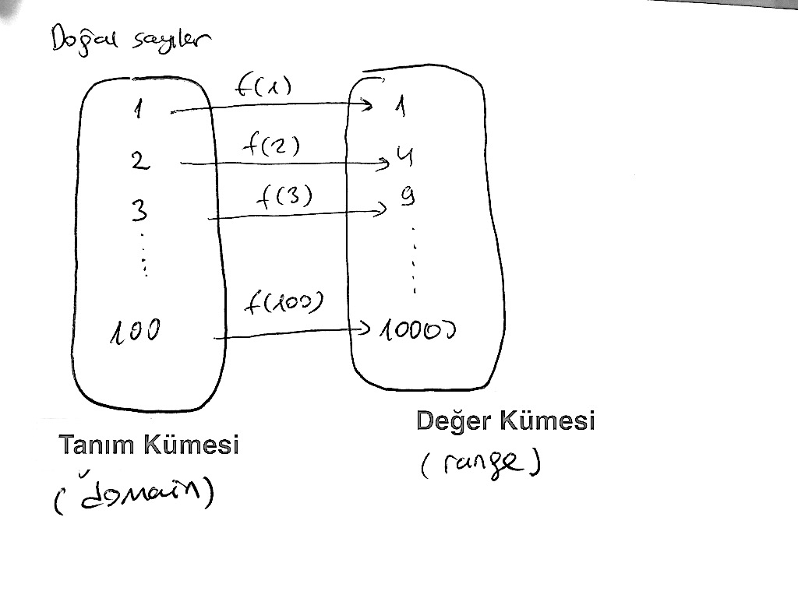
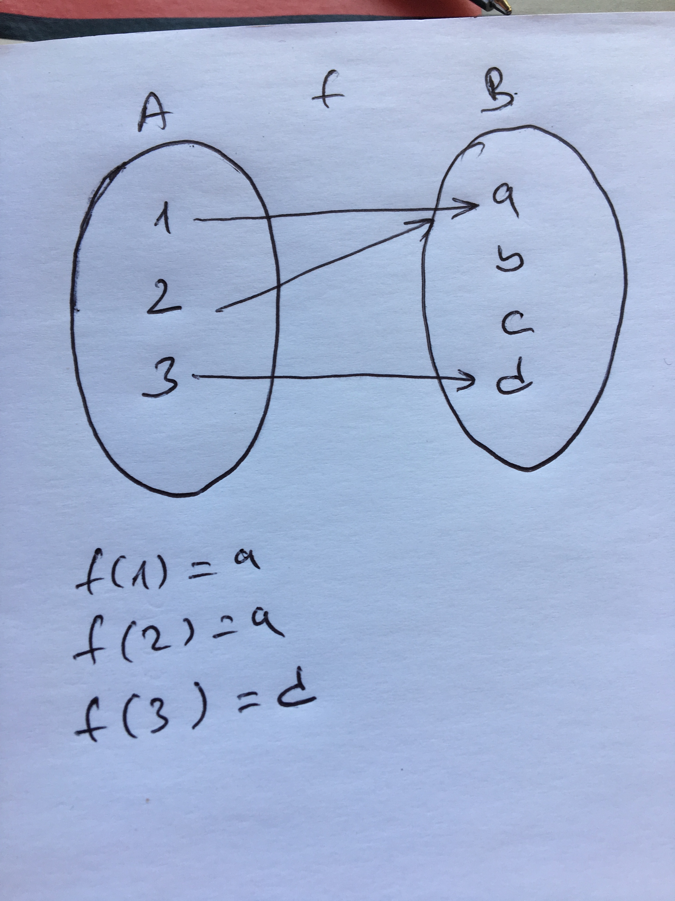

# F# ile Fonksiyonel Programlama

# İçindekiler 

* 1.Bölüm : Giriş
    * 1.1 F# ile Tanışma
    * 1.2 F# Sözdizimine Hızlı Bakış
    * 1.3 Kısa F# Tarihçesi
    * 1.4 Neden F#?
    * 1.5 Fonksiyonlara Matematiskel Bakış
    * 1.6 Fonksiyonların İlginç Özellikleri
    * 1.7 Fonksiyonel Programlama Nedir?
   
* 2.Bölüm : Kurulum ve Hazırlık
    * F# Geliştirme Platformu Temel Bileşenleri 
    * Windows ve Visual Studio 
    * OSX ve Visual Studio for Mac
    * Linux ve Visual Studio Code
    * Merhaba Dünya!
* 3.Bölüm : F# Temelleri
    * Söz dizimi kuralları
    * Basit Veri Tipleri
    * Fonksiyonlar
    * Temel Veri Tipleri
    * Kod Organizasyonu
* 4.Bölüm : Fonksiyonel Programlama
    * Desen Eşleştirme (Pattern Matching)
    * Küme Teorisi ve F# Tipleri
        * Değişkenler Grubu (Tuple)
        * Ayrışık Bileşim (Discriminated Union)
        * Kayıt (Record) 
    * Gevşek Değerlendirme (Lazy Evaluation)
    * Gevşek Diziler (Sequences)
    * Sorgu İfadeleri (Query Expressions)
* 5.Bölüm : Genel Amaçlı Programlama
    * Değişken ve Değişmeyen Kavramları (Immutability and Mutability)
    * .NET Bellek Yönetimi
    * Değişken İçeriğini Değiştirme
    * Diziler
    * .NET Yığın Yapıları Kullanımı
    * Döngü Yapıları (For ve While)
    * Koşullu Dallanma Yapıları (If/Else)
    * İstisna Yönetimi (Exceptions)
* 6.Bölüm : Nesne Tabanlı Programlama ve Sınıflar
    * Fonksiyonel Bir Dilde Neden Nesne Tabanlı Programlama Desteği Var?
    * Sınıf Tanımlama
    * Sınıf Özellik ve Üyeleri 
    * Sınıflar Arası Kalıtım 
    * Ara Birim Kullanımı (Interfaces)
* 7.Bölüm : İleri Seviye Fonksiyonel Programlama Yöntemleri
    * Aktif Desenler (Active Patterns)
    * Liste Modülü
    * Kuyruk Özyenilemeli Fonksiyonlar
    * Fonksiyonlar ile Programlama
    * Fonksiyonel Programlama Desenleri
* 8.Bölüm : Asenkron ve Paralel Programlama
    * İşletim Sistemi İplikleri ile Çalışma (Thread)
    * Asenkron Programlama
    * Asenkreon Programlama Kütüphanesi
    * Paralel Programlama
    * Paralel Programlama Kütüphanesi
* 9.Bölüm : Örnek Uygulamalar
    * Veritabanı Uygulaması
    * Veri Ayıklama ve Analiz Uygulaması
    * Web Programlama Uygulaması
    * Finansal Uygulalma : Kredi Puanı Hesaplayıcı
    * UrhoSharp İle Örnek Oyun 

# 1. Bölüm : Giriş

Bu bölümün ilk kısmında F#'ın kısa tarihçesini aktarıp "Neden F#?" ve "F# programlama dili neye benzer?" sorularının cevaplarını arayacağız. Bölümün ikinci kısmında ise fonksiyonel programlamanın tanımını yaparak matematiksel anlamda fonksiyonları ve fonksiyonların bazı ilginç özelliklerini ele alacağız.

## 1.1 F# ile Tanışma
Programlama dili kitapları ve kaynakları ekrana  "Merhaba Dünya!" yazdırmak için kullanılan kod parçası ile başlar. Biz de kitabımıza bu klasik ile başlıyoruz. 

```fsharp
// tek satırlık yorumlar için // kullanılır
(* 
    Birden fazla satırlı yorumlar için  (* *) çifti kullanılır
*)

// "let" anahtar kelimesi ile değeri değiştirilemeyen (immutable) değer ifadeleri tanımlanır
let sayı = 5
let ondalıkSayı = 3.14
let metin = "Merhaba Dünya!"

// Değer ifadelerini `` `` arasında yazarak F# anahtar kelimelerini de değer ifadesi adı olarak kullanabilirsiniz
let ``let``= "F# ile Fonksiyonel Programlama"

// `` `` kullanarak boşluk içeren değer ifadesi isimleri oluşturabilirsiniz.
// Bu kullanım özellikle birim test (unit test) yazıyorsanız oldukça faydalı olacaktır
let ``Cümle gibi değer``="Cümle gibi değer ifadesinin değeri"

// F# değer ifadelerinin ismi olarak UTF-8 karakterleri kullanılmasına izin verir
let çÇşŞğĞüÜöÖİı = "Türkçe'ye özel karakterler"


// ======== Listeler ============
let pozitifSayılar = [1;2;3;4;5]        // Köşeli parantez ile liste tanımlanır
                                        // liste elemanlarını da ; ile ayrırırıs
let doğalSayılar = 0 :: pozitifSayılar   // :: operatörü varolan listenin başına 0 değerini ekleyerek yeni bir liste oluşturur
// doğalSayılar listesi [0;1;2;3;4;5] şeklinde olacaktır

let tamSayılar = [-5;-4;-3;-2;-1] @ doğalSayılar   // @ operatörü iki listeyi birleştirip yeni bir liste oluşturur
// tamSayılar listesi [-5;-4;-3;-2;-1;0;1;2;3;4;5] şeklinde olacaktır

// DİKKAT: liste ve dizilerin elemanlarını tanımlarken virgül yerine noktalu virgül kullanılır

// ======== Fonksiyonlar ========
// "let" anahtar kelimesi ile aynı zamanda ismi olan fonksiyonlar da tanımlanır
let küp x = x * x * x        // Fonksiyon tanımında parantez, süslü parantez veya noktalı virgül kullanılmıyor
küp 3                        // Fonksiyonu çalıştıralım, girdi parametrelerini tanımlarken de parantez kullanmıyoruz

let ekle x y = x + y         // ekle fonksiyonunu çağırırken ekle (1,2) şeklinde girdi parametreleri için parantez kullanmayın
                             // (1,2) 1 ve 2 parametrelerini girdi olarak vermek anlamına gelmez
ekle 2 3                     // (1,2) şeklindeki ifade ile değer grubu (tuple) tanımlanır

// Birden fazla satıra yayılmış bir fonksiyon tanımlamak için girintiler (indent) kullanılır. Kod satırlarının bitişini belirtmek için ; kullanılmaz
let çiftSayılar liste =
   let çiftMi x = x%2 = 0      // çiftMi fonksiyonunu iç fonksiyon olarak tanımla
   List.filter çiftMi liste    // List.filter standard List modülünde yer alan hazır bir fonksiyon
                               // List.filter girdi olarak bir fonksiyon parametresi ve bu fonksiyonu çalıştıracağı listeyi alır

çiftSayılar pozitifSayılar     // Fonksiyonu çalıştır

// Parantezleri işlem önceliğini belirtmek için kullanabilirsiniz. Aşağıdaki örnekte
// önce List.map işleminin yapılmasını sonra da List.sum işleminin yapılmasını belirtiyoruz
// Parantezler kullanmasaydık "List.map" fonksiyonu "List.sum" fonksiyonuna birinci girdi parametresi olarak geçilecekti
let küplerinToplamı =
   List.sum ( List.map küp [1..100] )

// Bir fonksiyonun çıktısını sonraki fonksiyona "|>" operatörü ile aktarabilirsiniz
// Küplerin toplamı fonksiyonun |> kullanan yeni hali aşağıdaki gibidir
let küplerinToplamı2 =
   [1..100] |> List.map küp |> List.sum  // 1 ile 100 arasındaki değer listesini List.map fonksiyonuna 
                                         // ikinci girdi parametresi olacak şekilde aktar
                                         // List.map fonksyonunun birinci girdi parametresi ise küp fonksiyonudur
                                         // List.map sonucunu List.sum fonksiyonuna girdi parametresi olarak aktar 

// "fun" anahtar kelimesini kullanarak adsız (anonim) fonksiyonlar tanımlayabilirsiniz
let küplerinToplamı3 =
   [1..100] |> List.map (fun x->x*x*x) |> List.sum // fun x -> x * x * x anonim bir fonksiyon tanımıdır

// Öz yinelemeli fonksiyon tanımlamak için "rec" anahtar kelimesi kullanılır
// Aşağıdaki fonksiyon öz yinelemeli olarak faktöriyel hesabı yapar
let rec fact x = 
    if x <= 1 then 1 else x * fact (x - 1)

// F#'da fonksiyonların dönüş değerleri dolayılı olarak belirlenir bu nedenle "return" benzeri bir anahtar kelimeye ihtiyaç yoktur
// Bir fonksiyon bloğundaki son ifade her zaman dönüş değerini oluşturur

// ======== Desen Eşleme (Pattern Matching) ========
// Desen eşleştirme için Match..with.. yapısı kullanılır
let basitDesenEşleme =
   let x = 1
   match x with
    | 1 -> printfn "x'in değer 1"
    | 2 -> printfn "x'in değeri 2"
    | _ -> printfn "x'in değeri 1 veya 2 değil"   // _ simgesi herhangi bir değeri eşlemek için yer tutucu olarak kullanılır

// Some(..) ve None C benzeri dillerde null veya 
// Pascal benzeri dillerde nil olarak ifade edilen değeri de alabilen değer ifadelerini
// tanımlamak için kullanılır. F#'da Some/None dil yapısına option (opsiyon) denir
let geçerliDeğer = Some(42)
let geçersizDeğer = None

// In this example, match..with matches the "Some" and the "None",
// and also unpacks the value in the "Some" at the same time.
let optionKullanarakEşleme girdi =
   match girdi with
    | Some i -> printfn "Girdi değeri = %d" i
    | None -> printfn "Girdi değer belirtilmemiş"

optionKullanarakEşleme geçerliDeğer  // Ekrana "Girdi değeri = 42" basılacak
optionKullanarakEşleme geçersizDeğer // Ekrana "Girdi değer belirtilmemiş" basılacak

// ========= Karmaşık Veri Tipleri  =========

// Değer grupları (tuple) farklı tiplerde değer barındırabilen tiplerdir. Değer grubu tanımlanırken virgül kullanılır
let ikili = 1,2
let üçlü = "a",2,true

// Kayıt tiplerinin alanları vardır ve alanları ayrımak için noktalı virgül kullanılır
type Öğrenci = {Ad:string; Soyad:string; Numara:int}
let öğrenci1 = {Ad="Arda"; Soyad="Özgür";Numara=124}

// Bileşimler (union) birden fazla seçenek tanımlamamızı sağlar. Bunlara ayrışımlı bileşimler (discriminated union) de denir
// Bileşimlerin seçenkleri dikine çizgi (|) simgesi ile birbirinden ayrışırlar
type Derece = 
	| C of float
	| F of float
let dereceSantigrad = C 20.0
let dereceFahrenheit = F 68.0

type Kişi = {Ad:string;Soyad:string}
// Tipler öz yinelemeli olarak karmaşık yapılar (örneğin ağaç yapısı) oluşturacak şekilde tanımlanabilir
// Aşağıdaki örnekte İşçi ve Yönetici'den oluşan ve Yönetici olarak öz yinelemeli bir şekilde Çalışan listesi kullanan 
// basit bir ağaç tanımı yapılıyor
type Çalışan = 
  | İşçi of Kişi
  | Yönetici of Çalışan list

let kişi = {Kişi.Ad="Ali";Soyad="Özgür"}
let işçi = İşçi kişi

// ========= Ekrana çıktı gönderme =========
// F# standard kütüphanesindeki printf/printfn fonksiyonları ekrana metin basmak için kullanılır
printfn "Ekrana bir int %i, bir float %f ve bir bool %b gönderiyorum" 42 3.14 true
printfn "Ekrana bir metin %s ve tipi ile ilgilenmediğim jenerik bir %A gönderiyorum" "Merhaba Dünya" [1;2;3;4;5]

// F# tüm karmaşık tipleri ekrana düzgün formatlayarak basar
printfn "ikili=%A,\nkişi=%A,\nişçi=%A"  ikili kişi işçi

// Formatlanmış metni çıktı olarak döndürürmek için 
// F# standard kütüphanesindeki sprintf fonksiyonun kullanabilirsiniz
let çıktı1 = sprintf "Ekrana bir int %i, bir float %f ve bir bool %b gönderiyorum" 42 3.14 true
let çıktı2 = sprintf "Ekrana bir metin %s ve tipi ile ilgilenmediğim jenerik bir %A gönderiyorum" "Merhaba Dünya" [1;2;3;4;5]
let çıktı3 = sprintf "ikili=%A,\nkişi=%A,\nişçi=%A"  ikili kişi işçi

```

## 1.3 Kısa F# Tarihçesi

F#, Türkçe **efşarp** olarak telafuz edilen yabancı kaynaklarda da **FSharp** veya **F Sharp** olarak da rastlayabileceğiniz yordamsal (imperative) ve bildirimsel (declarative) yaklaşımlarının her ikisini de (multi-paradigm) destekleyen fonksyionel bir programlama dilidir. 

> **DİKKAT**
>
>"Fonksiyionel programlama dili" ifadesindeki **fonksiyonel** ibaresi ilk etapta "çok faydalı", "işe yarayan" benzeri anlamlar çağırıştırsa da kitapta bu anlamlarda kullanılmamıştır. "Fonksiyonel programlama" ifadesi programlama dilleri tasarımında matematikteki fonksiyonları ve özelliklerini temel alan bir yaklaşımı ifade eder. Bölümün sonunda bu tanım ayrıntılı olarak ele alınmaktadır.

F# programlama dili Microsoft tarafından tasarlanıp geliştirilen açık kaynak kodlu fonksiyonel bir programlama dilidir. Microsoft'un F# gibi bir dili geliştirmesinin altındaki temel motivasyon Microsoft'un geliştirdiği bir platformu olan .NET Framework'ün 90'lı yılların sonundaki temel tasarım amacına kadar uzanır. Microsoft'un .NET Framework'ünü Java'nın sanal ortamına (JVM) benzetebilirsiniz. .NET Framework farklı programlama dilleri ile geliştirilmiş programların MSIL (Microsoft Intermediate Language) adı verilen ara bir dile derlenmesi sonrasında üretilen kodu çalıştıran sanal bir ortam sunar.

> **BİLGİ**
>
>MSIL, işletim sistemi ve bilgisayar mimarisi bağımsız bir dildir ve .NET Framework'ü hedefleyen programalama dillerinin (C#, VB.NET ve F#) derleyicileri tarafından üretilir, elle kodlama yapılmaz.  

 .NET Framwork'ü hedefleyen herhangi bir dilde geliştirilen ve MSIL'e derlenen programlar .NET Framework'ün desteklediği Windows, Linux veya OSX işletim sistemlerinde çalıştırılabilir. F# da .NET Framework'ü destekleyen dillerden birisidir. 

> **BİLGİ**
> 
> .NET Framework ilk çıktığında sadece Windows işletim sistemini destekliyordu. Kısa bir süre sonra bağımsız bir grup yazılımcı Linux ve OSX'de de çalışabilen Mono isimli açık kaynak bir .NET Framework geliştirdi. 2015 yılı itibariyle Microsoft Mono'ya kod katkısı sağlamaya başlayarak diğer yandan da Windows, Linux ve OSX'de çalışan .NET Core isimli işletim sistemi bağımsız bir .NET Framework versiyonu geliştirmektedir.

F#'ın Microsoft içindeki yaratıcısı olarak adlandırılan Don Syme F#'ın ortaya çıkışını kendi sözleri ile şöyle anlatmaktadır

> .NET platformunun vizyonunda başlangıçtan itibaren birden fazla programlama dilinin desteklenmesi önemli bir hedef olarak yer alıyordu. 1998 yılında, programlama dillleri ile ilgili araştırma grubumdan 10 kişi ile birlikte Microsoft'a dahil olduğumuz zaman, Project 7 kod adlı projeyi başlatan James Plamondon isimli birisi bizimle irtibata geçti. Project 7, yedi adet akademik ve yedi adet de yazılım sektöründe kullanılan genel amaçlı programlama dilinin .NET'i desteklemesinin sağlanmasını hedefleyen bir projeydi. Project 7 ile Microsoft .NET'in gelecekte farklı programlama dillerini destekleyebilmek için hangi alanlarda ne tür esneklikler sağlaması gerektiğini erken safhada anlamasını sağlayacaktı. 
>
> .NET'in Generic'leri üzerinde çalışırken elde ettiğim tecrübey ML benzeri bir fonksiyonel programlama dilinin .NET'i destekleyip desteklemeyeceğini araştırmak için  ".NET için Haskell" üzerinde çalışmaya başladım. Bu çalışmada önemli gelişmeler sağlamamıza rağmen Haskell ile .NET'in yapısı arasındaki ciddi uyumsuzluklar nedeni ile bu çalışmayı sonlandırmadan durdurduk.

Don Syme ve ekibi yukarıda da aktardığımız Project 7 kapsamında Haskell ve ML'in de aralarında bulunduğu bazı fonksiyonel dilleri .NET'e taşıma çalışmalarına başladılar. Çalışma yapılan diller arasında ML basitliği ve .NET ile olan uyumu ile ön plana çıkmaktaydı. Caml ve OCaml dilleri de ML'in varyantları olarak ML'in sadeliğini ve basitliğini bir üst seviyeye taşıyan yapıları barındırmaktaydı. Don Syme ve ekibi o dönem için en popüler ML varyantı olan OCaml'ı .NET'e taşıma çabalarına yoğunlaştılar ve 2005 yılında temelinde OCaml olan F# dilinin ilk versiyonu yayınlandı. Aşağıdaki örnekte F# için verilen faktöriyel hesaplama kodu OCaml ile birebir aynıdır.

```fsharp
(* 01_1_01.fsx *)

let rec fact x = if x <= 1 then 1 else x * fact (x - 1);;
fact 5
```
> **BİLGİ**
>
> OCaml kodunu online olarak https://try.ocamlpro.com adresinden deneyebilirsiniz. Deneme yaparken her bir satırın sonuna ;; eklemeyi unutmayın


2017 yılı itibariyle F# 4.1 versiyonuna ulaşımış arkasında Microsoft gibi dev bir firmanın bulunduğu açık kaynak kodlu fonksiyonel bir programlama dili olarak varlığını sürdürmektedir. .NET Framework'ün çalıştığı platformların çeşitliliği arttıkça F# dilinin ulaştığı  kitleler ve farklı alanlardaki popülerliği de artmaktadır.

2017 yılı itibariyle F# versiyon tarihçesini ve dieğer ayrıntıları aşağıdaki çizelgede inceleybilirsiniz.


> **BİLGİ**
>
>F# ile ilgili daha ayrıntılı bilgilere İngilizce olan http://fsharp.org sitesinden erişebilirsiniz.
>
>F# kaynak kodunu incelemek isterseniz https://github.com/fsharp/fsharp adresinden GitHub deposuna göz atablirsiniz.


## 1.4 Neden F#?

Yeni bir programlama dili öğrenmeye başladığınızda, eğer ortada profesyonel bir zorunluluk yoksa, bu dilin zaten bildiğiniz diğer diller ile karşılaştırıldığında kodlama yaklaşımınıza ne tür pozitif katkılar yapacağını veya ne tür zorluklar barındırdığını açık ve seçik olarak mümkün olduğu kadar erken deneyimlemelisiniz. İlk defa bir programlama dilini ayrıntıları ile öğrenmeye çalışıyorsanız da yaptığınız dil tercihinin size uygun ve doğru tercih olup olmadığına büyük bir sabırsılıkla bir an önce karar vermek isteyeceksiniz. 

Bu bölümde F# programlama dilini öğrenmeniz için sizi motive edeceğini umduğum bazı dil özelliklerini kod örnekleri ile ele alıyoruz. Göreceğiniz F# kodlarını bu aşamada tam olarak anlamayabilirsiniz, bu nedenle kodları anlamaya değil kodlardaki zerafet ve şıklığa odaklanmanızı öneriyorum.

### Az Seremonili Söz Dizimi
F# sade ve seremonisi az olan bir söz dizimine (syntax) sahiptir. F#'da süslü parantezlere ({}), noktalı virgüllere ve normal parantezlere çok az sayıdaki bildirimde ihtiyaç duyulur. Kod blokları her bir satırda bırakılan girinti (indentation) miktarı ile belirtilir ve buna bağlı olarak okuması keyifli ve şık görünümlü programlar üretilebilir.

Aşağıdaki kod örneğinde // simgesi ile belirtilen yorum satırlarının hemen altındaki kod satırlarında bahsettiğimiz özellikleri tek tek görebilirsiniz

```fsharp
(* 01_1_02.fsx *)

// Süslü parantez, parantez veya noktalı virgüle ihtiyacınız yok
// Kare fonksiyonu tanımı
let kare x = x * x 

// Liste tanımlamak çok basit ve tek satır
// 1 ile 10 arasındaki sayıları barındıran liste
let sayılar = [1..10] 

// Tek satırda listedeki sayıların karesini alıp yeni bir liste üretebilirsiniz
let kareler = sayılar |> List.map kare

// Girintiler ile belirlenen kod blokları
let tekMiÇiftMi x = // Fonksiyon tanımı başlangıcı
    // Fonksiyonun içi
    match x with
    | a when a <= 0 -> failwith "Değer sıfırdan büyük olmalı" 
    | a when a % 2 = 0 -> true
    | _ -> false
    // Fonksiyonun sonu

// Yeni bir kod bloğu
tekMiÇiftMi 12
```
### Sade ve Şık Tip Tanımları 
Yazılım geliştirme aktivitelerinden en önemlisi yazdığınız kodun çözmesi gereken problemin modellenmesi aşamasıdır. Modelleme aşamasında problemi oluşturan parçaların büyük bir kısmı için onları daha net tanımlamamızı sağlayan özel tipler oluşturmamız gerekir. Programınızdaki akış ve kontrol koduna ilave olarak tip tanımları için yazılan kodun miktarı harcanan zamanı ve programın içinde oluşabilecek olası hataların sayısını doğrudan etkiler.

F#'da bu gereksinimin karşılanması için oldukça sade ve şık tip tanımı yapıları vardır. Değer grupları (tuple), kayıt (record) ve ayrışık bileşimler (discriminated union) F#'daki temel tip tanımlama yapılarıdır.


```fsharp
(* 01_1_03.fsx *)

// Farklı tipte birden fazla değer barındırabilen basit tipler (tuple) 
let çocuk = ("Arda","Özgür",10)
let ad,soyad,yaş = çocuk // değerleri çözümleme

// Daha yapısal tipler (record)
type Kişi = {Ad:string;Soyad:string}

// Yeni kişi kaydı oluşturma
let arda = {Ad="Arda";Soyad="Özgür"}
let kuzey = {Ad="Kuzey";Soyad="..."}

// Daha karmaşık tip tanımları (discriminated union)
type Kullanıcı = 
    | Öğrenci of Kişi
    | Yönetici of Kullanıcı list

// Öğrenci ve yönetici oluşturma
let öğrenci1 = Öğrenci arda
let öğrenci2 = Öğrenci kuzey
let yönetici = [öğrenci1;öğrenci2]

```

### Güçlü Tip Sistemi
Programlama dilleri sınıflandırmasında dinamik tipli diller ve statik tipli diller şeklinde bir ayrım yapılmaktadır. Static tipli dillerde değişkenler, metod girdi parametreleri ve metodun dönüş değeri için tip tanımı yapılması zorunludur ve tip uyumu derleyici tarafından derleme anında sıkı bir şekilde kontrol edilir. Dinamik tipli dillerde ise herhangi bir tip tanımı yapılmasına gerek kalmadan değişken veya metodlar tanımlanabilir ve tip kontrolü derleme anında değil çalışma anında yapılır. Her iki yaklaşımın da avantajları ve dezavantajları var ancak kitabımızda bunlara yer vermeyeceğiz. 

F# derleyici seviyesinde statik tipli diller gibi davranırken kod yazımı sırasında dinamik tipli diller gibi davranır. Bunun anlamı kodunuzu yazarken değer ifadeler ve fonksiyon tanımlarında parametre tiplerinizi çoğunlukla belirtmek zorunda olmasanız da (dinamik dillerdeki gibi) derleme sırasında derleyici biraz akıllı davranarak tip uyumluluğunu (statik dillerdeki gibi) sizin için kontrol edecek ve hata durumunda sizi bilgilendirecektir. F#'ın kullandığı bu mekanizmaya **tip çıkarsama (type inference)** denir. 

Tip çıkarsama yöntemi sayesinde çoğunlukla tip bildirimlerine ihtiyaç duymadan daha kısa ve okunaklı kod yazaral aynı zamanda da kodunuzun tip uyumluluğu anlamında güvenli olması sağlanır.

```fsharp
(* 01_1_04.fsx *)

let tamSayı = 1 // int
let metin = "Neden F#" // string
let pi = 3.14 // float
let evetHayır = true // bool

// Kare alma fonksiyonu. Girdi parametresi ve çıktının int olduğu çıkarsanır
let kare x = x * x
let sonuç1 = kare 12
//let sonuç2 = kare 3.14 // Hata girdi parametresi int değil

// Ondalık basamaklı sayılar için kare fonksiyonu. Girdi parametresi ve çıktı olarak float olacağını belirttik
let kare2 (x:float) : float = x * x
let sonuç3 = kare2 3.14 
//let sonuç4 = kare2 3 // Hata girdi parametresi float değil


// Kişi ve Çalışan tipinde kayıt tanımları
type Çalışan = {Ad:string;Soyad:string}
type Kişi = {Ad:string;Soyad:string}


// arda ve ali değer ifadelerinin tipini belirtmedik buna rağmen tipinin Kişi olduğu çıkarsanır
let arda = {Ad="Arda";Soyad="Özgür"}
let ali = {Ad="Ali";Soyad="Özgür"}

// seniha değer ifadesinin Çalışan tipinden olduğunu biz ifade ettik
let seniha = {Çalışan.Ad="Seniha";Soyad="Özgür"}

```

Tip çıkarsama yaklaşımı her zaman tutarlı sonuç üretse bile bazen sizin ne ifade etmek istediğinizi net olarak belirtmemeniz nedeni ile varsayımlar yaparak sizi memnun etmeyecek tip çıkarsamaları da yapabilir. Yukarıdaki örnekte yer alan **let seniha = {Çalışan.Ad="Seniha",Soyad="Özgür"}** ifadesini **let seniha = {Ad="Seniha",Soyad="Özgür"}**
şeklinde yazsaydık **Kişi** tip tanımı kodumuzun içinde **Çalışan** tip tanımından sonra geldiği için *seniha* değer ifadesinin tipinin *Kişi* olduğu çıkarsanacaktı. Bunu engellemek için *seniha* değer ifadesinin değerini oluştururken alanlardan herhangi birinin önüne kayıt tipini **Çalışan.Ad="Seniha"** şeklinde yazılması yeterlidir. Böylece F# derleyicisine bir ipucu vererek tip çıkarsama işleminin istenmeyen bir varsayım yapması engellenir. 

### Sade ve Yetenekli Veri Yapıları
Çok genel bir tanıma göre yazılım programları akış kontrolü ve veri alma, verme ve işleme kabiliyeti olan akıllı görünümlü otomasyon sistemleri olarak tanımlanır. Bu basit tanıma istinaden programlarımızı geliştirmek için yazdığımız kodun önemli bir miktarının fonksiyonlar arasında, tipler arasında, modüller arasında veya diğer yazılımlar ile veri alış verişini sağlayan ifadelerden oluştuğunu rahatlıkla söyleyebiliriz. Daha kapsayıcı, formel ve gelişmiş yazılım programı tanımları da var ancak kitabımızın kapsamı dışında olduğu için bunları ele almayacağız. 

F#, programlarımızın önemli bir miktarını oluşturan veri alma, verme ve işleme işlemleri için hem dil seviyesinde hem de standard kütüphanesinde çok verimli ve kullanımı kolay yapılar sunar.

Aşağıdaki örnekte F#'da yer alan temel veri yapılarından olan liste, dizi ve sekans (silsile) tipleri için örnekler verilmiştir.

```fsharp
(* 01_1_05.fsx *)
open System

// 1 ile 5 arasındaki sayıları barındıran liste
let list1 = [1;2;3;4;5]

// 6 ile 10 arasındaki sayıları barındıran liste
let liste2 = [6..10]

// 12 ile 20 arasındaki çift sayıları barındıran liste
let liste3 = [12..2..20]

// 1 ile 5 arasındaki sayıları barındıran dizi
let dizi1 = [|1;2;3;4;5|]

// 6 ile 10 arasındaki sayıları barındıran dizi
let dizi2 = [|6..10|]

// 12 ile 20 arasındaki çift sayıları barındıran dizi
let dizi3 = [|12..2..20|]

// 1 ile int tipinin en büyük değeri arasındaki sayıları barındıran sekans/silsile
let sayılar4 = seq{1..System.Int32.MaxValue}
```
> **NOT**
>
> **seq** (sekans veya silsile) veri tipi fiziksel belleğin izin verdiği ölçüde sınırsız sayıda elemanı barındırabilir. **seq** veri tipi büyük veri işlemlerinde kullanabileceğiniz en optimum performansa sahip veri yapısıdır.

Sade ve yetenekli veri yapılarına ilave olarak F#'ın standard kütüphanesinde yer alan **List**, **Seq** ve **Array** modülleri içinde bu veri yapıları üzerinde kolay bir şekilde işlem yapmanızı sağlayan onlarsa hatta yüzlerce fonksiyon yer alır.

Aşağıdaki kod örneğinde **List** modülü içinde yer alan birkaç fonksiyonun kullanımını görebilirsiniz.

```fsharp
(* 01_1_06.fsx *)

// 1 ile 100 arasındaki değerleri barındıran liste
let liste = [1..100]

// List.map 
// Listedeki değerlerin ondalık değerlere çevirip ve yeni bir liste oluştur 
let ondalıkSayıListesi = liste |> List.map (fun x -> float(x)) 

// List.average
// Listedeki değerlerin ortalaması 
let ortalama = ondalıkSayıListesi |> List.average

// List.choose
// Listedeki 50'den büyük değerler seçilir
let büyükSayılar = liste |> List.choose (fun x -> if x > 50 then Some x else None)

// List.chunkBySize
// Listeyi üçlü gruplar halinde sayıları barındıran listeye çevir
let üçlüGruplarListesi = liste |> List.chunkBySize 3

// List.filter
// Listedeki 50'den küçük sayıları filtrele ve yeni bir liste oluştur
let küçükSayılar = liste |> List.filter (fun x -> x <=50)

// @ iki listeyi ekleme operatörü
// :: listenin başına eleman ekleme operatörü 
// 200 ile 300 arasındaki sayıları barındıran liste
let liste2 = [200..300]

// liste ve liste2'yi birleştir ve yeni bir liste oluştur
let liste3 = liste @ liste2


// liste3'ün başına 0 değerini ekle
let liste4 = 0 :: liste3

// liste4'ün sonuna 301 ekle
let liste5 = liste4 @ [301]

// List.iter ve List.iteri
// liste5'in elemanları üzerinde tek tek ilerle ve her bir elemanı kullanarak değerini ekrana bas
liste5 |> List.iter (fun x -> printfn "Değer = %d" x)

// liste5'in elemanları üzerinde tek tek ilerle ve her bir eleman ve elemanın indeksini kullanarak pozisyonunu ve değerini ekrana bas
liste5 |> List.iteri (fun i x -> printfn "Değer %d = %d" i x)

```

> **BİLGİ**
>
> **|>** operatörü **pipe forward (ileri aktarım)** olarak adlandırılan ve **let (|>) x f = f x** şeklinde tanımlanan özel bir ikili (unary) operatördür. Bu tanımdaki (|>) ikili operatör fonksiyonunun adı,x normal bir değer parametresi, f de bir fonksiyon parametresidir. Bu operatör ikili bir operatör olduğu için **f x** şeklindeki fonksiyon çağırısını **x |> f** şeklinde yapmanızı sağlar.

### Eş zamanlı ve paralel çalıştırma yapıları
Bulut teknolojilerinin gelişmesi ve özellikle büyük veri işleme uygulamalarında standard platformlar hale gelmeye başlamaları ile birlikte makul zamanda ve kullanılabilir tüm kaynakları en verimli şekilde kullanabilmek için eş zamanlı ve paralel veri işleme ve işlem yapma kabiliyetleri modern programlama dillerinde büyük önem kazanmaya başlamıştır. 

F#'da eş zamanlı (asenkron) ve paralel işlem yapmak için kullanımı oldukça basit dil yapıları ve standard kütüphane içinde yine kullanımı oldukça kolay olan bir kuyruk mekanizması vardır.

```fsharp
(* 01_1_07.1.fsx *)
(* 
    async kullanarak değerleri eş zamanlı olarak ekrana basma 
*)
open System
open System.Net
open Microsoft.FSharp.Control.CommonExtensions   

// Değeri ekrana basan fonksiyon
let ekranaBas değer =        
    async {                             
        printfn "Değer %d" değer 
        }

// Basılacak değerler listesi
let sites = [0..10]

sites 
|> List.map ekranaBas  // Eş zamanlı görevleri oluştur
|> Async.Parallel          // Eş zamanlı görevleri paralel çalışacak şekilde ayarla
|> Async.RunSynchronously  // Görevleri başlat

```

F#'da herhangi bir fonksiyonu asenkron hale getirmek için **async{}** dil yapısının (Örneğimizdeki **indir** fonksiyonu) kullanılması yeterlidir.

```fsharp
(* 01_1_08.fsx *)
(*
    Fibonacci sayılarının paralel olarak hesaplanması
*)

// Fibonacci sayısını hesaplayan fonksiyon
let rec fib n =
    match n with
    | n when n=0 -> 0
    | n when n=1 -> 1
    | n -> fib(n - 1) + fib(n - 2)

// Paralel çalışacak görevleri oluştur
let işlemler = Async.Parallel [ for i in 0..10 -> async {  return fib i } ]

işlemler 
|> Async.RunSynchronously // Görevleri çalıştır
|> Array.iteri ( fun i x -> printfn "fib(%d) = %d" i x) // Sonuçları ekrana yazdır
```

F# standard kütüphanesinin Async modülü içindeki **Async.Parallel**, **Async.RunSynchronously** gibi fonksiyonlar kullanarak paralel çalışacak görevler oluşturulup bu görevler eş zamanlı olarak çalıştırılır.

> **BİLGİ**
>
> **Async.RunSynchronously** fonksiyonun adından görevleri senkron yani ardı ardına çalıştıracakmış gibi bir izlenim oluşabilir. Ancak bu fonksiyon gerçekte paralel çalışacak tüm görevleri eş zamanlı olarak başlatıp hepsi tamamlanana kadar program akışınızı bekletmek için kullanılır. Bu fonksiyonun adındaki senkron ibaresi paralel görevlerin senkron çalıştırılmasına değil görevlerin hepsi bitene kadar program akışının (senkron yani ardışıl) bekletilmesine atıfta bulunur. Tüm görevler bitene kadar program akışınız bir sonraki satıra geçmeyecektir. Eğer farklı bir davranış olarak akışın devam etmesini istenirse **Async.StartImmediate** kullanılabilir

Bu iki yapıya ilave olarak F# standard kütüphanesi ile hazır gelen **MailboxProcessor** modülü kullanılarak programlarımızın içinde asenkron kuyruk (queue) kullanımını gerektiren işlevleri kodlayabiliriz.

```fsharp
(* 01_1_09.1.fsx *)
(*
    MailboxProcessor modülü ile kuyruk örneği
*)

// Kuyruğu oluştur
let kuyruk = MailboxProcessor.Start(fun gelenKutusu -> async{
	let! msg = gelenKutusu.Receive()
	printfn "Gelen Mesaj: %s" msg
	})

// Kuyruğua mesaj koy
kuyruk.Post "F# ile Fonksiyonel Programlama"
```  
### Fonksiyonel Olmayan Yöntem Desteği
F# temelinde ve ağırlıklı olarak fonksiyonel bir dildir. Ancak, .NET Framework üzerinde çalışan ve fonksiyonel olmayan diğer diller ile kütüphane seviyesinde ortak kullanımı mümkün kılmak için fonksiyonel yaklaşıma ters düşen ve daha çok prosedürel ve nesne tabanlı yaklaşımları andıran özellikler de F# tarafından dil seviyesinde desteklenmektedir.

```fsharp
(* 01_1_10.fsx *)
open System

// Saf fonksiyonel yaklaşıma aykırı olan değeri değiştirilebilir değer ifadeleri.
let mutable sayı = 42
sayı <- 43

let dizi = [|1..100|]
// Prosedürel programlama dillerindeki for döngü yapısı ve koşullu if yapısı 
for i in dizi do
    if i % 2 = 0 then
        printfn "Çift Sayı = %d" i
    else
        printfn "Tek Sayı = %d" i

// printfn saf olmayan bir fonksiyon çünkü yan etki olarak ekrana bir çıktı verir
printfn "Sayının değeri = %d" sayı

// System.Int32 F#'ın değil .NET'in sağladı tam sayı tipidir
// Aşağıdaki ifade ile System.Int32 tipi için ÇiftMi isimli yeni bir uzantı metodu tanımlanır
type System.Int32 with
    member this.ÇiftMi = this % 2 = 0

// System.Int32 tipinden iki sayı oluşturalım
let çiftSayı:System.Int32 = 12 
let tekSayı:System.Int32 = 11 

// Uzantı metodu ile sayıların çift olup olmadığını kontrol edelim
çiftSayı.ÇiftMi
tekSayı.ÇiftMi

// Nesne tabanlı programlama dillerindeki gibi sınıf tanımları
type Şekil = 
    abstract member Renk : string
    abstract AlanHesapla : unit -> float 
```
Bu çoklu yaklaşım (multi-paradigm) sayesinde fonksiyonel olmayan diller ile tecrübesi olan yazılım geliştiriciler tarzlarını çok fazla değiştirmeden olabildiğince hızlı bir şekilde F# kullanmaya başlayabilirler. Ancak bu yaklaşım sürdürülebilir değildir ve uzun vadede F#'ın sağladığı fonksiyonel yapılara adapte olunması tavsiye edilir.

### Geniş Uygulama Yelpazesi
F# uzun bir geçmişe sahip fonksiyonel bir programlama dilidir. http://fsharp.org/testimonials/ adresindeki başarı hikayelerine bakıldığında enerji, sağlık, finans, sigortacılık, DNA araştırmaları, akademik araştırmalar, genel amaçlı web ve mobil uygulamaları, orta katman uygulamaları, veri analizi ve görselleştirme, kara para aklama tespit uygulamaları, analitik uygulamalar gibi bir çok sektörde kullanım alanı bulduğunu görebiliyoruz. Şimdi sıra sizde! Siz de F#'ı öğrenerek kendi sektörünüzde başarılı uygulamalar geliştirebilir ve başarı hikayeleri sayfasında kendinize yer bulabilirsiniz.

### Aktif Geliştirici Topluluğu
F#, Microsoft tarafından geliştirilen bir dil olmasına rağmen açık kaynak olarak yayınlanmıştır. Microsoft dilin geliştirilmesine sadece tam zamanlı iş gücü katkısı yapara, bunun dışında dilin tasarımı ve yol haritası ile ilgili kararlar F# geliştiricileri ve kullanıcılarının oluşturduğu topluluk tarafından demokratik bir şekilde alınır ve uygulanır. Microsoft çalışanı olan bir F# geliştiricisi ile bağımsız bir F# geliştiricisinin dile katkı yapma fırsatları eşittir. 

Siz de F#'ın GitHub deposuna (https://github.com/fsharp/fsharp) erişerek kod katkısı, dokümantasyon katkısı yapailir yeni özellik taleplerinizi F# topluluğunun tartışmasına ve değerlendirmesine sunabilirsiniz.

### Hazır Paketler
F# bir .NET dili olduğu için .NET için geliştirilmiş tüm paket kütüphanelerini Microsoft'un resmi paket yayınlama platformu olan NuGet (https://www.nuget.org) üzerinden indirerek kendi programlarınızda kullanabilirsiniz.

> **İPUCU**
>
>NuGet'e alternatif olarak açık kaynak kodlu olarak yayınlanmış Paket (https://github.com/fsprojects/Paket) uygulaması ile de paket kütüphanelerini indirebilirsiniz.

## 1.5 Fonksiyonlara Matematiksel Bakış

Fonksiyonel programlamanın temeli matematiksel fonksiyonlar ve fonksiyonların bazı özellikleri üzerine inşa edilmiştir. Matematiksel açıdan **fonksiyon** tanımlarından bir tanesi aşağıdaki gibi yapılır

> X ve Y iki küme, f⊂X×Y bir bağıntı olsun. Aşağıdaki koşullar sağlanırsa f bağıntısına bir fonksiyon denir:
>1. ∀x∈X,∃y∈Y:(x,y)∈f,
>2. (x,y),(x,y′)∈f⇒y=y′
>
>Burada X'e tanım kümesi, Y'ye ise değer kümesi denir. Tanımından da anlaşılacağı gibi fonksiyon, tanım kümesindeki her elemanı, değer kümesindeki tek bir elemanla eşleştiren bir bağıntıdır. Bu yüzden fonksiyonlarda xfy veya (x,y)∈f gösterimi yerine y=f(x) gösterimi kullanılır. Bir fonksiyona bazen dönüşüm de denir. Eğer f, X'den Y'ye bir fonksiyon ise bu durum f:X→Y ile ya da X→fY ile gösterilir.
>
Yukarıdaki tanımda belirtilen 1. koşuldaki **∀x∈X** ifadesini "X kümesinin elemanı olan tüm x değerleri", **∃y∈Y** ifadesini ise "Y kümesinin elemanı olan bir y değeri" şeklinde okuyabilirsiniz. **∀** ve **∃** sembolleri matematikte nicelik/miktar belirten sembollerdir, **∀** sembolü **tüm** ve **∃** sembolü de **bir** anlamında miktar belirtir. Bu tanımda yer alan diğer iki sembolden **∈** sembolü bir değerin bir kümenin elemanı olduğunu ifade eder, **⊂** sembolü ise **alt küme** anlamına gelir ve tanımda (x,y) değer çiftinin f fonksiyonunun üreteceği sonuç kümesinin bir alt kümesi olduğu anlamını taşır.

Tanımın ikinci koşulu olan "(x,y),(x,y′)∈f⇒y=y′" ifadesini ise şöyle yorumlarız; f fonksiyonu, X değer kümesinin bir x elemanını Y kümesinin y ve y′ şeklinde iki elemanı ile eşleştiriyorsa y ve y′ değerleri birbirine eşittir. Başka bir deyişle, f fonksiyonu X değer kümesinin elemanı olan bir x değerini her zaman Y kümesinin bir elemanı olan aynı y değeri ile eşleştirir.

Şimdi gelin bu fonksiyon tanımını görselleştirerek basit bir örnek ile somutlaştıralım. 

**f(x) = x * x** şeklinde bir fonksiyon tanımı olsun. Bu fonksiyon girdi olarak verilen x değerinin karesini hesaplar. Daha matematiksel bir şekilde ifade edecek olursak; bu fonksiyon doğal sayılar kümesinin elemanı olan tüm **x** değerlerini yine doğal sayılar kümesinin elemanı olan bir **x*x** değeri ile eşleştirmektedir.



Yukarıdaki şekilde yer alan **tanım kümesi** ve **değer kümesi** kavramları önemlidir, zira fonksiyonları tanım kümesindeki elemanları değer kümesindeki elemanlar ile eşleştiren birer dönüşüm olarak da ifade edebiliriz. 



Yukarıdaki örnekte
* Tanım Kümesi A : A{1,2,3}
* Değer Kümesi B : B{a,b,c,d}
* Görüntü Kümesi : f(A) = {a,d}

f fonksiyonunu da  f(A) = {(1,a),(2,a),(3,d)} şeklindeki eşleştirmelerin kümesi olarak tanımlarız.

## 1.6 Fonksiyonların İlginç Özellikleri

Matematiksel fonksiyonların fonksiyonel programlama dillerinin yapısını yakından etkileyen belirleyici iki önemli özelliğinden bahsedebiliriz, bunlar

* Fonksiyonlar tanım kümesindeki bir elemanı her zaman değer kümesindeki aynı eleman ile eşleştirir
* Fonksiyonların yan etkileri yoktur

**f(x) = x * x** şeklindeki fonksiyon tanımını örnek olarak ele alırsak, bu fonksiyonun tanım kümesindeki 2 değerini değer kümesindeki 4 değeri ile ( f(2)=4 ), 3 değerini de 9 değeri ile eşleştirdiğini ( f(3) = 9) söyleriz. Bu fonksiyonun **f(2) ≠ 4** veya **f(3) ≠ 9** şeklinde bir eşleştirme yapması asla mümkün değildir. Programcı terimleri ile ifade edecek olursak fonksiyonlar **girdi parametresi olarak kullanılan bir değer için her zaman aynı çıktıyı üretir**.

f(x) = x * x fonksiyonunun F# ile matematiksel tanımına uygun olarak basit bir eşleştirme dönüşümü olarak aşağıdaki gibi ifade edebiliriz. 

```fsharp
(* 01_2_01.fsx *)

let f (x) =
    match x with
    | 1 -> 1
    | 2 -> 4
    | 3 -> 9
    | _ -> -1 //Diğer olası tüm değerler

```

Dikkat ederseniz fonksiyonları bu noktaya kadar hep *eşleştirme yapan birer dönüşüm* olarak tanımlamaya özen gösterdik. Eğer fonksiyonel olmayan programlama dilleri ile tecrübeniz varsa fonksiyonların veya metodların hesaplama yapmak için kullanıldığını düşünüyor olabilirsiniz. Ancak yükarıdaki **f(x) = x * x**  örneğinde de görebileceğiniz gibi fonksiyonlar aslında herhangi bir hesaplama yapmazlar, fonksiyonlar basitçe iki kümenin elemanlarını birbirleri ile eşleştirirler. Bu nedenle fonksiyonları programcı bakış açısıyla herhangi bir hesaplama yapmayan basit birer switch/case (C,C++, Java, C#, JavaScript gibi dillerin hepsinde olan koşullu dallanma yapısı) kod bloğu olarak düşünebilirsiniz. 

Ancak, switch/case benzeri yapılar yazım açısından zahmetli olup genellemeye uygun değildirler. Tanım kümesinin tüm elemanlarının switch/case ile değer kümesinden bir eleman ile eşleştirilmesi pratik olarak mümkün değildir. Bu nedenle fonksiyonları, bir hesaplama yaptığı izlenimine kapılmamıza da neden olan, aşağıdaki şekilde yazarak genelleştirilebilir.

```fsharp
(* 01_2_02.fsx *)

let f (x) = x * x
```

Fonksiyonların ikinci ilginç özelliği ise yan etkilerinin olmamasıdır. **Yan etki** fonksiyonun eşleştirme dönüşümünü yaparken giridi olarak verilen tanım kümesindeki değerin de değişmesi anlamına gelir. Bu durumda fonksiyon sadece tanım kümesindeki değeri değer kümesi ile eşleştirmiş olmaz yan etki olarak tanım kümesindeki değeri de değiştirmiş olur. 

Örneğin **f(x) = x * x** fonksiyonuna girdi olarak verilen değer kümesindeki **x = 5** değerinin **y = f 5** ifadesi ile yapılan dönüşüm işlemi sonrasında hala 5'e eşit olması f(x) fonksiyonunun yan etkisi olmadığını gösterir.

```fsharp
(* 01_2_03.fsx *)

let f(x) = x * x   // fonksiyon tanımı

let x = 5          // Tanım kümesinden 5 değeri
let y = f 5        // y = f(5)

printfn "x = %d" x // x değeri değişmiş mi kontrolü
printfn "y = %d" y // y = f(5) dönüşümü yapılmış mı kontrolü

```

Bu iki özelliği sağlayan fonksiyonları matematikçiler ve fonksiyonel programcılar **saf fonksiyonlar** olarak adlandırır. Saf fonksiyonlar aynı girdi değerleri için her zaman aynı çıktıyı üretir ve bu işlem sonsuza dek farklı değerler ile tekrarlansa bile fonksiyonun davranışı değişmez, ikinci olarak ise saf fonksiyonlar hiç bir zaman girdinin değerini değiştirmez. 

Saf fonksiyonlar fonksiyonel programlama çerçevesinde aşağıdaki yöntemlerin uygulanmasını mümkün kılar

* Örneğin 100 çekirdekli bir işlemciniz varsa 1 ile 100 arasındaki sayıların karelerini aynı anda her bir çekirdekte tanım kümesinden bir elemanı değer kümesinden bir elemana eşleştirecek şekilde **paralel** olarak programlayabilirsiniz. Bu fonksiyonların birinci özelliği sayesinde mümkün olur

* Bir fonksiyonu çıktısına ihtiyaç duyduğunuz anda gevşek olarak (lazy) değerleyebilirsiniz. Fonksiyonel olmayan programlama dillerinde program akışı bir methoda veya fonksiyona geldiği anda o method veya fonksiyon hemen çalıştırılır ve sonuç alanının bir bellek konumunda saklamanız gerekir. Fonksiyonel programlama dillerinde program akışı bir fonksiyona geldiğinde eğer fonksiyonun sonucuna hemen ihtiyacınız yoksa bu fonksiyonun değerlenmesini geciktirebilirsiniz. Buna **gevşek değerleme**(lazy evaluation) denir. Gevşek değerleme de fonksiyonların birinci özelliği sayesinde mümkündür, çünkü bir fonksiyonu ne zaman değerlerseniz değerleyin tanım kümesindeki aynı değeri her zaman değer kümesindeki aynı eleman ile eşleştirir (aynı girdi için her zaman aynı çıktıyı üretir)

* Yine fonksiyonların birinci özelliği sayesinde bir fonksiyonun tanım kümesindeki bir değerin eşleştirildiği değer kümesindeki değeri daha sonra tekrar kullanılmak üzere bellemesini sağlayabilirsiniz. Fonksiyonel programlama dillerinde bu özelliğe **belleme**(memoization) denir. Belleme davranışı doğrudan fonksiyon tanımında ifade edilebilir ve fonksiyon eğer daha önce bellediği bir eşleştirme işlemini yapacaksa bu işlemi gerçekten yapmadan sonucunu hazır olarak bellekten okuyarak döndürebilir.

* Fonksiyonların ikinci özelliği sayesinde (yan etkisinin olmaması) birden fazla fonksiyonu istediğiniz sıra ile değerleyebiliriz (evaluate). Fonksiyonlar değerlendiğinde tanım kümesindeki girdi değeri değişmediği için (girdi değeri bozulmadığı için) değer kümesindeki eşleşen değer de değişmez. 

### Değerleme Sırası Önemli Mi Değil Mi?

Fonksiyonların ikinci özelliğine istinaden fonksiyonları istediğimiz sırada değerleyebileceğimizi ve sonucun değişmeyeceğini söylemiştik. Ancak matematiksel olarak f(g(x)) = g(f(x)) önermesi her zaman doğru değildir. Bu önerme sadece bazı özel f ve g fonksiyonları için doğru olabilir (örneğin birim fonksiyon), bu özel fonksiyonlar dışındaki fonkisyonlar için f(g(x)) ≠ g(f(x)) önermesi geçerlidir.
  
Fonksiyonların çalıştırma sırasını önemli olduğuğunu aşağıdaki örnek programımızda da hızlıca görebiliriz. Sıralama değiştirildiğinde sonuç da kaçınılmaz olarak değişebilmektedir. 

```fsharp
(* 01_2_04.fsx *)
let f(x)  = x + 1 // bir arttırma fonksiyonu tanımı
let g(x) = x * x // kare alma fonksiyonu tanımı

printfn "Sonuç 1 = %d" (f(g(1))) // Sonuç 1 = 2
printfn "Sonuç 2 = %d" (g(f(1))) // Sonuç 2 = 4
```

Ancak fonksiyonel programlama açısından değerleme (evaluate) ve çalıştırma (execute) aynı kavramlar değildir. Değerleme sırası kavramı daha çok derleyici seviyesinde geçerli olan bir kavramdır ve yazdığınız kodun çalıştırılma sırası ile doğrudan bir ilişkisi yoktur. Bu nedenle matematiksel ve programatik olarak yukarıdaki örnekteki **f(g(x))** ve **g(f(x))** çağırıları eş çağırılar değildirler. Bu nedenle fonksiyonel programlamada değerleme sırası önemli olmamakla birlikte çalıştırma sırası diğer tüm programlama yaklaşımlarında olduğu gibi önemlidir.

Şimdi gelelim derleyici açısından değerleme sırasının neden önemli olmadığına. Yime yukarıdaki örneğimizdeki f ve g fonksiyonlarını örnek olarak kullanalım. f(g(1)) ifadesi için iki farklı şekilde değerleme yapılabilir. İlk değerleme (Normal Sıralı Değerleme - Normal Order Evaluation) yaklaşımı şöyle olacaktır

```
// Normal Değerleme

f(g(1))
= g(1)+1  // f(x) = x + 1 olduğu için f(x) g(1) + 1 olarak değerlendi
= (1*1)+1 // g(1) -> 1*1 olarak değerlendi
= 1 + 1   // g(1) = 1 olduğu için ifade 1 + 1 olarak değerlendi
= 2
```  

İkinci değerleme yaklaşımı (Uygun Sıralı Değerleme - Applicative Order Evaluation) ise şöyle olacaktır

```
f(g(1))
= f(1*1) // önce g(1) ifadesi değerlendi -> 1*1
= f(1)   // sonuç f(1)
= 1+1    // sonra da f(1) ifadesi değerlendi -> 1 + 1
= 2      // sonuç
``` 

Hangi değerleme yaklaşımı uygulanırsa uygulansın **f(g(1))** ifadesinin sonucu değişmez ve 2'ye eşittir. 

> **BİLGİ**
> 
>**Normal Sıralı Değerleme (Normal Order)** yapılırken bir fonksiyonun en soldaki görünümü öncelikli olarak değerlenir. f(g(1)) ifadesinde en solda f fonksiyonu var ve f(x) = x + 1 oladuğu için f(g(1)) ifadesi açılarak g(1) + 1 olarak yazılır. Programlama terminolojisinde buna *isimle çağırma (call by name)* de denir
>
> **Uygun Sıralı Değerleme (Applicative Order)** yapılırken en içteki fonksiyonun görünümü öncelikli olarak değerlenir. f(g(1)) ifadesinde en içteki fonksiyon g fonksiyonu olduğu için g(1) ifadesi değerlendi (1 * 1 = 1) ve f(g(1)) ifadesi f(1*1) olarak yazıldı. Programlama terminolojisinde buna *değerle çağırma (call by value)* de denir

Kullandığınız fonksiyonel programlama dilinin derleyicisi her zaman yukarıdaki değerleme yöntelerinden birini kullanabileceği gibi yazdığınız ifadelere veya derleyicinin çalıştırıldığı donanımın yeteneklerine göre iki değerleme yöntemini de değişimli olarak duruma göre kullanabilir.

Fonksiyonların ilginç iki özelliğine ilave olarak pek de ilginç olmayan iki özelliğinden daha bahsedebiliriz. Bunlar

* Fonksiyonların girdisi olan tanım kümesinden bir elemanını değeri ve çıktısı olan değer kümesindeki bir elemanının değeri değiştirilemez. Buna **değerin değişmezliği (immutability)** denir.
* İkinci olarak fonksiyonların tek bir girdi değerinin ve tek bir çıktı değerinin olmasıdır. 

Bu iki özellik ilk başta çok önemli değilmiş hatta biraz da kısıtlayıcıymış gibi görünebilir. Ancak, bu özellikler fonksiyonel programlama dillerinin tasarımını doğrudan etkiler. Örneğin F# (ef şarp - F sharp) programlama dilinde derleyici yazdığınız tüm fonksiyonları tek bir giriş parametresi alan ve tek bir çıktı üreten birer fonksiyon olarak değerler, benzer şekilde F# programlama dilinde varsayılan davranış tanımladığınız değişkenlerin tanımlandığı andaki değerlerinin daha sonra değiştirilmesine izin verilmemesi şeklindedir.

> **BİLGİ**
>
> F# programlama dilinde aslında **değişken (variable)** terimi yerine **değer ifadesi (value expression)** terimi kullanılır. Örneğin aşağıdaki a,b ve pi değer ifadeleri değişken değildir çünkü değerlerini bir defa tanımlandıktan sonra değiştiremeyiz (*değişmezlik - immutability*) 
> ```fsharp
> (* 01_2_05.fsx *)
>
>let a = 42
>a = 43 // Hata
>
>let b = "F# ile Fonksiyonel Programlama"
>b = "F# ile fonksiyonel programlama" // Hata
>
>let pi = 3.14
>pi = 3.0 // Hata 
>```
>
>Ancak F# dilinde dilin yaklaşımı nedeni (multi paradigm bir dil) ile değeri değiştirilebilen (mutable) değer ifadeleri tanımlamak da mümkündür
>```fsharp
>(* 01_2_06.fsx *)
>let mutable a = 42
>printfn "a = %d" a
>
>a <- 43 // Değer ifadesinin değerini değiştir
>printfn "a = %d" a
>
>let mutable b = "F# ile Fonksiyonel Programlama"
>printfn "b = %s" b
>
>b <- "F# ile fonksiyonel programlama" // Değer ifadesinin değerini değiştir
>printfn "b = %s" b
>
>let mutable pi = 3.14
>printfn "pi = %f" pi
>pi <- 3.0 // Değer ifadesinin değerini değiştir
>printfn "pi = %f" pi
>```

## 1.7 Fonksiyonel Programlama Nedir?

Fonksiyonel programlama, saf fonksiyonları (pure functions) ve değeri sonradan değiştirilemeyen değer ifadelerini (value expressions) kullanarak paylaşılan program durumuna (shared program state) ve yan etkilere (side effect) mahal vermeden yapılan kodlama faaliyetidir. Bazı kaynaklar fonksiyonel programlamayı fonksiyonların birinci sınıf vatandaş (first class citizen) olarak kabul edildiği kodlama faliyeti olarak da tanımlamaktadır. Fonksiyonel programlama bir araç veya dile bağlı değildir ve bir paradigma (yaklaşım) olarak değerlendirilir. Fonksiyonel olmayan programlama dilleri ile de (eğer dilin yapısı müsait ise) fonksiyonel programlama yaklaşımına ve ilkelerine uygun kod yazmak mümkün olabilir.

Fonksiyonel programlama yaklaşımına göre tasarlanmış programlama dilleri **bildirimsel (declarative)** diller sınıfında yer alır. Bildirimsel dilleri sınıfının karşıtı olarak ise C, C++, Java, Pascal ve C# gibi **yordamsal (imperative)** diller yer alır.

> **NOT**
>
> Programlama dilleri sınıflandırılırken bakış açısına bağlı olarak farklı yöntemler uygulamak ve farklı sınıflandırmalar yapmak mümkündür. Bildirimsel ve yordamsal şeklindeki sınıflandırma bunlardan en genel geçer sınıflandırmayı temsil eder. Bunun dışında prosedürel diller, makina dilli, üst seviye diller, görsel diller, domain spesifik diller vs gibi sınıflandırmalar da yapılabilmektedir.

Şimdi gelin basit bir F# kod parçası ile fonksiyonel programlama dili ile geliştirilen kodun neye benzediğini hızlıca deneyimleyelim

```fsharp
(* 01_2_07.fsx *)

let liste = [1..10] // 1 ile 10 arasındaki sayıları barındıran liste
let kare x = x * x  // Bir sayının karesini alan fonksiyon tanımı

let sonuc = List.map kare liste // List modülü içindeki map fonksiyonu
printfn "Sonuç = %A" sonuc
// val sonuc : int list = [1; 4; 9; 16; 25; 36; 49; 64; 81; 100]
```

Yukarıdaki kod parçasında **list** isimli bir değer ifadesi ve **kare** isimli bir fonksiyon tanımı yapılmaktadır. **List.map kare liste** ifadesi ile de **List** modülü içindeki **map** isimli **yüksek mertebelili** fonksiyon birinci parametresi **kare** fonksiyonu ikinci parametresi de **liste** olacak şekilde çalıştırılmaktadır. 

Şimdi gelin bu örnek kod parçasındaki bazı satırların fonksiyonel programlama yöntemine uygunluğunu değerlendirelim. Şöyle ki

* **kare** fonksiyonu saf bir fonksiyondur çünkü tanım kümesindeki her bir değer için sonuç olarak her zaman aynı çıktıları üretir.İlave olarak fonksiyon girdi veya çıktının değerini değiştirmez
* **liste** değer ifadesinin değeri 1 ile 10 arasındaki sayılardır ve liste değer ifadesinin içeriği tanımlandığı andan sonra değiştirilemez
* **List.map** fonksiyonu yüksek mertebeli bir fonksiyondur çünkü **kare** fonksiyonunu parametre olarak kabul eder  

> **BİLGİ**
>
> Yüksek mertebeli fonksiyonlar başka bir fonksiyonu girdi parametresi olarak kabul eden fonksiyonlardır. Yukarıdaki örnekte kullanılan **List.map** fonksiyonu **kare** fonksiyonunu parametre olarak alabildiği için **yüksek mertebeli (higher order)** bir fonksiyondur.

### Bildirimsel ve Yordamsal Programlama Yaklaşımları 

F#, OCaml, Scala, Haskell gibi fonksiyonel programlama dilleri bildirimsel (declarative) diller sınıfında yer alan dillerdir. C,C#, Java, Pascal ve Cobol gibi diller ise ana yaklaşımları nedeni ile  yordamsal (imperative) diller sınıfında yer alır. Ancak programlama dillerinin bu iki yaklaşıma göre hangi sınıfta yer aldığının belirlenmesi için çok net kriterler yoktur. Bazı diller (örneğin JavaScript, C# veya Java 8) destekledikleri programlama yapılarına göre her iki sınıfta da yer alabilmektedir. Tüm bu kriter belirsizliği ve karmaşasına reğmen bir programcı olarak bu iki sınıf arasındaki temel farkları bilmeniz hem F# öğrenirken hem de diğer diller ile çalışırken sizin için oldukça faydalı olacaktır. 

Şimdi gelin her iki yaklaşımın tanımını yaparak aralarındaki farkları ortaya koyalım.

Yordamsal programlama dillerinde yazdığınız kod bir işlemin **nasıl (how)** yapılacağını tarif eder. Bu yüzden bu tür dillerin temel yapı taşları **tümcelerdir (sentence)**. Bu tümceler ile adım adım programın hangi işlemi **nasıl** yapması gerektiği tarif edilir ve bilgisayar bu adımları takip ederek programı çalıştırır. Bu sınıftaki dillere prosedürel diller de denir. Bu tür dillerde adım adım bir tarif söz konusu olduğu için genellikle akış kontrolü için **while** ve **for** gibi döngü yapıları, koşullu dallanma için **if/else** ve **switch** yapıları ve her bir adım sonrasında ulaşılan durumun takip edilmesi ve kayıt altına alınması için de **değişkenler** kullanılır. 

Bildirimsel programlama dillerinde ise yazdığınız kod bir işlemin nasıl yapılacağına değil işlem sonucunun **ne olacağına(what)** odaklanmıştır. Bu sınıftaki dillere fonksiyonel diller de denir. Bu tür dillerin temel yapı taşı **değer ifadeleridir (expression)** ve bilgisayar programınızdaki bu değer ifadelerini çalıştırarak sonucun üretilmesini sağlar. Bildirimsel dillerde akış kontrolü için **öz yinelemeli (recursive) fonksiyonlar**, koşullu dallanma için **yüksek mertebeli fonksiyonlar (higher order functions)** ve **match** benzeri yapılar kullanılır. Bildirimsel dillerde işlem sonucuna odaklanılır ve önceki adımlarda ulaşılan durumun takip edilmesi için değişkenlere ihtiyaç duyulmaz. Bu nedenle daha önce de değindiğimiz gibi bu dillerde doğrudan değişken tanımı yapılmasına izin verilmez.

F# ağırlıklı olarak fonksiyonel (bildirimsel) bir dil olmakla birlikte yordamsal yapıları da desteklediği için gelin şimdi örnekler ile her iki yaklaşım için yazmamız gereken kodun nasıl görüneceğine bakalım

```fsharp
(* 01_2_08.1.fsx *)
(* Yordamsal (fonksiyonel olmayan) yaklaşım *)
let liste = [1..10]

let mutable ikiyeBölünenler = []
let mutable ikiyeBölünmeyenler = []

for d in liste do
    if d % 2 = 0 then
        ikiyeBölünenler <- ikiyeBölünenler @ [d]
    else
        ikiyeBölünmeyenler <- ikiyeBölünmeyenler @ [d]
printfn "İkiye bölüneneler = %A" ikiyeBölünenler
printfn "İkiye bölünmeyenler = %A" ikiyeBölünmeyenler
```  

```fsharp
(* 01_2_08.1.fsx *)
(* Bildirimsel (fonksiyonel) yaklaşım *)
let liste = [1..10]
let ikiyeBolünebilirMi x = x % 2 = 0

let ikiyeBölünenler = liste |> List.filter ikiyeBolünebilirMi
printfn "İkiye bölüneneler = %A" ikiyeBölünenler

let ikiyeBölünmeyenler = liste |> List.filter (ikiyeBolünebilirMi >> not)
printfn "İkiye bölünmeyenler = %A" ikiyeBölünmeyenler

```

Yukarıdaki kod örneklerini de göz önünde bulundurarak her iki yaklaşım arasındaki temel farkları şöyle ifade edebiliriz

* İki yaklaşımın kodalama stilleri birbirinden farklıdır. Yordamsal dillerde yapılacak her işlem adım adım belirtilmek durumunda olduğu için genelde yazılması gereken kod miktarı fazla olur. Yukarıdaki örnek kodlarda da göreceğiniz gibi fonksiyonel yaklaşım ile en basit bir programda bile %40 (10 satıra karşılık 6 satır)seviyesinde daha az kod yazılması mümkün 
* Yordamsal dillerde çalıştırılan adımlar sonrasında varılan durumun takip edilmesi için değişkenler kullanılır ve bu değişkenlerin değerleri herhangi bir aşamada değiştirilebilir. Ancak fonksiyonel dillerde değişken kavramı yoktur bunun yerine değer ifadeleri (value expression) kullanılır ve bu ifadelerin değerleri ilk atandıkları andan sonra değiştirilemez.
* Çalıştırma sırası yordamsal dillerde önemlidir çünkü durum takibi değişkenler ile yapılır ve her adım çalıştırıldıktan sonra bu değişkenlerin değeri değişebilir. Bu nedenle yordamsal dillerde kodun çalışma sırası önemlidir. Ancak, fonksiyonel dillerde değer ifadelerinin değerleri atandıktan sonra değiştirilemediği için ve fonksiyonel programlar durumsuz oldukları için çalışma sırası önemli değildir. Daha önceki bölümlerde bu sıralamanın derleyici seviyesinde de esnek olarak ayarlandığından örnekler ile bahsetmiştik
* Fonksiyonel dillerde fonksiyonlar birinci sınıf vatandaştırlar ve bir fonksiyon başka bir fonksiyonu girdi parametresi olarak alıp çıktı olarak geri döndürebilir. Yordamsal dillerin bir kısmında da bu mümkündür ancak genel olarak fonksiyonları girdi ve çıktı olarak kullanmak daha fazla kod yazılmasını ve hata kontrollerinin düzgün yapılmasını gerektirir.
* Yordamsal dillerde akış kontrolü için döngü (for/while), koşullu dallanma (if/else, switch) ve metod tanımları kullanılır, programcılar bu yapıları kullanarak program akışını kontrol altında tutarlar. Fonksiyonel dillerde ise akış kontrolü için genel olarak fonksiyonlar ve öz yinelemeli (recursive) fonksiyonlar kullanılır, bu dillerde akış kontrolü alt seviyede derleyici tarfından en optimum şekilde otomatik oluşturulur.
* Yordamsal dillerde kullanılan temel veri yapıları değişkenler ve diziler (array) gibi içeriği değiştirilebilen yapılarıdır. Fonksiyonel diller ise genel olarak fonksiyonları ve veri yapıları olarak yığınları (collection) kullanırlar.

> **BİLGİ**
>
> Diziler(array) ve yığınlar(collection) arasındaki temel fark dizilerin boyunun sabit ve değiştirilemez olması buna karşın yığınların boyutunun fiziksel kapasitenin izin verdiği sınırlara kadar büyüyebilmesidir. Diziler ve yığınlar hem yordamsal dillerde hem de fonksiyonel dillerde yer alan veri yapılarıdır, ancak fonksiyonel dillerde yığın kullanımı tavsiye edilen pratiklerden birisidir.

Yordamsal diller bir çok sektörde yoğun olarak kullanılan ana dillerdir bu nedenle fonksiyonel dillere oranla popülerliği ve üretilen kod miktarı daha fazladır. Ancak, bulut tabanlı sistemlerin ve büyük veri odaklı veri işleme uygulamalarının popüler hale gelmesi ile birlikte F#, Clojure ve Haskell gibi fonksiyonel programlama dilleri de geliştiricilerin ilgisini çekmeye başlamış ve kullanımı gün geçtikçe yaygınlaşmaktadır. Değer ifadelerinin değerlerinin atandıktan sonra değiştirilememesi(immutability) ve fonksiyonların prensip olarak yan etkisinin (side effect) olmaması gibi temel yapısal özellikler bu dillerin paralel ve eş zamanlı işleme kabiliyeti gerektiren büyük veri projelerinde her geçen gün daha fazla tercih edilmesini sağlamaktadır.

Sizler de bulut tabanlı büyük veri işleme uygulamaları veya benzer uygulamalar geliştirmek istiyorsanız F# veya farklı bir fonksiyonel programlama dilini öğrenerek kariyerinize pozitif bir katkı yapabilir, farklı mücadele ve fırsatlara açılan kapıları aralayabilirsiniz.

> **NOT**
>
> Nesne tabanlı (object oriented) diller de günümüzde yordamsal (imperative) ve bildirimsel (declarative,fonksiyonel) dillerden daha fazla popüler olan üçüncü yaklaşımı temsil etmektedir. 

# 3.Bölüm : F# Temelleri
Bu bölümde önce F#'ın söz dizimi kurallarına formel olarak inceliyoruz. Daha sonra da basit (int,string,bool gibi) ve temel veri (değer grubu, unit, listeler, diziler gibi) tiplerini ele alıp  F#'ın temel yapı taşları olan fonksiyonların ayrıntılarını inceliyoruz. Son olarak kod organizasyonu ile ilgili ipuçları ile de bölümü tamamlıyoruz.

* Söz dizimi kuralları
* Basit Veri Tipleri
* Karşılaştırma ve Eşitlik
* Fonksiyonlar
* Temel Veri Tipleri
* Kod Organizasyonu

## 3.1 Söz dizimi kuralları
F#'ın göze hoş gelen, okuması kolay ve kodunuzun çalışmasına doğrudan etkisi olmayan fazlalıklardan arındırılmış bir söz dizimine sahiptir. F# söz dizimi sade olmakla birlikte oldukça şıktır ve farklı dil yapılarını güzel bir şekilde ifade etmenizi sağlar. Gelin şimdi F# söz diziminin temelini oluşturan kavram ve kuralları inceleyelim

### Girinti Kullanımı (Indentation)
F#'da kod blokları, ya da daha doğru tabirle kod alanları (scope), girintiler (indentation) ile birbirinden ayrılır. Girintilerin her zaman 4 boşluk karakteri uzunluğunda olmalı. Girintileri oluşturmak için TAB özel karekteri kullanılmaz ancak tüm kod editörleri TAB tuşuna basınca TAB karakteri yerine belirli sayıda boşluk karakteri basacak şekilde ayarlanabilir bu nedenle pratikte TAB tuşunu kullanmanızın önünde bir engel yoktur.

C,C++,C#,Java ve JavaScript gibi dillerde kod alanlarını belirlemek için süslü parantez olarak adlanrılılan {} karakter çifti kullanılırken F#'da özel bir karakter veya karakter çifit kullanımına gerek yoktur. Girintiler kod lanlarını belirlediği için değer ifadelerinin bitişini belirtmek için noktalı virgül (;) benzeri karakterlerin kullanım ihtiyacı da dolaylı olarak ortadan kalkar.

```fsharp
(* 03_1_01.0.fsx*)

let sayı = 42

// Modül tanımı
module Modül1 = 
    // Aşağıdaki satırlar girinti verildiği için Modül1 alanına aittir
    let sayı' = 43
    let kırkÜçEkle x = sayı' + x

// Aşağıdaki satırda girinti yok o nedenle Modül1 ile aynı alana yani Global alana ait
let sayı'' = 44

// Modül1 alan adı ekleyerek kırkÜçEkle fonksiyonunu Global kod alanından kullanabiliriz
Modül1.kırkÜçEkle 44

// Global kod alanında fonksiyon tanımı
let birArttırVeKaresiniAl x =
    // Aşağıdaki satırlar girinti verildiği için birArttırVeKaresiniAl alanına aittir
    let t = x + 1
    t * t

// sayı'' değeri birArttırVeKaresiniAl fonksiyonu ile aynı yani Global kod alanında
birArttırVeKaresiniAl sayı''

// Global kod alanında fonksiyon tanımı
let çiftMiTekMi x = 
    // Fonksiyonun kod alanı içinde tanımlı kod
    if x % 2 = 0 then
        // If koşulu kod alanı
        true
    else
        // Else koşulu kod alanı
        false


// Yeni bir modül tanımı
module Modül2 = 
    // Modül alanı başlangıcı
    let çiftMiTekMi x = 
        // Fonksiyon alanı başlangıcı
        match x with
        // match alanı başlangıcı
        | a when a % 2 = 0 -> 
            // Koşul kod alanı 
            "Çift"
        | _ -> 
            // Koşul kod alanı
            "Tek"

// Müdül2 kod alanındaki çiftMiTekMi fonksiyon çağırısı
Modül2.çiftMiTekMi 12

// Global kod alanındaki çiftMiTekMi fonksiyon çağırısı
çiftMiTekMi 12

```

F#'da modül alan adları **ModüleAdı.** şeklinde kullanılarak modül içindeki değerler veya fonksiyonlara erişilebilir. İlave olarak aynı kod alanına ait değer ifadeleri kendi yerel kod alanlarından bir üst seviyedeki kod alanından değer ifadelerini kullanabilir.

```fsharp
(* 03_1_01.1fsx *)
// Global alanda tanımlı değer
let kırkİki = 42
 
// Global alanda tanımlı fonksiyon
let kırkİkiEkle x =
    // Global alandaki kırkİki değerii fonksiyon içinden kullanabiliriz
    kırkİki + x

// Modül tanımı
module Modül1 = 
    // bir değeri Modül1 kod alanında
    let bir = 1


// Modül1 alan adında yer alan bir değerine Modül1.bir şeklinde erişebiliriz
kırkİkiEkle Modül1.bir
```

### "let" Anahtar Kelimesi
F#'da fonksiyonel bir dil olması nedeniyle **değişken**, **değişken tanımlama** ve **değişkenin değerini değiştirme** gibi kavramlar kullanılmaz. Kitabın ilk bölümünde de bahsettiğimiz gibi F#'ın temelinde **değer ifadesi**(expression) dediğimiz kavram vardır. Değer ifadelerinin değerleri değişkenlerde olduğu gibi program akışı sırasında değiştirilemez.

**"let"** anahtar kelimesi F#'da isimlendirilmiş değer ifadelerinin ve fonksiyonların (ki onlar da birer değer ifadesidir) tanımlanması için kullanılır. Genel yapısı şöyledir

```fsharp

// Basit değer ifadesi (tek satır)
let değerAdı = değer

// Basit değer ifadesi (çoklu satır)
let değerAdı =
    değer

// Fonksiyon (tek satır)
let fonksiyonAdı girdi1 .... girdiN = fonksiyon kodu

// Fonksiyon (çoklu satır)
let fonksiyonAdı girdi1 .... girdiN =
    fonksiyon kodu

```
Şimdi gelin yukarıdaki kurallara göre **let** kullanarak bazı değer ifadeleri tanımlayalım

```fsharp
(* 03_1_01.fsx *)

// Basit değer ifadesi tanımlama
let sayı = 12
let metin = "F# ile fonksiyonel programlama"
let pi = 3.14
let cevap = true

// Tek satırda birden fazla değer ifadesi tanımlama
let a,b,c = 1,2,3

// Daha karmaşık değer grubu tipinden değerler de tanımlanabilir
let x,y,z = (42,"F# ile Fonksiyonel Programlama", 3.14)

// Fonksiyon tanımlama
let küp x = x * x * x

// Öz yinelemeli fonksiyon tanımlama
let rec fib n = if n <= 1 then n else fib(n - 1) + fib(n - 2)

```

"let" anahtar kelimesi bir değer ifadesine değerinin bağlanmasını (binding) sağlar, bu nedenle diğer dillerdeki gibi klasik anlamda bir atama imkanı sağlamaz. Basit değer ifadelerinde bağlanan değer genelde int, string, bool gibi basit veri tipleri olurken fonksiyonlar için bağlanan değerler fonksiyonun çalıştığında yürüteceği işlemleri tanımlayan kod ifadeleridir.

 "let" ile tanımlanan basit veya fonksiyon değer ifadelerine mutlaka ama mutlaka bir değer bağlanmalıdır.

```fsharp
// Hata! Herhangi bir değer bağlanmamış
let sayı

//Doğru
let sayı = 42

// Hata! Herhangi bir fonksiyon ifadesi bağlanmamış
let fonksiyon girdi 

// Doğru
let fonksiyon girdi = girdi + 1
```

"let" anahtar kelimesi modül seviyesinde, sınıf seviyesinde veya fonksiyon tanımı içinde kullanılabilir. Değer ifadelerine tanımlandıkları satırdan sonra aynı alan (scope) içinden (modül, sınıf veya fonksiyon tanımı içinden)erişilip kullanılabilir. 

```fsharp
(* 03_1_02.fsx *)

// Global alanda (Program) let ile değer tanımlama
let globalSayı = 42

// Global alanda (Program) let ile fonksiyon tanımlama
let kare x = x * x 

// Modül tanımı
module Modül1 =
    // Modül alanı içinde basit değer tanımlama
    let modülSayısı = 43

    // Modül alanı içinde fonksiyon tanımlama
    let kök x = (kare x) * x


// Fonksiyon alanında yerel değer ifadeleri tanımlama
let yerDeğiştir x y = 
    let ix = y
    let iy = x
    (ix,iy) // Değer grubu tipinden fonksiyon çıktısı


(* --- Kurgumuzu test edelim --- *)  

kare globalSayı

// modülSayısı global alandan erişilebilir değil
//kare modülSayısı

// modülSayısı değerine Modül1 alan adı eklenerek erişebiliriz
kare Modül1.modülSayısı

// Modül1 içindeki kök fonksiyonuna Modül1 alan adı eklenerek global alandan erişebiliriz
Modül1.kök 12

// yerDeğiştir fonksiyonu çağırısı
yerDeğiştir 1 2

// Hata! yerDeğiştir yerel alanında tanımlı ix ve iy sadece fonksiyon içinde erişelebilir
//let tx, ty = ix,iy
```
### "do" anahtar kelimesi

"do" anahtar kelimesi kullanılarak değer ifadesi veya fonksiyon tanımı olmasına ihtiyaç duyulmadan kod çalıştırılabilir. Program başlangıcında, modül tanımı başında veya sınıf tanımınız içinde otomatik olarak çalışmasını istediğiniz kod blokları varsa "do" anahtar kelimesini kullanabilirsiniz.

```fsharp
(* 03_1_03.fsx *)

do printfn "Program çalışmaya başladı"

// .... Program kodunuz
let kare x = x * x
printfn "2'nin karesi = %d" (kare 2)


module Modül1 =
    printfn "Modül çalışmaya baladı"
    let kare x = x * x
    printfn "Modül çalışması tamamlandı"

do printfn "Program sonlandı"
```   

Bahsettiğimiz kullanım senaryosuna ihtiyaç duyduğunuz yerlerde "do" kullanımı opsiyoneldir. Yukarıdaki örnek kod parçasında Modül1 içinde "do" kullanılmadan yazılan printfn ifadeleri de çalıştırılır. 

"do" kullanımı ile ilgili en önemli kısıtlama "do" sonrasında yazılan ifadenin dönüş değerinin **unit** tipinden olmasıdır. **unit** tipi F#'da özel bir tiptir ve **hiç birşey** anlamına gelmektedir.


> **BİLGİ**
>
> **unit** tipini C,C++,Java ve C# dillerindeki **void** tipi ile aynı olduğunu düşünebilirsiniz.

```fsharp
(* 03_1_04.fsx *)

// Hatalı kullanım
// 1 + 1 ifadesinin sonucu tam sayı tipinde ve 2
do 1 + 1 

// Doğru kullanım.
// 1+1 sonucu olan 2 değeri ignore fonksiyonuna iletilir ve ignore unit tipinde çıktı verir 
do (1 + 1) |> ignore
```

> **BİLGİ**
>
> **ignore** fonksiyonu F# standard kütüphanesi ile gelen bir fonksiyondur. Girid parametresi olarak tek bir parametre alır ve parametrenin tipi ne olursa olsun her zaman **unit** tipinden bir çıktı üretir.

### Yorum Satırları
Kodunuza iki şekilde yorum satırı ekleyebilirsiniz
* Tek satırlık yorumlarınız için // karakterlerini kullanabilirsiniz
* Birden fazla satırlık yorumlarınız için ise (* *) çiftini kullanabilirsiniz

// karakterleri sonrasında ve (* *) arasında yer alan ifadeler F# derleyicisi tarafından derlenmez ve dolayısıyla programınızın bir parçası olarak çalıştırılmaz

```fsharp
(* 03_1_05.fsx *)

// Tek satırlık yorum
// let x = 12

(*
    Çok satırlı
    yorum
*)

(*
    let kare x 
        x * x
*)
```
### Koşullu Derleme
Platforma, işletim sistemine veya çalışma ortamına bağlı olarak aynı işlevi farklı yapılar kullanarak kodlama ihtiyacı duyabilirsiniz. Bu duruma genelde 
* Mobil ve masaüstü işletim sistemi uygulamalarının 
* Aynı işletim sisteminin farklı versiyonlarını desteklemek 

ortak kod havuzundan derlenmesi gibi gerekçeler ile ihtiyaç duyulur.

Bu tür durumlarda F#'da **#if #else #endif** derleyici makroları kullanılır.

```fsharp
(* 03_1_06.fsx *)

//------ ÖRNEK 1 ------//
#if v1
// v1 koşulunda çalışması istenen kod parçası
let kare x = x * x

#else 
// v1 koşulu haricinde çalışması istenen kod parçası
let kare x = sprintf "Kare %d" x

#endif

// v1 ortam değişkeni tanımlı olmadığı için çıktı "Kare 4" olacaktır
kare 2

//------ ÖRNEK 2 ------//

let osx = true
#if osx
// osx koşulunda çalışması istenen kod parçası
let ortam() = "OSX"

#else 
// osx koşulu haricinde çalışması istenen kod parçası
let ortam() = "OSX DEĞİL"

#endif

// osx değeri tanımlı ancak yine de çıktı "OSX DEĞİL" olacaktır
// Ortam değişkenlerini kodunuz içinde tanımlayamazsınız!
ortam()
```

Koşullu dallanma durumunu kontrol eden değişkenler **ortam değişkenleridir** ve bunların değeri derleyiciye parametre olarak geçilmelidir. Koşullu derleme derleyici seviyesinde devreye giren bir mekanizmadı, dolayısıyla koşul değişkenlerinize kodunuzun içinde değer ataması yapamazsınız.

F# derleyicisi ve F# interaktif için ortam değişkenlerini **--define** seçeneği ile aşağıdaki gibi tanımlayabilirsiniz.

* **fsharpc --define v1** 
* **fsharpi --define osx** 

Visual Studio gibi F# destekleyen editörlerde doğrudan derleyici veya interaktif araçlarına erişiminiz olmadığı için ortam değişkenlerinizi editör seçenek ekranlarını kullanarak tanımlayabilirsiniz.

### Tanımlayıcı ve Anahtar Kelimeler
Değer ifadeleri tanımlarken kullandığımız ifade isimlerini **tanımlayıcılar**, F#'in dili içinde tanımlı özel tanımlayıcılara da **anahtar kelimeler** diyoruz. 

```fsharp
(* 03_1_07.fsx *)

// sayı bir tanımlayıcı
// let ise anahtar bir kelime
let sayı = 42

```
F#'da anahtar kelimeler dışında kalan tanımlayıcıları kullanırken aşağıdaki kurallara uymak gerekir 

* Sadece herhangi bir harf veya _ ile başlayabilir
* 0 ve 9 arasında sayısal karakterler ile başlayamaz
* Harfler, sayılar,_ ,' karakterleri kullanılabilir 
* Boşluk ve - karakterini içeremez. Bu karakterleri kullanabilmek tanımlayıcı `` `` (iki ters kesme simgesi çifti) arasında yazılmalı
* `` ``kullanımı durumunda tanımlayıcı adında TAB, satır başı veya `` karakterleri yer alamaz
* Tip isimleri, bileşim etiketleri, modül isimleri veya kod alanı isimlerinde ‘.', '+', '$', '&', '[', ']', '/', '\\', '*', '\"', '`' karakterleri kullanılamaz
* F# dilinin anahtar kelimeleri `` `` yöntemi haricinde tanımlayıcı olarak kullanılamaz


```fsharp
(* 03_1_08.fsx *)

// Doğru kullanım
let sayı = 42
//let -sayı = 42 // Hatalı

let _sayı = 42
//let 42sayısı = 42 // Hatalı

let mucize_sayı = 42
//let mucize-sayı = 42 // Hatalı

let kare x = x * x
//let -kare x = x * x // Hatalı

let _kare x = x * x
//let 42çarpıKare x = 42 * (x * x) // Hatalı

let kare_fonk x = x * x
//let kare-alma x = x * x // Hatalı

// Anahtar kelimenin tanımlayıcı olarak kullanımı
let ``let``= "Let ifadesi"
//let let = "Let ifadesi" // Hatalı

// Boşluklu tanımlayıcı ismi
let ``iki ile topla`` x = x + 2
//let iki ile topla x = x + 2 // Hatalı

//UTF-8 karakterlerin kullanımı
let çığırAçanSayı = 42
let π = 3.14
let cliché = "Klişe"

// f fonksiyonu
let f (x:float) = 2.0 * x + 4.0

// f' fonksiyonu, f fonksiyonun tersi
let f' (x:float) = 0.5 * x - 2.0
```

> **DİKKAT**
> 
> F# derleyicisi kod dosyalarının karakter kodlamasının (encoding) UTF-8 olduğunu varsayar. 


> **Anahtar Kelimeler (4.1 versiyonu itibariyle)**
> 
>abstract and as assert base begin class default delegate do
done downcast downto elif else end exception extern false finally
for fun function global if in inherit inline interface internal
lazy let match member module mutable namespace new null of open or override private public rec return sig static struct then to true try type upcast use val void when while with yield

> **Rezerve Edilmiş Anahtar Kelimeler**
>
>*Gelecekte kullanılmak üzere aşağıdaki anahtar kelimeler rezerve edilmiştir.*
>
> atomic break checked component const constraint constructor
continue eager fixed fori functor include measure method mixin object parallel params process protected pure recursive sealed tailcall trait virtual volatile


Tüm F# anahtar kelimelerini ve sembollerinin "Ek-1: Anahtar Kelimeler" ve "Ek-2 : Semboller" altında bulabilirsiniz

### Shebang 
F# kaynak kodu veya script dosyalarınızın başında **#!** ile başlayan ve **shebang (okunuşu şibank)** olarak adlandırılan özel bir karakter kombinasyonu kullanılabilir. Bu kombinasyon Unix konvansiyonu ile uyumluluk için kullanılır ve scriptin yorumlayıcı program yolununun tanımlanabilmesini sağlar.

Örneğin F# script dosyanızın başına aşağıdaki shebang komutunu eklerseniz Unix,Linux ve OSX işletim sistemlerinde dosyanızı komut satırına yazar yazmaz belirttiğiniz yoldaki F# yorumlayıcısı **fsharpi** dosyanızın içindeki kodu çalıştıracaktır 

```fsharp
#!/bin/usr/env fsharpi --exec

(* 03_1_09.fsx *)
printfn "Merhaba Dünya!"
```

```bash
# Komut satırı
$ 03_1_09.fsx
```

## 3.2 Basit Veri Tipleri
Tüm programlama dillerinde herhangi bir verinin mutlaka bir tipi vardır. Sayı, metin, karakter ve evet/hayır şeklinde değer barındıran tiplere basit tipler denir. Programlama dilleri tasarımında tipler daha çok kavramsal büyüklükler olarak ele alınır ve asıl amaçları programlarımızdaki hataları derleme anında veya çalışma anında engellemektir. Tipler, program versinin program akışı sırasında doğru bir şekilde kullanılmasını ve fonksiyonlar arasında veri aktarımının güvenli bir şekilde yapılmasını sağlar. Özetle tipler ile ilgili tüm kaygı kavramsal seviyede veri dönüşümün tutarlılığına odaklanmıştır.

F#'da basit tipler olarak adlandırdığımız 16 veri tipi vardır. F# bir .NET dili olduğu için tiplerden 15 tanesi doğrudan .NEt tip sistemi tarafından tanımlanır, yani F# standard kütüphanesinde bu 15 tip için ayrı bir tanım yoktur. 

Gelin şimdi bu tipleri bir çizelge olarak görelim


F#'da "let" ile basit değer ifadesi tanımlama formatı şöyledir

```
let <değer adı>:<değer tipi> = <değer>
````

```fsharp
let sayı:int = 42
let metin:string = "42"
```
Değer ifadelerinde tip kullanımı opsiyoneldir. Yukarıdaki ifadeler aşağıdaki gibi de yazılabilir, bu durumda F# **tip çıkarsama (type inference)** mekanizması sayesinde değer ifadesine verdiğiniz değerin tipini otomatik olarak değer ifadesinin tipi olarak çıkarsar

```fsharp
let sayı  = 42 // sayı değer ifadesinin tipi int olarak çıkarsanır

let metin = "42" // metin değer ifadesini tipi string olarak çıkarsanır
```

Fonksiyon tanımlarında da hem girdi parametreleri hem de fonksiyonun sonucunun değer tipini aşağıdaki formata uygun olarak belirtebilirsiniz.

```
let <fonksiyon adı> (girdi1:girdi tipi) (girdi2: girdi tipi): <sonuç tipi> = <kodunuz>
```

```fsharp
let topla (x:int) (y:int): string = 
    sprintf "%d + %d = %d" x y (x+y)

topla 42 0
```

Fonskiyon girdi parametreleri ve çıktı tanımında da değer tipi kullanımı opsiyoneldir. Tipler kullanılmadan yukarıdaki örneği aşağıdaki gibi de yazabilirdik, bu durumda F# tip çıkarsama ile doğru tipleri çıkarsayacaktır.

```fsharp
let topla x y = 
    sprintf "%d + %d = %d" x y (x+y)

let topla' (x:int) y = 
    sprintf "%d + %d = %d" x y (x+y)

let topla'' x (y:int) = 
    sprintf "%d + %d = %d" x y (x+y)

let topla''' x y : string = 
    sprintf "%d + %d = %d" x y (x+y)

topla 42 0
topla' 42 0
topla'' 42 0
topla'' 42 0
```

> **DİKKAT**
>
>Fonksiyon girdi paremetrelerinde değer tiplerini kullanmak isterseniz parametre ifadesini örneklerde de görebileceğiniz gibi () içine almalısınız aksi durumda F# kodunuzu farklı yorumlayabilir veya hata verebilir.

> **İPUCU**
>
> İiyaç duymadığınız sürece, özellikler basit değer ve fonksiyon tanımları için, değer tiplerini kullanmamanız tavsiye edilir.

F# bu basit tiplere ilave olarak değer ifadelerinizi 2'lik (binary), 8'lik (octal) ve 16'lık (hexadecimal) düzenlerde de tanımlamanıza izin verir

```fsharp
// 2'lik (binary) ifade formatı
let değer_ifades = 0b[0 veya 1]

// 8'lik (ocatl) ifade formatı
let değer_ifades = 0o[0..7]

// 16'lık (hexadecimal) ifade formatı
let değer_ifadesi_adı = 0x[0..1 A..F]
```

```fsharp
(* 03_2_02.fsx *)

// 2'lik (binary) olarak 29
let ikilik = 0b11101

// 8'lik (ocatl) olarak 29
let değer_ifades = 0o35

// 16'lık (hexadecimal) olarak 29
let değer_ifadesi_adı = 0x1D
```

### Artimetik İşlemler
F#'da kullanılan 16 basit veri tipinden 9'u sayısal değerleri tarif etmek için kullanılan tiplerdir. Bu sayısal veri tiplerini ve aşağıdaki artimetik operatörleri kullanarak F# ile  aritmetik işlemler yapabilirsiniz


Artimetik operatörler ile işlem yapılırken varsayılan olarak değer aşımları F# tarafından kontrol edilmez ve herhangi bir hata almazsınız. Değer aşımı durumunu şöyle tanımlayabiliriz, örneğin 127y değerine sahip 8-bit işaretli bir tam sayıya 1y eklediğinizde 8-bit işaretli tam sayılar aralığında pozitif üst limit 127 olduğu için sonuç 128y olamaz. Bu nedenle, üst limit aşımında sonuç negatif olacak alt limit aşımında da sonuç pozitif olacaktır. Bu durum sadece toplama ve çıkarma işlemleri için diğer artimetik işlemler için de geçerlidir.

Bu durum sayıların 2'li sayıs sistemindeki temsilinden ve basit 2'li sayıs sistemi aritmetiğinin bir sonucudur. Şöyle ki; 8-bit işaretli tam sayılar 2'li sayı sisteminde 8 bit ile temsil edilirler. Ancak bu 8 bit'den en soldaki 1. bit işaret bitidir. Pozitif sayılar için bu işaret bitinin değeri 0, negatif sayılar için de 1 olur. Buna göre

* 127y  = 01111111, soldan ilk bit 0 
* -127y = 10000000, soldan ilk bit 1

Aşağıda bu sonucun nasıl oluştuğunu basit artimetik adımları olarak görebilirsiniz

```
2'li sayı sistemi aritmetiğinde    1 + 1 = 2  -> 0 elde var 1
10'lu sayı sistemi aritmetiğinde   1 + 9 = 10 -> 0 elde var 1

## Pozitif yönde aşım
 127y = 01111111
 1y   = 00000001
+ ----------------
        10000000  -> -128

## Negatif yönde aşım
-128y = 10000000
-1y   = 11111111
+ ----------------
        01111111 -> 127
```

```fsharp

(* 03_2_03.fsx *)

// 8-bit işretli tam sayı -128 ile 127 aralığında değer alabilir
let sonuç1 = 127y + 1y // Sonuç -128y
let sonuç2 = -128y - 1y // Sonuç 127y


// 32 bit işaretli tam sayı -32768 ile 32767 aralığında değer alabilir
let sonuç3 = 32767s + 1s // Sonuç -32768s
let sonuç4 = -32768s - 1s // Sonuç 32767s

// Çarpma işleminde aşım 
let sonuç5 = -128y * 3y // Sonuç -128y

// 2'li sayı düzeninde ifadeler ve aşım
let a = 0b01111111y // 127y
let b = 0b00000001y // 1y
let sonuç6 = a + b  // -128y

let a' = 0b10000000y // -128y
let b' = 0b11111111y // -1y
let sonuç7 = a' + b' // 127y 
```

Toplama, çıkarma, çarpma, bölme, kare alma ve mod alma operatörlerine ilave olarak F# standard kütüphanesinde matematiksel işlemlerde kullanabileceğiniz aşağıdaki fonksiyonlar da yer alır


> **İPUCU**
>
>Daha gelişkin matemtiksel fonksiyonlara ihtiyacınız varsa .NET platformu için açık kaynaklı olarak geliştirilen ve F# içinden de kullanabileceğiniz [Math.NET](https://numerics.mathdotnet.com) kütüphanesine göz atabilirsiniz.

### Tipler Arası Dönüşüm
F# güvenli tipli (safe type) bir programlama dilidir, bunun bir sonucu olarak 

* Her değerin doğrudan veya tip çıkarsama ile tipinin derleme anından bilinmeli
* Tipler arasındaki dönüşümler açık açık belirtilmeli

Diğer bazı dillerde olduğu gibi F# derleyicisi, formel olarak bazı koşullarda yapabilecek olsa bile, derleme anında basit veri tipleri arasında otomatik dönüşüm yapmaz. Örneğin 32 bit işaretli bir tam sayıyı girdi olarak alan bir fonksiyona 8 bit işaretli bir tam sayıyı girdi olarak doğrudan göndermezsiniz.

```fsharp
(* 03_2_04.fsx *)

let kare x = x * x 
let sayı = 2y

// Aşağıdaki kullanım hatalı
// F# tip çıkarsama mekanizması kare fonksiyonun girdi olarak 32 bit 
// işaretli tam sayı beklediğini çıkarsadı
//let sonuç = kare sayı

// Doğru kullanım
let doğruSayı  = 2 // Tip çıkarsama doğruSayı değerinin tipini int olarak çıkarsadı
let sonuç = kare doğruSayı

// Fonksiyon girdi parametresinin tipini doğrudan tanımlayarak alternatif yaklaşım
let kare' (x:sbyte) = x * x
let sonuç' = kare' sayı 

// 8 bit işaretli sayısı 32 bit işaretli sayıya çevirerek kullanım
let sonuç'' = kare (int sayı)


// 64 bit işaretli tam sayı
let büyükSayı = System.Int64.MaxValue - 1L // 9223372036854775806L

// 32 bit işaretli tam sayıya çevirmek istediğimizde değer aşımı meydana gelir
let intSayı = int büyükSayı // -2
```

F# basit veri tipleri arasındaki dönüşüm işlemlerini sizin kodlamanızı bekler. Bu nedenle tip dönüşümü yaparken, özellikle sayısal tipler için, bölümün başında verdiğimiz tablodaki değer aralıklarını kontrol etmenizde fayda olacaktır. Bu aralıklara uygun olmayan tip dönüşümlerinde değer aşımı durumu ortaya çıkar ve F# varsayılan olarak değer aşımı için hata üretmez.  

> **İPUCU**
>
>Değer aşımlarının F# tarafından kontrol edilmesini ve aşım durumunda hata üretilmesini istiyorsanız F# standard kütüphanesinde yer alan **Checked** modülünü kullanmalısınız. Bu modülü kullanmak için kaynak kodu dosyanızın başında **open Checked** ifadesini yazmanız yeterlidir. Bu satırdan sonraki kod satırlarınız için F# **Checked** modülü içindeki artimetik operatör tip dönüşüm fonksiyonlarını kullanacaktır

### Karşılaştırma ve Eşitlik
Sayısal değerleri eşittir, eşit değildir, büyüktür, küçüktür, büyük eşittir ve küçük eşittir operatörleri ve **compare** standard kütüphane fonksiyonu ile karşılaştırabilirsiniz. Karşılaştırma operatörlerinin işlem sonucu her zaman **true** veya **false** mantıksal değerine eşittir, **compare** fonksiyonun dönüş değeri ise eşitlik durumunda 0, ilk girdi parametresi ikinciden küçük ise -1, ilk girdi parametresi ikinciden büyük ise 1 olur.


### Bit Manipülasyonu


### Mantıksal/Lojik Değerler
F#'da mantıksal 1 ve 0 değerlerini tanımlamak için **bool** tipi kullanılır. Bool tipi **true** veya **false** şeklinde 1 bitlik iki değerden birini alabilir. Mantıksal **bool** tipindeki değerler ile VE, VEYA ve DEĞİL operatörleri kullanılarak **Bool Cebri** işlemleri yapılabilir.


> **POLEMİK**
>
>Bir teoriye göre evrendeki tüm karmaşık sistemler sadece lojik VE, VEYA ve DEĞİL basit devreleri kombine edilerek oluşturulabilir.

### Karakterler
F# karakter veri tipi desteği için .NET'in sağladığı imkanları kullanır. Karakterlerin tipi **char** olarak tanımlanır veya çıkarsanır. .NET'de karakterler 2 byte'lık unicode değerler olarak UTF-16 adı verilen formatta ifade edilir. Karakter değeri tanımlamak için basılabilir herhangi bir karakter tek tırnak çifti (**' '**) arasına yazmanız yeterli olur. Bu kullanıma ilave olarak tek tırnak çifti içine yazmak istediğiniz karakterin unicode kodunu da yazabilirsiniz.

>**İPUCU**
>
> Karakterlerin unicode ifadeleri ve UTF-8, UTF-16 ve UTF-32 gibi kodlama yöntemleri kitabın kapsamı dışında olduğu için ayrıntılarına girilmemiştir. Ancak isterseniz unicode karakter kodlarını https://unicode-table.com adresinden inceleyebilirsiniz.

```fsharp
(* 03_2_05.fsx *)

let üHarfi = 'ü'
let sesliHarfler = ['a';'e';'ı';'i';'o';'ö';'u';'ü']

let üHarfiUnicode = '\u00FC'
let sesliHarflerUnicode = ['\u0061';'\u0065';'\u0131';'\u0069';'\u006F';'\u00F6';'\u0075';'\u00FC']
```
Alfabetik karakterler ilave olarak ASCII kod tablosunda kontrol karakteri olarak tanımlanan tab, yeni satır, satır başı gibi özel karakterler ile tek tırnak ('), çıft tırnak (") ve geri bölü (\) gibi F# dilinde özel anlamı olan karakterleri başlarına geri bölü (\) karakteri koyarak kullanabilirisiniz.

```fsharp
(* 03_2_06.fsx *)
let tekTırnak = '\''
let çiftTırnak = '\"'
let geriBölü = '\\'
let tab = '\t'
let yeniSatır = '\n'
let satırBaşı = '\r'

printfn "tek tırnak %c, çift tırnak %c" tekTırnak çiftTırnak

// 'a' karakterinin sayısal unicode değeri
let a = int 'a'

// 'a' karakterinin 8 bitlik işaretsiz sayı olarak karşılığı
let bitmap = 'a'B
```

>**İPUCU**
>
> Bir karakterin sayısal karşılığını görmek için tip dönüşüm fonksiyonları kullanılabilir. Örneğin **let a = int 'a'** ifadesi ile "a" harfinin unicode kod tablosundaki sayısal karşılığını bulunur. Benzer şekilde **let a = 'a'B** ifadesindeki gibi karakterin sonuna "B" tip tanımlayıcısını ekleyerek "a" harfinin 8 bit işaretsiz tam sayı karşılığı olan değeri bulabiliriz.


### Metinler
F#'da metin değerlerini ifade etmek için çift tırnak çiftini (**" "**) kullanırız ve bu değerlerin tipi **string** olarak tanımlanır veya çıkarsanız. Çift tırnak çifti arasına yazılan tüm karakterler bir metin oluşturur. .NET metinler için unicode kodlamalarından UTF-16 kullandığı için F#'da da otomatik olarak bu destek yer alır. Metin değerlerinde Karakterler bölümünde bahsettiğimiz tüm alfabetik karakterleri ve kontrol karakterlerini kullanabilirsiniz.

```fsharp
(* 03_2_07 *)

let metin = "F# ile fonksiyonel programlama"
let metin' = "ali özg\u00FCr"
let metin'' = "\'Kitap Adı\' F# ile Fonksiyonel Programlama\n \"Yazar\" Ali Özgür"
```

Çift tırnak çiftine ilave olarak F#'da çift tırnak üçlüsü çifti (**""" """**) de metin değerleri tanımlamak için kullanılabilir. Bu alternatif kullanımın çift tırnak çiftine göre faydası metin değerinin içinde çift tırnak (") ve tek tırnak (') karakterlerini geri bölü ile yazmak zorunda olmamanızdır.

```fsharp
(* 03_2_07 *)

let metin = """ "Kitap Adı" F# ile fonksiyonel programlama, 'Yazar' Ali Özgür """
//Çıktı  " "Kitap Adı" F# ile fonksiyonel programlama, 'Yazar' Ali Özgür " olur
```

Çok uzun metin değerlerini tek satıra yazmak yerine birden fazla satır kullanarak da tanımlayabilirsiniz.Bunun için ifadenizi normal olarak çift tırnak ikilisi veya çift tırnak üçlüleri arasına yazıp her satırın sonuna geri bölü **\\** karekterini koymalısınız. Bu durumda **\\** koyduğunuz satırdan sonra boşluk karakterleri göz ardı edilerek birden fazla satıra yayılmış olan metin değeriniz tek satırda birleştirilir.

```fsharp
(* 03_2_07.fsx *)

let çokSatırlıMetin = " 1, \
                        2, \
                        3, "
// Çıktı "1,2,3" olur
```

Diğer bir alternatif metin tanımlama yöntemi verbatim metinlerdir ve **@** simgesi kullanılarak metin değeri tanımlanır. Bunun için metnin başlangıcını ifade eden çift tırnak çiftinin önüne **@** karakteri konulur. Bu sayede geri bölü karakterlerini \ kullanmadan doğurudan metninizin içine yazabilir ve kontrol karakterlerine metninizde yer verebilirsiniz (\n yeni satır kontrol karakteri olarak olarak algılanmaz doğrudan \n olarak algılanır).

```fsharp
(* 03_2_07.fsx *)

let metin = @"Yazar \ Ali Özgür. Kontrol karakterlerimiz şunlar \r \n \t \\"
// Çıktı "Yazar \ Ali Özgür. Kontrol karakterlerimiz şunlar \r \n \t \\" olur
```


## 3.3 Fonksiyonlar

### İsimsiz/Anonim Fonksiyonlar (Lambda ifadeleri)
Özellikle girdi parametresi olarak başka bir fonksiyonu alabilen yüksek mertebeli fonksiyonlarda basit hesaplamaları yapmak için isimsiz fonksiyon ifadelerini fonksiyon parametresi olarak kullanmak için sıkça anonim fonksiyon oluşturma ihtiyacı duyacaksınız.


## 3.4 Temel Veri Tipleri

## 3.5 Kod Organizasyonu