# F# ile Fonksiyonel Programlama

## İçindekiler 

* 1.Bölüm : Giriş
    * 1.1 F# ile Tanışma
    * 1.2 Kısa F# Tarihçesi
    * 1.3 Neden F#?
    * 1.4 Fonksiyonlara Matematiksel Bakış
    * 1.5 Fonksiyonların İlginç Özellikleri
    * 1.6 Fonksiyonel Programlama Nedir?

* 2.Bölüm : F# Geliştirme Platformu 
    * 2.1 FSC - F# Derleyicisi
    * 2.2 FSI - F# Etkileşimli Ortamı (F# Interactive)  
    * 2.3 F# Standard Dosya Uzantıları
    * 2.4 Derleyici ve Etkileşimli Ortam Değişkenleri
    * 2.5 Geliştirme Araçları
    * 2.6 Merhaba F# 

* 3.Bölüm : F# Temelleri
    * 3.1 Söz dizimi kuralları
    * 3.2 Basit Veri Tipleri
    * 3.3 Fonksiyonlar
    * 3.4 Fonksiyonların İleri Seviye Kullanımı
    * 3.5 Temel Veri Tipleri
    * 3.6 Yapısal Eşitlik
    * 3.7 Kod Organizasyonu

* 4.Bölüm : Fonksiyonel Programlama
    * Desen Eşleştirme (Pattern Matching)
    * Küme Teorisi ve F# Tipleri
        * Değişkenler Grubu (Tuple)
        * Ayrışık Bileşim (Discriminated Union)
        * Kayıt (Record) 
    * Gevşek Değerleme (Lazy Evaluation)
    * Sekanslar (Sequences)
    * Sorgu İfadeleri (Query Expressions)
* 5.Bölüm : Genel Amaçlı Programlama
    * Değişken ve Değişmeyen Kavramları (Immutability and Mutability)
    * .NET Bellek Yönetimi
    * Değişken İçeriğini Değiştirme
    * Diziler
    * .NET Yığın Yapıları Kullanımı
    * Döngü Yapıları (For ve While)
    * Koşullu Dallanma Yapıları (If/Else)
    * İstisna Yönetimi (Exceptions)
* 6.Bölüm : Nesne Tabanlı Programlama ve Sınıflar
    * Fonksiyonel Bir Dilde Neden Nesne Tabanlı Programlama Desteği Var?
    * Sınıf Tanımlama
    * Sınıf Özellik ve Üyeleri 
    * Sınıflar Arası Kalıtım 
    * Ara Birim Kullanımı (Interfaces)
* 7.Bölüm : İleri Seviye Fonksiyonel Programlama Yöntemleri
    * Aktif Desenler (Active Patterns)
    * Liste Modülü
    * Kuyruk Özyenilemeli Fonksiyonlar
    * Fonksiyonlar ile Programlama
    * Fonksiyonel Programlama Desenleri
* 8.Bölüm : Asenkron ve Paralel Programlama
    * İşletim Sistemi İplikleri ile Çalışma (Thread)
    * Asenkron Programlama
    * Asenkreon Programlama Kütüphanesi
    * Paralel Programlama
    * Paralel Programlama Kütüphanesi
* 9.Bölüm : Örnek Uygulamalar
    * Veritabanı Uygulaması
    * Veri Ayıklama ve Analiz Uygulaması
    * Web Programlama Uygulaması
    * Finansal Uygulalma : Kredi Puanı Hesaplayıcı
    * UrhoSharp İle Örnek Oyun 

# 1. Bölüm : Giriş

Bu bölümün ilk kısmında F#'ın kısa tarihçesini aktarıp "Neden F#?" ve "F# programlama dili neye benzer?" sorularının cevaplarını arayacağız. Bölümün ikinci kısmında ise matematiksel anlamda fonksiyonları ve fonksiyonların bazı ilginç özelliklerini ele alıp fonksiyonel programlamanın tanımı ile bölümü tamamlayacağız.

## 1.1 F# ile Tanışma
Programlama dili kitapları ekrana  "Merhaba Dünya!" yazdırmak için kullanılan kod ile başlar. Bu klasik kod parçası öğrenmek üzere olduğunuz dil hakkında hızlıca bir fikir edinmenizi sağlar. Biz de kitabımıza bu klasik ile başlıyoruz. 

```fsharp
printfn "Merhaba Dünya!"
```
F# özelinde,yukarıda da gördüğünüz gibi, bu işlemi yapan kod parçası kısa ve sadedir. 

Şimdi gelin biraz daha ayrıntılı kod örnekleri ile günlük F# kodlamanızda ağırlıklı olarak kullanacağız yapıları tanıyalım. Yapılan işlemlerin karmaşıklığı ve ayrıntısı artsa bile F#'ın sadeliğinden ödün vermediğini ve kodun oldukça şık göründüğünü söyleyebiliriz. 

>**İPUCU**
>
>Kodun şıklığı estetik uyumla birlikte kolay okunan, kolay anlaşılan ve nihayetinde kolay yönetilebilen kodu simgeler.


```fsharp
// tek satırlık yorumlar için // kullanılır
(* 
    Birden fazla satırlı yorumlar için  (* *) çifti kullanılır
*)

// "let" anahtar kelimesi ile değeri değiştirilemeyen (immutable) değer ifadeleri tanımlanır
let sayı = 5
let ondalıkSayı = 3.14
let metin = "Merhaba Dünya!"

// Değer ifadelerini `` `` arasında yazarak F# anahtar kelimelerini de 
// değer ifadesi adı olarak kullanabilirsiniz
let ``let``= "F# ile Fonksiyonel Programlama"

// `` `` kullanarak boşluk içeren değer ifadesi isimleri oluşturabilirsiniz.
// Bu kullanım özellikle birim test (unit test) yazıyorsanız oldukça faydalı olacaktır
let ``Cümle gibi değer``="Cümle gibi değer ifadesinin değeri"

// F# değer ifadelerinin ismi olarak UTF-8 karakterleri kullanılmasına izin verir
let çÇşŞğĞüÜöÖİı = "Türkçe'ye özel karakterler"


// ======== Listeler ============
// Köşeli parantez ile liste tanımlanır
// liste elemanlarını da ; ile ayrırırıs
let pozitifSayılar = [1;2;3;4;5]        

// :: operatörü var olan listenin başına 0 değerini ekleyerek yeni bir liste oluşturur
// doğalSayılar listesi [0;1;2;3;4;5] şeklinde olacaktır
let doğalSayılar = 0 :: pozitifSayılar

// @ operatörü iki listeyi birleştirip yeni bir liste oluşturur
// tamSayılar listesi [-5;-4;-3;-2;-1;0;1;2;3;4;5] şeklinde olacaktır
let tamSayılar = [-5;-4;-3;-2;-1] @ doğalSayılar   

// DİKKAT: liste ve dizilerin elemanlarını tanımlarken virgül yerine noktalu virgül kullanılır

// ======== Fonksiyonlar ========
// "let" anahtar kelimesi ile aynı zamanda ismi olan fonksiyonlar da tanımlanır

// Fonksiyon tanımında parantez, süslü parantez veya noktalı virgül kullanılmıyor
let küp x = x * x * x      
 // Fonksiyonu çalıştıralım, girdi parametrelerini tanımlarken de parantez kullanmıyoruz  
küp 3                      

// ekle fonksiyonunu çağırırken ekle (1,2) şeklinde girdi parametreleri için parantez kullanmayın
// (1,2) 1 ve 2 parametrelerini girdi olarak vermek anlamına gelmez
// (1,2) şeklindeki ifade ile değer grubu (tuple) tanımlanır
let ekle x y = x + y        
ekle 2 3

// Birden fazla satıra yayılmış bir fonksiyon tanımlamak için girintiler (indent) kullanılır. 
// Kod satırlarının bitişini belirtmek için ; kullanılmaz
let çiftSayılar liste =
    // çiftMi fonksiyonunu iç fonksiyon olarak tanımla
    let çiftMi x = x%2 = 0      
    // List.filter standard List modülünde yer alan hazır bir fonksiyon
    // List.filter girdi olarak bir fonksiyon parametresi ve bu fonksiyonu çalıştıracağı listeyi alır
    List.filter çiftMi liste    

// Fonksiyonu çalıştır
çiftSayılar pozitifSayılar 

// Parantezleri işlem önceliğini belirtmek için kullanabilirsiniz. Aşağıdaki örnekte
// önce List.map işleminin yapılmasını sonra da List.sum işleminin yapılmasını belirtiyoruz
// Parantezler kullanmasaydık "List.map" fonksiyonu "List.sum" fonksiyonuna 
// birinci girdi parametresi olarak geçilecekti
let küplerinToplamı =
   List.sum ( List.map küp [1..100] )

// Bir fonksiyonun çıktısını sonraki fonksiyona "|>" operatörü ile aktarabilirsiniz
// Küplerin toplamı fonksiyonun |> kullanan yeni hali aşağıdaki gibidir

// 1 ile 100 arasındaki değer listesini List.map fonksiyonuna 
// ikinci girdi parametresi olacak şekilde aktar
// List.map fonksyonunun birinci girdi parametresi ise küp fonksiyonudur
// List.map sonucunu List.sum fonksiyonuna girdi parametresi olarak aktar 
let küplerinToplamı2 =
   [1..100] |> List.map küp |> List.sum  

// "fun" anahtar kelimesini kullanarak adsız (anonim) fonksiyonlar tanımlayabilirsiniz
let küplerinToplamı3 =
    // fun x -> x * x * x anonim bir fonksiyon tanımıdır
   [1..100] |> List.map (fun x->x*x*x) |> List.sum


// Fonksiyonların içinde yerel fonksiyonlar tanımlayabiliriz
let birArttır x = 
    // Yerel fonksiyon. Kabuk fonksiyonun parametrelerine erişir
    let birArttırİçFonksiyon() = 
        x + 1

    // Yerel fonksiyonu kabuk fonksiyon içinden çağır
    birArttırİçFonksiyon()

// Fonksiyonu çağır
birArttır 2


// Öz yinelemeli fonksiyon tanımlamak için "rec" anahtar kelimesi kullanılır
// Aşağıdaki fonksiyon öz yinelemeli olarak faktöriyel hesabı yapar
let rec fact x = 
    if x <= 1 then 1 else x * fact (x - 1)

// F#'da fonksiyonların dönüş değerleri dolayılı olarak belirlenir bu nedenle 
// "return" benzeri bir anahtar kelimeye ihtiyaç yoktur
// Bir fonksiyon bloğundaki son ifade her zaman dönüş değerini oluşturur

// ======== Desen Eşleme (Pattern Matching) ========
// Desen eşleştirme için Match..with.. yapısı kullanılır
let basitDesenEşleme =
   let x = 1
   match x with
    | 1 -> printfn "x'in değer 1"
    | 2 -> printfn "x'in değeri 2"
    // _ simgesi herhangi bir değeri eşlemek için yer tutucu olarak kullanılır
    | _ -> printfn "x'in değeri 1 veya 2 değil"   

// Some(..) ve None C benzeri dillerde null veya 
// Pascal benzeri dillerde nil olarak ifade edilen değeri de alabilen değer ifadelerini
// tanımlamak için kullanılır. F#'da Some/None dil yapısına option (opsiyon) denir
let geçerliDeğer = Some(42)
let geçersizDeğer = None

// In this example, match..with matches the "Some" and the "None",
// and also unpacks the value in the "Some" at the same time.
let optionKullanarakEşleme girdi =
   match girdi with
    | Some i -> printfn "Girdi değeri = %d" i
    | None -> printfn "Girdi değer belirtilmemiş"

// Ekrana "Girdi değeri = 42" basılacak
optionKullanarakEşleme geçerliDeğer

// Ekrana "Girdi değer belirtilmemiş" basılacak
optionKullanarakEşleme geçersizDeğer

// ========= Karmaşık Veri Tipleri  =========

// Değer grupları (tuple) farklı tiplerde değer barındırabilen tiplerdir. 
// Değer grubu tanımlanırken virgül kullanılır
let ikili = 1,2
let üçlü = "a",2,true

// Kayıt tiplerinin alanları vardır ve alanları ayrımak için noktalı virgül kullanılır
type Öğrenci = {Ad:string; Soyad:string; Numara:int}
let öğrenci1 = {Ad="Arda"; Soyad="Özgür";Numara=124}

// Bileşimler (union) birden fazla seçenek tanımlamamızı sağlar. 
// Bunlara ayrışımlı bileşimler (discriminated union) de denir
// Bileşimlerin seçenkleri dikine çizgi (|) simgesi ile birbirinden ayrışırlar
type Derece = 
	| C of float
	| F of float
let dereceSantigrad = C 20.0
let dereceFahrenheit = F 68.0

type Kişi = {Ad:string;Soyad:string}
// Tipler öz yinelemeli olarak karmaşık yapılar (örneğin ağaç yapısı) 
// oluşturacak şekilde tanımlanabilir.
// Aşağıdaki örnekte İşçi ve Yönetici'den oluşan ve 
// Yönetici olarak öz yinelemeli bir şekilde Çalışan listesi kullanan 
// basit bir ağaç tanımı yapılıyor
type Çalışan = 
  | İşçi of Kişi
  | Yönetici of Çalışan list

let kişi = {Kişi.Ad="Ali";Soyad="Özgür"}
let işçi = İşçi kişi

// ========= Ekrana çıktı gönderme =========
// F# standard kütüphanesindeki printf/printfn fonksiyonları 
// ekrana metin basmak için kullanılır
printfn "Bir int %i, bir float %f ve bir bool %b" 42 3.14 true
printfn "Metin %s ve tipi ile ilgilinemiyorum : %A" "Merhaba Dünya" [1;2;3;4;5]

// F# tüm karmaşık tipleri ekrana düzgün formatlayarak basar
printfn "ikili=%A,\nkişi=%A,\nişçi=%A"  ikili kişi işçi

// Formatlanmış metni çıktı olarak döndürürmek için 
// F# standard kütüphanesindeki sprintf fonksiyonun kullanabilirsiniz
let çıktı1 = sprintf "Bir int %i, bir float %f ve bir bool %b" 42 3.14 true
let çıktı2 = sprintf "Metin %s ve tipi ile ilgilinemiyorum : %A" "Merhaba Dünya" [1;2;3;4;5]
let çıktı3 = sprintf "ikili=%A,\nkişi=%A,\nişçi=%A"  ikili kişi işçi
```
### printfn Fonksiyonu

Kitabın içinde yer alan kod örneklerinde yoğun olarak **printfn** standard kütüphane fonksiyonu kullanılmaktadır. Bu fonksiyon konsol ekranına metin yazdırmak için kullanılır. **printfn** fonksiyonu ile birlikte **printf** ve **sprintf** fonksiyonlarını da kod örneklerimizde yoğun olarak kullanacağız.


* **printf**, konsol ekranına metin basmak için kullanılır
* **printfn**, printf ile aynı farklı olarak metnin sonunda yeni bir satır ekler
* **sprintf**, format ifadesi kullanarak metin üreten fonksiyon

```fsharp
printfn "F# ile fonksiyonel programlama"
printfn "Ali Özgür"
// Konsol ekranı çıktısı
(* 
F# ile fonksiyonel programlama
Ali Özgür
*)

printf "F# ile fonksiyonel programlama"
printf ", Ali Özgür"
//// Konsol ekranı çıktısı
//F# ile fonksiyonel programlama, Ali Özgür

let yazar = "Ali Özgür"
let kitapBilgisi = sprintf "F# ile fonksiyonel programlama, %s" yazar

// kitapBilgisi ifadesinin değeri
//"F# ile fonksiyonel programlama, Ali Özgür"
```

Bu üç fonksiyonun asıl gücü derleme anında format metni içindeki yer tutucuların (%d,%s,%A gibi) tipi ile bu yer tutuculara değeri veren girdi parametrelerinin tip ve adet uyumluluğunun kontrol edilmesidir. 

Aşağıdaki tabloda format metni içinde kullanılabilecek olan tüm yer tutucuların listesi verilmiştir.

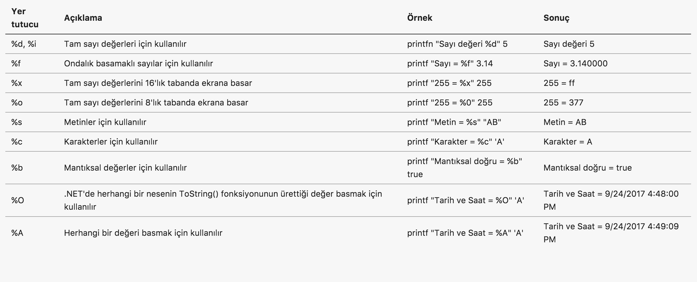

Format metninde yer alan yer tutucu ile ekrana basılmaya çalışılan aynı pozisyondaki değerin tipi farklı ise veya format metnindeki yer tutucu sayısı ile fonksiyona verilen girdi değerlerinin sayısı farklı ise derleyici hata verir.

```fsharp
printf "Sayı değeri %d" "1"  // %d tam sayı tipi yer tutucusu
printfn "Sayı değeri %f" 1   // %f ondalık basamaklı sayı tipi yer tutucusu
printfn "Harf değeri %c" "A" // %c karakter tipi yer tutucusu

printf "Sayı değerileri %d ve %d" 1  // eksik değer, iki tane bekleniyor

```
>**BİLGİ**
>
>F#'da ekrana metin basmak için .NET ile gelen standard Console sınıfının metodları da kullanılabilir. Ancak, printf ve sprintf tip uyumluluğunu kontrol ettiği için daha güvenli fonksiyonlardır ve bunların kullanılması tavsiye edilir.

## 1.2 Kısa F# Tarihçesi

F#, Türkçe **efşarp** olarak telafuz edilen yabancı kaynaklarda da **FSharp** veya **F Sharp** olarak rastlayabileceğiniz yordamsal (imperative) ve bildirimsel (declarative) yaklaşımlarının her ikisini de (multi-paradigm) destekleyen fonksyionel bir programlama dilidir. 

> **DİKKAT!**
>
>"Fonksiyionel programlama dili" ifadesindeki **fonksiyonel** ibaresi ilk etapta "çok faydalı", "işe yarayan" benzeri anlamlar çağırıştırsa da kitapta bu anlamlarda kullanılmamıştır. "Fonksiyonel programlama" programlama dilleri tasarımında matematikteki fonksiyonları ve özelliklerini temel alan yaklaşımı ifade eder.

F#, Microsoft tarafından tasarlanıp geliştirilen açık kaynak kodlu bir dilidir. F#'ın geliştirmesindeki temel motivasyon Microsoft'un en önemli platformlarından biri olan .NET Framework'ün temel tasarım amacına kadar uzanır. .NET Framework diller, derleyiciler, standard bir kütüphane ve sanal çalışma ortamı gibi bileşenleri içeren bir çatı olarak kurgulanmıştır. .NET'i destekleyen programlama dilleri ile geliştirilmiş programlar dillerin kendilerine özel derleyicileri tarafında derlenir. Derleme sonrasında MSIL (Microsoft Intermediate Language) isimli ara bir dile dönüştürülen programlar CLR (Common Language Runtime ) adı verilen ortak dil çalışma ortamında çalıştırılabilir. 

> **BİLGİ**
>
>MSIL, işletim sistemi ve mimari bağımsız bir dildir ve .NET Framework'ü hedefleyen programalama dillerinin (C#, VB.NET ve F#) derleyicileri tarafından üretilir, elle kodlanmaz.  

 .NET Framwork'ü hedefleyen herhangi bir dilde geliştirilen ve MSIL'e derlenen programlar .NET'in desteklediği Windows, Linux ve OSX işletim sistemlerinde çalıştırılabilir. 

> **BİLGİ**
> 
> .NET Framework ilk çıktığında sadece Windows işletim sistemini destekliyordu. Kısa bir süre sonra bağımsız bir grup yazılımcı Linux ve OSX'de de çalışabilen Mono isimli açık kaynak bir .NET Framework geliştirdi. 2015 yılı itibariyle Microsoft Mono'ya kod katkısı sağlamaya başlamıştır. Microsoft aynı zamanda Windows, Linux ve OSX'de çalışan .NET Core isimli işletim sistemi bağımsız bir .NET Framework versiyonu geliştirmektedir.

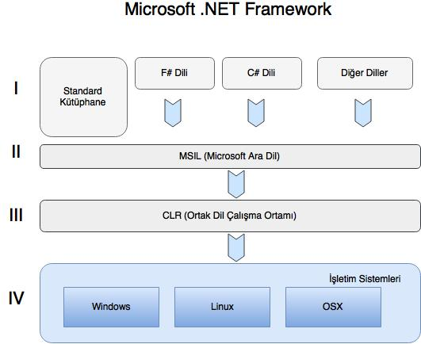

F#'ın yaratıcısı olan Don Syme F#'ın nasıl ortaya çıktığını şöyle anlatmaktadır

> .NET platformunun vizyonunda başlangıçtan itibaren birden fazla programlama dilinin desteklenmesi önemli bir hedef olarak yer alıyordu. 1998 yılında, programlama dilleri ile ilgili araştırma grubumdan 10 kişi ile birlikte Microsoft'a dahil olduktan sonra, Project 7 kod adlı projeyi başlatan James Plamondon bizimle irtibata geçti. Project 7, yedi adet akademik ve yedi adet de genel amaçlı programlama dilinin .NET'i desteklemesini hedefleyen bir projeydi. Project 7 ile farklı programlama dillerini destekleyebilmek için .NET'in sağlaması gereken mekanizmalar ve esneklikler araştırılacak ve uygulanmaya başlanacaktı.
>
> .NET'in Generic'leri üzerinde çalışırken elde ettiğim tecrübeyle ML benzeri fonksiyonel bir programlama dilinin .NET'i destekleyip desteklemeyeceğini araştırmak için  ".NET için Haskell" üzerinde çalışmaya başladım. Bu çalışmada önemli gelişmeler sağlamamıza rağmen Haskell ile .NET arasındaki ciddi uyumsuzluklar nedeni ile çalışmayı durdurduk.

Don Syme ve ekibi o dönemin (2000'li yılların başı) en popüler ML varyantı olan OCaml'ı .NET'e taşıma çabalarına yoğunlaştılar ve sonuç olarak temelinde OCaml olan F#'ın ilk versiyonu 2005 yılında yayınlandı. 

İki dilin benzerliğini görmek için aşağıdaki F# faktöriyel hesaplama kodunu OCaml yorumlayıcısında çalıştırabilirsiniz.

```fsharp
(* 01_1_01.fsx *)
let rec fact x = if x <= 1 then 1 else x * fact (x - 1);;
fact 5
```
> **BİLGİ**
>
> OCaml kodunu online olarak [OCaml Pro](https://try.ocamlpro.com) adresinden deneyebilirsiniz. Deneme yaparken her bir satırın sonuna ;; eklemeyi unutmayın


F#, 2017 yılı itibariyle 4.1 versiyonuna ulaşımış arkasında Microsoft gibi dev bir şirketin bulunduğu açık kaynak kodlu fonksiyonel bir programlama dili olarak varlığını sürdürmektedir. .NET Framework'ün çalıştığı platformların çeşitliliği arttıkça F# dilinin ulaştığı kitleler ve farklı alanlardaki popülerliği de artmaktadır.

F# versiyon tarihçesini ve diğer ayrıntıları aşağıdaki çizelgeden inceleybilirsiniz.

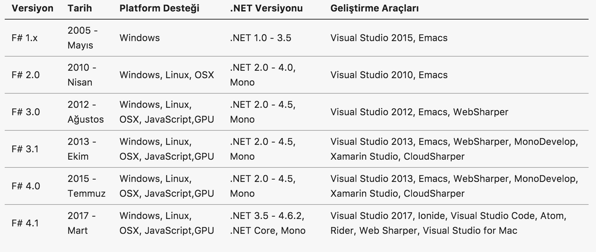

> **BİLGİ**
>
>F# ile ilgili daha ayrıntılı bilgilere http://fsharp.org adresinden erişebilirsiniz.
>
>F# kaynak kodunu incelemek için https://github.com/fsharp/fsharp adresindeki GitHub deposuna başvurabilirsiniz.


## 1.3 Neden F#?

Yeni bir programlama dili öğrenmeye başladığınızda, eğer ortada profesyonel bir zorunluluk yoksa, bu dili zaten bildiğiniz diğer diller ile karşılaştıracaksınız.  İlk defa bir programlama dili öğreniyorsanız da yaptığınız dil tercihinin size uygun olup olmadığına karar vermek isteyeceksiniz. 

Bu bölümde F# programlama dilini öğrenmeniz için sizi motive edeceğini umduğum bazı dil özelliklerini kod örnekleri ile ele alıyoruz. Göreceğiniz F# kodlarını bu aşamada tam olarak anlamayabilirsiniz. Bu nedenle, kodları anlamaya değil kodlardaki zerafet ve şıklığa odaklanarak dilin size sağlayacağı katkılara veya karşılaşacağınız zorluklara odaklanmanızı öneriyorum. 

### Az Seremonili Söz Dizimi
F#, sade ve seremonisi az olan bir söz dizimine (syntax) sahiptir. F#'da süslü parantezlere ({}), noktalı virgüllere ve normal parantezlere nadiren ihtiyaç duyulur. Kod alanlar (global alan, modül içii, fonksiyon içi vs) girintiler (indentation) kullanılarak tanımlanır.

Aşağıdaki kod örneğinde // simgesi ile belirtilen yorum satırlarının hemen altındaki kod satırlarında bahsettiğimiz özellikleri görebilirsiniz

```fsharp
(* 01_1_02.fsx *)

// Süslü parantez, parantez veya noktalı virgüle ihtiyacınız yok
// Kare fonksiyonu tanımı
let kare x = x * x 

// Liste tanımlamak çok basit ve tek satır
// 1 ile 10 arasındaki sayıları barındıran liste
let sayılar = [1..10] 

// Tek satırda listedeki sayıların karesini alıp yeni bir liste üretebilirsiniz
let kareler = sayılar |> List.map kare

// Girintiler ile belirlenen kod blokları
let tekMiÇiftMi x = // Fonksiyon tanımı başlangıcı
    // Fonksiyonun kod alanı başlangıcı
    match x with
    | a when a <= 0 -> failwith "Değer sıfırdan büyük olmalı" 
    | a when a % 2 = 0 -> true
    | _ -> false
    // Fonksiyonun kod alanı sonu

// Global alanda fonksiyon çağırısı
tekMiÇiftMi 12
```
### Sade ve Şık Tip Tanımları 
En öncemli yazılım geliştirme aktivitelerinden biri problemin modellenmesi aşamasıdır. Modelleme aktivitesi UML dili ve araçları ile yapılabileceği gibi sadece kod yazılarak de yapılabilir. Kod yazarak yapacağınız modelleme bir taşla iki kuş vurmanızı sağlar.

* Hem problemi oluşturan parçaların probleme özel tipler ile tanımlarsınız
* Hem de değerli zamanınızı sadece model olarak kullanılabilecek bir çıktı için değil aynı zamanda çalıştırabilir kod üretmek için harcamış olursunuz 

Teoride tüm programlama dilleri modelleme için kullanılabilir. Ancak kullandığınız dilin sağladığı yapılar yukarıda bahsettiğimiz avantajlar için katlanabileceğinizden daha karmaşık veya hantal olabilir. F# bu karmaşa ve hantallıktan uzak bir dildir, çünkü sunduğu  tip tanımlama yapıları sadelik ve şıklık konusunda oldukça iddialıdır.


Değer grupları (tuple), kayıt (record) ve ayrışık bileşimler (discriminated union) F#'daki temel tip tanımlama yapılarıdır.

```fsharp
(* 01_1_03.fsx *)

// Farklı tipte birden fazla değer barındırabilen basit tipler (tuple) 
let çocuk = ("Arda","Özgür",10)
let ad,soyad,yaş = çocuk // değerleri çözümleme

// Daha yapısal tipler (record)
type Kişi = {Ad:string;Soyad:string}

// Yeni kişi kaydı oluşturma
let arda = {Ad="Arda";Soyad="Özgür"}
let kuzey = {Ad="Kuzey";Soyad="..."}

// Daha karmaşık tip tanımları (discriminated union)
type Kullanıcı = 
    | Öğrenci of Kişi
    | Yönetici of Kullanıcı list

// Öğrenci ve yönetici oluşturma
let öğrenci1 = Öğrenci arda
let öğrenci2 = Öğrenci kuzey
let yönetici = [öğrenci1;öğrenci2]

```

### Güçlü Tip Sistemi
Programlama dilleri sınıflandırmasında dinamik tipli diller ve statik tipli diller şeklinde genel bir ayrım yapılır. Static tipli dillerde değişkenler, metod girdi parametreleri ve metodun dönüş değeri için tip tanımı yapılması zorunludur. Tip uyumu derleyici tarafından derleme anında sıkı bir şekilde kontrol edilir. Dinamik tipli dillerde ise herhangi bir tip tanımı yapılmasına gerek kalmadan değişken veya metodlar tanımlanabilir. Tip kontrolü derleme anında değil çalışma anında yapılır. 

Her iki yaklaşımın da seveni olduğu kadar nefret edeni de fazladır. Bu iki yaklaşımın sağladığı avantajları ve dezavantajlar kitabımızın kapsamı dışında olduğu için ayrıntılara yer vermiyoruz. Ancak, benim size tavsiyem bu konudaki fanatik tarışmalardan uzak durarak her zaman elinizdeki problemi en iyi şekilde çözeceğini düşündüğünüz yaklaşıma göre tasarlanmış dilleri kullanmanızdır.

F# derleyici seviyesinde statik tipli diller gibi davranırken kod yazımı sırasında dinamik tipli diller gibi davranır. Bunun iki anlamı vardır

1. Kod yazarken değer ifadeler ve fonksiyon tanımlarında parametre tiplerinizi çoğunlukla belirtmek zorunda değilsiniz (dinamik dillerdeki gibi)
2. Derleme sırasında derleyici biraz akıllı davranarak tip uyumluluğunu sizin için kontrol edip hataları yakalar. 

F#'ın kullandığı bu mekanizmaya **tip çıkarsama (type inference)** denir. Tip çıkarsama yöntemi sayesinde tip bildirimlerine ihtiyaç duymadan daha kısa ve okunaklı kod yazabilirsiniz. Buna ilave olarak yazılan kodun tip uyumluluğu anlamında güvenli olması derleyici tarafından garantilenir.


```fsharp
(* 01_1_04.fsx *)

let tamSayı = 1 // int
let metin = "Neden F#" // string
let pi = 3.14 // float
let evetHayır = true // bool

// Kare alma fonksiyonu. Girdi parametresi ve çıktının int olduğu çıkarsanır
let kare x = x * x
let sonuç1 = kare 12
//let sonuç2 = kare 3.14 // Hata girdi parametresi int değil

// Ondalık basamaklı sayılar için kare fonksiyonu. Girdi parametresi ve çıktı olarak float olacağını belirttik
let kare2 (x:float) : float = x * x
let sonuç3 = kare2 3.14 
//let sonuç4 = kare2 3 // Hata girdi parametresi float değil


// Kişi ve Çalışan tipinde kayıt tanımları
type Çalışan = {Ad:string;Soyad:string}
type Kişi = {Ad:string;Soyad:string}


// arda ve ali değer ifadelerinin tipini belirtmedik buna rağmen tipinin Kişi olduğu çıkarsanır
let arda = {Ad="Arda";Soyad="Özgür"}
let ali = {Ad="Ali";Soyad="Özgür"}

// seniha değer ifadesinin Çalışan tipinden olduğunu biz ifade ettik
let seniha = {Çalışan.Ad="Seniha";Soyad="Özgür"}

```

Tip çıkarsama yaklaşımı her zaman tutarlı sonuç üretir. Bazen de programcının ne ifade etmek istediğini net olarak belirtmemesi nedeni ile varsayımlar yapar. Bu varsayımlar nedeni ile sizi memnun etmeyen hatalı tipler de çıkarsayabilir. 

Yukarıdaki örnekte yer alan

**let seniha = {Çalışan.Ad="Seniha",Soyad="Özgür"}** 

ifadesini 

**let seniha = {Ad="Seniha",Soyad="Özgür"}** 

şeklinde yazsaydık **Kişi** tipi **Çalışan** tipi tanımından sonra yapıldığı için *seniha* değer ifadesinin tipinin *Kişi* olduğu çıkarsanır. Bu durum *seniha* değerini tanımlarken alanlardan ilkinin önüne hangi tipe ait olduğunu **Çalışan.Ad="Seniha"** şeklinde belirterek engellenebilir. Bu yöntem ile F# derleyicisine bir ipucu verilerek tip çıkarsama sırasında istenmeyen bir varsayım yapması engellenir. 

### Sade ve Yetenekli Veri Yapıları
Çok genel bir tanıma göre yazılım programları akış kontrolü, veri alma, veri verme ve işleme kabiliyeti olan akıllı görünümlü otomasyon sistemleridir. Bu basit tanıma göre programlarımızı geliştirmek için yazdığımız kodun önemli bir miktarının fonksiyonlar arasında, tipler arasında, modüller arasında veya diğer yazılımlar ile veri alış verişini sağlayan ifadelerden oluştuğunu söyleyebiliriz. 

>**BİLGİ**
>
>Literatürde daha kapsayıcı ve formel yazılım programı tanımları da vardır. Ancak bu tanımlar kitabımızın kapsamı dışında olduğu için ele alınmamıştır.

F#, bu basit tanımda yer verilen işlemler için hem dil seviyesinde hem de standard kütüphanesinde çok verimli ve kullanımı kolay yapılar sunar. Aşağıdaki örneğimizde F#'da yer alan temel veri yapılarından olan liste, dizi ve sekans (silsile) tipleri için örnekler verilmiştir.

```fsharp
(* 01_1_05.fsx *)
open System

// 1 ile 5 arasındaki sayıları barındıran liste
let list1 = [1;2;3;4;5]

// 6 ile 10 arasındaki sayıları barındıran liste
let liste2 = [6..10]

// 12 ile 20 arasındaki çift sayıları barındıran liste
let liste3 = [12..2..20]

// 1 ile 5 arasındaki sayıları barındıran dizi
let dizi1 = [|1;2;3;4;5|]

// 6 ile 10 arasındaki sayıları barındıran dizi
let dizi2 = [|6..10|]

// 12 ile 20 arasındaki çift sayıları barındıran dizi
let dizi3 = [|12..2..20|]

// 1 ile int tipinin en büyük değeri arasındaki sayıları barındıran sekans/silsile
let sayılar4 = seq{1..System.Int32.MaxValue}
```
> **NOT**
>
> **seq** (sekans veya silsile) fiziksel belleğin izin verdiği ölçüde sınırsız sayıda elemanı barındırabilen standard bir F# tipidir. **seq** büyük veri işlemlerinde kullanabileceğiniz en yüksek performanslı tiplerden birisidir.

Sade ve şık veri yapılarına ilave olarak standard F# kütüphanesindeki **List**, **Seq** ve **Array** modülleri veri işleme için kullanabileceğiniz onlarca fonksiyonu hazır olarak kullanımınıza sunar. 

Kod örneğimizde **List** modülü içinde yer alan birkaç fonksiyonun kullanımı gösterilmektedir.

```fsharp
(* 01_1_06.fsx *)

// 1 ile 100 arasındaki değerleri barındıran liste
let liste = [1..100]

// List.map 
// Listedeki değerlerin ondalık değerlere çevirip yeni bir liste oluştur 
let ondalıkSayıListesi = liste |> List.map (fun x -> float(x)) 

// List.average
// Listedeki değerlerin ortalaması 
let ortalama = ondalıkSayıListesi |> List.average

// List.choose
// Listedeki 50'den büyük değerler seçilir
let büyükSayılar = liste |> List.choose (fun x -> if x > 50 then Some x else None)

// List.chunkBySize
// Listeyi üçlü gruplar halinde sayıları barındıran listeye çevir
let üçlüGruplarListesi = liste |> List.chunkBySize 3

// List.filter
// Listedeki 50'den küçük sayıları filtrele ve yeni bir liste oluştur
let küçükSayılar = liste |> List.filter (fun x -> x <=50)

// @ iki listeyi ekleme operatörü
// :: listenin başına eleman ekleme operatörü 
// 200 ile 300 arasındaki sayıları barındıran liste
let liste2 = [200..300]

// liste ve liste2'yi birleştir ve yeni bir liste oluştur
let liste3 = liste @ liste2


// liste3'ün başına 0 değerini ekle
let liste4 = 0 :: liste3

// liste4'ün sonuna 301 ekle
let liste5 = liste4 @ [301]

// List.iter ve List.iteri
// liste5'in elemanları üzerinde tek tek ilerle ve her bir elemanı kullanarak değerini ekrana bas
liste5 |> List.iter (fun x -> printfn "Değer = %d" x)

// liste5'in elemanları üzerinde tek tek ilerle ve her bir eleman ve elemanın indeksini kullanarak pozisyonunu ve değerini ekrana bas
liste5 |> List.iteri (fun i x -> printfn "Değer %d = %d" i x)

```

> **BİLGİ**
>
> **|>** operatörü **pipe forward (ileri aktarım)** olarak adlandırılan ve **let (|>) x f = f x** şeklinde tanımlanan özel bir ikili (binary) operatördür. Bu tanımdaki (|>) ifadesi ikili operatör fonksiyonunun adı,x normal değer parametresi, f de bir fonksiyon parametresidir. Bu operatörü kullanarak normalde **f x** şeklindeki yapmanız gereken fonksiyon çağırılarını **x |> f** şeklinde de yapabilirsiniz.

### Eş zamanlı ve paralel çalıştırma yapıları

Sahip olunan kaynakları en verimli şekilde kullanıp makul sürede sonuç üretebilmek bulut ekonomisinin en önemli gelişim alanlarından birini oluşturmaktadır. Programlama dillerinin sunduğu eş zamanlı ve paralel işlem yapıları birim zamanda işlenen veriyi ve kurulan bağlantı miktarını arttırdığı için önemli ilerlemelerin ve keşiflerin kapılarını açar. Özellikle sosyal platformlar ve IoT (nesnelerin interneti) tarafından üretilen büyük verinin düşük birim maliyetler ile işlenebilmesi yapay öğrenme ve davranış analitiği alanında geniş bir yelpazede farklı uygulamaları mümkün kılmaya devam edecektir.

F#, eş zamanlı (asenkron) ve paralel işlemler için kullanımı basit dil yapılarının yanı sıra hazır bir kuyruk mekanizması sunar.


```fsharp
(* 01_1_07.1.fsx *)
(* 
    async kullanarak değerleri eş zamanlı olarak ekrana basma 
*)
open System
open System.Net
open Microsoft.FSharp.Control.CommonExtensions   

// Değeri ekrana basan fonksiyon
let ekranaBas değer =        
    async {                             
        printfn "Değer %d" değer 
        }

// Basılacak değerler listesi
let sites = [0..10]

sites 
|> List.map ekranaBas  // Eş zamanlı görevleri oluştur
|> Async.Parallel          // Eş zamanlı görevleri paralel çalışacak şekilde ayarla
|> Async.RunSynchronously  // Görevleri başlat

```

F#'da herhangi bir fonksiyonu asenkron hale getirmek için **async{}** dil yapısı kullanılır. Örneğimizdeki **ekranaBas** fonksiyonu asenkron bir fonksiyondur. 

```fsharp
(* 01_1_08.fsx *)
(*
    Fibonacci sayılarının paralel olarak hesaplanması
*)

// Fibonacci sayısını hesaplayan fonksiyon
let rec fib n =
    match n with
    | n when n=0 -> 0
    | n when n=1 -> 1
    | n -> fib(n - 1) + fib(n - 2)

// Paralel çalışacak görevleri oluştur
let işlemler = Async.Parallel [ for i in 0..10 -> async {  return fib i } ]

işlemler 
|> Async.RunSynchronously // Görevleri çalıştır
|> Array.iteri ( fun i x -> printfn "fib(%d) = %d" i x) // Sonuçları ekrana yazdır
```

F# standard kütüphanesinin **Async** modülü içindeki **Parallel**, **RunSynchronously** gibi fonksiyonlar kullanarak paralel çalışacak görevler oluşturulup bu görevler çalıştırılır.

> **BİLGİ**
>
> **Async.RunSynchronously** fonksiyonun adında bakıldığında görevleri senkron yani ardı ardına çalıştıracakmış gibi bir izlenim oluşabilir. Ancak bu fonksiyon paralel çalışacak tüm görevleri eş zamanlı olarak başlatıp hepsi tamamlanana kadar program akışını bekletir. Paralel tüm görevler tamamlanana kadar bir sonraki satıra işletilmez. Eğer görevlerin hepsinin tamamlanmasını beklemeden akışın devam etmesi istenirse **Async.StartImmediate** kullanılmalıdır.

Bu iki yapıya ilave olarak F# standard kütüphanesi ile hazır gelen **MailboxProcessor** modülü ile programlarımızın içinde asenkron kuyruk (queue) kullanımını gerektiren işlevleri kodlayabiliriz.

```fsharp
(* 01_1_09.1.fsx *)
(*
    MailboxProcessor modülü ile kuyruk örneği
*)

// Kuyruğu oluştur
let kuyruk = MailboxProcessor.Start(fun gelenKutusu -> async{
	let! msg = gelenKutusu.Receive()
	printfn "Gelen Mesaj: %s" msg
	})

// Kuyruğua mesaj koy
kuyruk.Post "F# ile Fonksiyonel Programlama"
```  
> **BİLGİ**
>
> **let!** ifadesi asenkron fonksiyon çağırılarının sonuçlarını değer ifadelerine atamak için kullanılır. **let!** kullanıldığında asenkron çağrı tamamlanana kadar kod akışı bir sonraki satırdan devam etmez. Asenkron fonksiyon çağırılarda sadece **let** kullanıldığında ise fonksiyon çalıştırılmaz bunun yerine asenkron bir görev oluşturulur. Bu asenkron görev daha sonra  **Async.RunSynchronously**  veya **Async.StartImmediate** ile çalıştırılmalıdır.
>


### Fonksiyonel Olmayan Yöntem Desteği
F# temelde fonksiyonel bir dildir. Ancak, .NET'i destekleyen diğer diller ile uyumluluğun sağlanması için fonksiyonel yaklaşıma ters düşen prosedürel ve nesne tabanlı yaklaşımlar da F# tarafından desteklenir.

```fsharp
(* 01_1_10.fsx *)
open System

// Saf fonksiyonel yaklaşıma aykırı olan değeri değiştirilebilir değer ifadeleri.
let mutable sayı = 42
sayı <- 43

let dizi = [|1..100|]
// Prosedürel programlama dillerindeki for döngü yapısı ve koşullu if yapısı 
for i in dizi do
    if i % 2 = 0 then
        printfn "Çift Sayı = %d" i
    else
        printfn "Tek Sayı = %d" i

// printfn saf olmayan bir fonksiyon çünkü yan etki olarak ekrana bir çıktı verir
printfn "Sayının değeri = %d" sayı

// System.Int32 F#'ın değil .NET'in sağladı tam sayı tipidir
// Aşağıdaki ifade ile System.Int32 tipi için ÇiftMi isimli yeni bir uzantı metodu tanımlanır
type System.Int32 with
    member this.ÇiftMi() = this % 2 = 0

// System.Int32 tipinden iki sayı oluşturalım
let çiftSayı:System.Int32 = 12 
let tekSayı:System.Int32 = 11 

// Uzantı metodu ile sayıların çift olup olmadığını kontrol edelim
çiftSayı.ÇiftMi()
tekSayı.ÇiftMi()

// Nesne tabanlı programlama dillerindeki gibi sınıf tanımları
type Şekil = 
    abstract member Renk : string
    abstract AlanHesapla : unit -> float 
```
Bu çoklu yaklaşım (multi-paradigm) sayesinde fonksiyonel olmayan diller (Örneğin C# veya Java) ile tecrübesi olan yazılım geliştiriciler tarzlarını çok fazla değiştirmeden olabildiğince hızlı bir şekilde F# kullanmaya başlayabilirler. Ancak prosedürel yaklaşım F#'ın sağladığı avantajları ortadan kaldırır. Uzun vadede F#'ın sağladığı fonksiyonel yapı ve yöntemlere adapte olmanızı tavsiye ediyorum.

### Geniş Uygulama Yelpazesi
F# uzun bir geçmişe sahip fonksiyonel bir dilidir. http://fsharp.org/testimonials/ adresindeki başarı hikayelerine bakıldığında enerji, sağlık, finans, sigortacılık, DNA araştırmaları, akademik araştırmalar, genel amaçlı web ve mobil uygulamaları, orta katman uygulamaları, veri analizi ve görselleştirme, kara para aklama tespit uygulamaları, analitik uygulamalar gibi bir çok sektörde kullanıldığını göreceksiniz. 

**Şimdi sıra sizde! Siz de F#'ı öğrenerek kendi sektörünüzde programlar geliştirebilir ve başarı hikayeleri sayfasında kendinize yer bulabilirsiniz.**

### Aktif Geliştirici Topluluğu
F#, Microsoft tarafından geliştirilen bir dil olmasına rağmen açık kaynak olarak yayınlanmıştır. Microsoft dilin geliştirilmesine sadece tam zamanlı iş gücü katkısı yapar, bunun dışında dilin tasarımı ve yol haritası ile ilgili kararlar F# geliştiricileri ve kullanıcılarının oluşturduğu topluluk tarafından demokratik bir şekilde alınır ve uygulanır. Microsoft çalışanı olan bir F# geliştiricisi ile bağımsız bir F# geliştiricisinin dile katkı yapma fırsatları eşittir. 

Siz de F#'ın GitHub deposuna (https://github.com/fsharp/fsharp) erişerek kod katkısı, dokümantasyon katkısı yapabilir veya yeni özellik taleplerinizi F# topluluğunun tartışmasına ve değerlendirmesine sunabilirsiniz.

### Hazır Paketler
F# bir .NET dili olduğu için .NET için geliştirilmiş tüm paket kütüphanelerini Microsoft'un resmi paket yayınlama platformu olan **NuGet** (https://www.nuget.org) üzerinden indirerek kendi programlarınızda kullanabilirsiniz.

> **İPUCU**
>
>NuGet'e alternatif olarak açık kaynak kodlu olarak yayınlanmış **Paket** (https://github.com/fsprojects/Paket) ile de paket kütüphanelerini indirebilirsiniz.

## 1.4 Fonksiyonlara Matematiksel Bakış

Fonksiyonel programlamanın temeli matematiksel fonksiyonlar ve fonksiyonların bazı özellikleri üzerine inşa edilmiştir. Matematiksel açıdan en genel **fonksiyon** tanımı aşağıdaki gibi yapılır.

> X ve Y iki küme, f⊂X×Y bir bağıntı olsun. Aşağıdaki koşullar sağlanırsa f bağıntısına bir fonksiyon denir:
>1. ∀x∈X,∃y∈Y:(x,y)∈f,
>2. (x,y),(x,y′)∈f⇒y=y′
>
>Burada X'e tanım kümesi, Y'ye ise değer kümesi denir. Tanımından da anlaşılacağı gibi fonksiyon, tanım kümesindeki her elemanı, değer kümesindeki tek bir elemanla eşleştiren bir bağıntıdır. Bu yüzden fonksiyonlarda xfy veya (x,y)∈f gösterimi yerine y=f(x) gösterimi kullanılır. Bir fonksiyona bazen dönüşüm de denir. Eğer f, X'den Y'ye bir fonksiyon ise bu durum f:X→Y ile ya da X→fY ile gösterilir.
>
Yukarıdaki tanımda belirtilen 1. koşuldaki **∀x∈X** ifadesini "X kümesinin elemanı olan tüm x değerleri", **∃y∈Y** ifadesini ise "Y kümesinin elemanı olan bir y değeri" şeklinde okuyabilirsiniz. **∀** ve **∃** sembolleri matematikte nicelik/miktar belirten sembollerdir, **∀** sembolü **tüm** ve **∃** sembolü de **bir** anlamında miktar belirtir. 

Bu tanımda yer alan diğer iki sembolden **∈** sembolü bir değerin bir kümenin elemanı olduğunu ifade eder, **⊂** sembolü ise **alt küme** anlamına gelir. Tanımımıza göre (x,y) değer çiftinin f fonksiyonunun üreteceği sonuç kümesinin bir alt kümesi olduğunu söyleyebiliriz.

Tanımın ikinci koşulu olan " (x,y),(x,y′)∈f⇒y=y′ " ifadesini ise şöyle yorumlarız; f fonksiyonu, X değer kümesinin bir x elemanını Y kümesinin y ve y′ şeklinde iki elemanı ile eşleştiriyorsa y ve y′ değerleri birbirine eşittir. Başka bir deyişle, f fonksiyonu X tanım kümesinin elemanı olan bir x değerini her zaman Y değer kümesinin bir elemanı olan aynı y değeri ile eşleştirir.

Şimdi gelin bu fonksiyon tanımını görselleştirerek basit bir örnek ile somutlaştıralım. 

**f(x) = x * x** şeklinde bir fonksiyon tanımı olsun. Bu fonksiyon girdi olarak verilen x değerinin karesini hesaplar. Daha matematiksel bir şekilde ifade edecek olursak; bu fonksiyon doğal sayılar kümesinin elemanı olan tüm **x** değerlerini yine doğal sayılar kümesinin elemanı olan bir **x*x** değeri ile eşleştirmektedir.

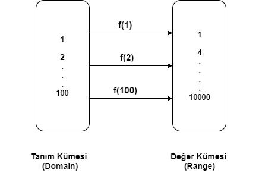

Yukarıdaki şekilde yer alan **tanım kümesi** ve **değer kümesi** kavramları önemlidir, zira fonksiyonları tanım kümesindeki elemanları değer kümesindeki elemanlar ile eşleştiren dönüşümler şeklinde de ifade ederiz. 

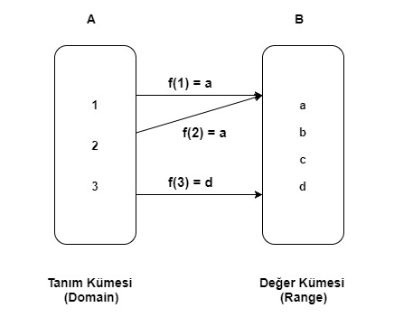

Yukarıdaki örnekte
* Tanım Kümesi A : A{1,2,3}
* Değer Kümesi B : B{a,b,c,d}
* Görüntü Kümesi : f(A) = {a,d}

f fonksiyonunu da  f(A) = {(1,a),(2,a),(3,d)} şeklindeki eşleştirmelerin kümesi olarak tanımlarız.

## 1.5 Fonksiyonların İlginç Özellikleri

Matematiksel fonksiyonların fonksiyonel programlama dillerinin yapısını yakından etkileyen belirleyici iki önemli özelliğinden bahsedebiliriz, bunlar

1. Fonksiyonlar tanım kümesindeki bir elemanı her zaman değer kümesindeki aynı eleman ile eşleştirir
2. Fonksiyonların yan etkileri yoktur

**f(x) = x * x** şeklindeki fonksiyon tanımını örnek olarak ele alırsak, bu fonksiyonun tanım kümesindeki 2 değerini değer kümesindeki 4 değeri ile ( f(2)=4 ), 3 değerini de 9 değeri ile eşleştirdiğini ( f(3) = 9) söyleriz. Bu fonksiyonun **f(2) ≠ 4** veya **f(3) ≠ 9** şeklinde bir eşleştirme yapması asla mümkün değildir. Programcı terimleri ile ifade edecek olursak **fonksiyonlar aynı girdi parametresi değeri için her zaman aynı çıktıyı üretir**.

f(x) = x * x fonksiyonunun F# ile matematiksel tanımına uygun olarak basit bir dönüşüm olarak aşağıdaki gibi ifade ederiz. 

```fsharp
(* 01_2_01.fsx *)

let f (x) =
    match x with
    | 1 -> 1
    | 2 -> 4
    | 3 -> 9
  //| ......
  //| ......
    | _ -> -1 //Diğer olası tüm değerler

```

Dikkat ederseniz fonksiyonları bu noktaya kadar hep *eşleştirme yapan birer dönüşüm* olarak tanımlamaya özen gösterdik. Eğer fonksiyonel olmayan programlama dilleri ile tecrübeniz varsa fonksiyonların veya metodların hesaplama yapmak için kullanıldığını düşünüyor olabilirsiniz. Ancak yükarıdaki **f(x) = x * x**  örneğinde de görebileceğiniz gibi fonksiyonlar aslında herhangi bir hesaplama yapmazlar, fonksiyonlar basitçe iki kümenin elemanlarını birbirleri ile eşleştirirler. Fonksiyonları, programcı bakış açısıyla, herhangi bir hesaplama yapmayan basit birer switch/case (C,C++, Java, C#, JavaScript gibi dillerin hepsinde olan koşullu dallanma yapısı) kod bloğu olarak düşünebilirsiniz. 

Ancak, switch/case benzeri yapılar yazım açısından zahmetli olup genellemeye uygun değildirler. Tanım kümesinin tüm elemanlarının switch/case ile değer kümesinden bir eleman ile eşleştirilmesi pratik olarak mümkün değildir. Bu nedenle fonksiyonları, bir hesaplama yaptığı izlenimine kapılmamıza da neden olan, aşağıdaki şekilde yazarak genelleştirebiliriz.

```fsharp
(* 01_2_02.fsx *)

let f (x) = x * x
```

Fonksiyonların ikinci ilginç özelliği ise yan etkilerinin olmamasıdır. **Yan etki** fonksiyonun eşleştirme dönüşümünü yaparken girdi olarak verilen tanım kümesindeki değeri de değiştirmesi durumuna denir. 

Örneğin **f(x) = x * x** fonksiyonuna girdi olarak verilen değer kümesindeki **x = 5** değerinin **y = f 5** ifadesi ile yapılan dönüşüm işlemi sonrasında hala 5'e eşit olması f(x) fonksiyonunun yan etkisi olmadığını gösterir.

```fsharp
(* 01_2_03.fsx *)

let f(x) = x * x   // fonksiyon tanımı

let x = 5          // Tanım kümesinden 5 değeri
let y = f 5        // y = f(5)

printfn "x = %d" x // x değeri değişmiş mi kontrolü
printfn "y = %d" y // y = f(5) dönüşümü yapılmış mı kontrolü

```

Bu iki özelliği sağlayan fonksiyonları matematikçiler ve fonksiyonel programcılar **saf fonksiyonlar** olarak adlandırır. Saf fonksiyonlar aynı girdi değerleri için her zaman aynı çıktıyı üretir ve bu işlem sonsuza dek farklı değerler ile tekrarlansa bile fonksiyonun davranışı değişmez. İlave olarak saf fonksiyonlar hiç bir zaman girdinin değerini değiştirmez. 

Saf fonksiyonlar fonksiyonel programlama çerçevesinde aşağıdaki yöntemlerin uygulanmasını mümkün kılar

* Örneğin 100 çekirdekli bir işlemciniz varsa 1 ile 100 arasındaki sayıların karelerini almayı **eş zamanlı** ve **paralel** olarak her çekirdekte bir işlem yapılacak şekilde kodlayabilirsiniz. Fonksiyonların birinci özelliği eş zamanlı ve paralele çağırıları mümkün kılar.

* Bir fonksiyonu çıktısına ihtiyaç duyduğunuz anda gevşek olarak (lazy) değerleyebilirsiniz. Fonksiyonel olmayan programlama dillerinde program akışı bir fonksiyona geldiği anda o fonksiyon hemen çalıştırılır. Fonksiyonun dönüş değeri de bir bellek konumunda saklanabilir. Fonksiyonel programlama dillerinde ise program akışı bir fonksiyona geldiğinde eğer dönüş değerine hemen ihtiyacınız yoksa fonksiyonun değerlenmesini geciktirebilirsiniz. Buna **gevşek değerleme** (lazy evaluation) denir. Fonksiyonların birinci özelliği gevşek değerlemeyi mümkün kılar çünkü bir fonksiyonu ne zaman değerlerseniz değerleyin aynı girdi için her zaman aynı çıktı üretilecektir.

* Fonksiyonlarınıb dönüş değerlerini daha sonra kullanılmak üzere bellemesini sağlayabilirsiniz. Fonksiyonel programlama dillerinde bu özelliğe **belleme**(memoization) denir. Belleme davranışı doğrudan fonksiyon tanımında ifade edilebilir. Fonksiyon eğer daha önce bellediği bir eşleştirme işlemini yapmak üzere çağırılırsa bu işlemi gerçekten yapmadan bellenen sonucu döndürür. Belleme de fonksiyonların birinci özelliği sayesinde mümkündür. 

* Birden fazla fonksiyon istenen sırada değerlenebilir(evaluate). Fonksiyonlar değerlendiğinde girdi parametresi değeri değişmediği için (girdi değeri bozulmadığı için) döndüş değeri de değişmez. Bu davranış fonksiyonların ikinci özelliğinin (yan etkisinin olmaması) bir sonucudur. 

### Değerleme Sırası Önemli Mi Değil Mi?

Fonksiyonların ikinci özelliğine istinaden fonksiyonları istediğimiz sırada değerleyebileceğimizi ve sonucun değişmeyeceğini söylemiştik. Ancak matematiksel olarak **f(g(x)) = g(f(x))** önermesi her zaman doğru değildir. Bu önerme sadece bazı özel **f** ve **g** fonksiyonları için doğru olabilir (örneğin birim fonksiyon). Bu özel fonksiyonlar dışındaki fonkisyonlar için **f(g(x)) ≠ g(f(x))** önermesi geçerlidir.
  
Fonksiyonların çalıştırma sırasını önemli olduğuğunu aşağıdaki örnek programımızda da hızlıca görebiliriz. Sıralama değiştirildiğinde işlem sonucu da değişir. 

```fsharp
(* 01_2_04.fsx *)
let f(x)  = x + 1 // bir arttırma fonksiyonu tanımı
let g(x) = x * x // kare alma fonksiyonu tanımı

printfn "Sonuç f(g(1)) = %d" (f(g(1))) // Sonuç f(g(1) = 2
printfn "Sonuç g(f(1)) = %d" (g(f(1))) // Sonuç g(f(1) = 4
```

Fonksiyonel programlama terminolojisinde değerleme (evaluate) ve çalıştırma (execute) aynı anlama gelmez. Değerleme sırası derleyici seviyesinde geçerli bir kavramdır ve yazdığınız kodun çalıştırılma sırası ile doğrudan bir ilişkisi yoktur. Bu nedenle matematiksel ve programatik olarak yukarıdaki örnekteki **f(g(x))** ve **g(f(x))** çağırıları eş çağırılar değildirler. Bu nedenle fonksiyonel programlamada değerleme sırası önemli olmamakla birlikte çalıştırma sırası diğer tüm programlama yaklaşımlarında olduğu gibi çok önemlidir.

f(g(1)) ifadesi için derleyici iki farklı değerleme stratejisi kullanabilir.
İlk değerleme **Normal Sıralı Değerleme** (Normal Order Evaluation) aşağıdaki adımlardan oluşur

```
// Normal Değerleme

f(g(1))
= g(1)+1  // f(x) = x + 1 olduğu için f(x) g(1) + 1 olarak değerlendi
= (1*1)+1 // g(1) -> 1*1 olarak değerlendi
= 1 + 1   // g(1) = 1 olduğu için ifade 1 + 1 olarak değerlendi
= 2
```  

İkinci değerleme yaklaşımı **Uygun Sıralı Değerleme**  (Applicative Order Evaluation) ise şöyle olur

```
f(g(1))
= f(1*1) // önce g(1) ifadesi değerlendi -> 1*1
= f(1)   // sonuç f(1)
= 1+1    // sonra da f(1) ifadesi değerlendi -> 1 + 1
= 2      // sonuç
``` 

Hangi değerleme yaklaşımı uygulanırsa uygulansın **f(g(1))** ifadesinin sonucu değişmez ve 2'ye eşittir. 

> **BİLGİ**
> 
>**Normal Sıralı Değerleme** yapılırken bir fonksiyonun en soldaki ifadesi öncelikli olarak değerlenir. f(g(1)) ifadesinde en solda f fonksiyonu var ve f(x) = x + 1 olduğu için f(g(1)) ifadesi açılarak g(1) + 1 şeklinde yazılır. Programlama terminolojisinde buna **isimle çağırma** (call by name) da denir
>
> **Uygun Sıralı Değerleme** yapılırken en içteki fonksiyonun ifadesi öncelikli olarak değerlenir. f(g(1)) ifadesinde en içteki fonksiyon g fonksiyonu olduğu için g(1) ifadesi değerlendi ve f(g(1)) ifadesi f(1 * 1) olarak yazıldı. Programlama terminolojisinde buna **değerle çağırma** (call by value) da denir

Kullandığınız fonksiyonel programlama dilinin derleyicisi her zaman yukarıdaki değerleme yöntemlerinden sadece birini kullanabilir. Yazdığınız ifadelere veya derleyicinin çalıştırıldığı donanımın yeteneklerine göre iki değerleme yöntemini duruma göre değişimli olarak da kullanabilir.

### Fonksiyonların İlginç Olmayan Özellikleri

Fonksiyonların ilginç özelliklerinin yanısıra pek de ilginç olmayan iki özelliğinden daha bahsedebiliriz. 

1. Fonksiyonların girdi prametre değerleri ve döndürdükleri değerler değiştirilemez. Buna **değerin değişmezliği (immutability)** denir.
2. Fonksiyonların tek bir girdi parametresi ve tek bir dönüş değeri vardır

Bu iki özellik ilk başta çok önemli değilmiş hatta biraz da kısıtlayıcıymış gibi görünebilir. Ancak bu özellikler fonksiyonel programlama dillerinin tasarımını doğrudan etkiler. Örneğin F# derleyicisi yazdığınız tüm fonksiyonları tek bir giriş parametresi alan ve tek bir çıktı üreten birer fonksiyon olarak değerler. Benzer şekilde F#'da **let** ile tanımlanan değer ifadelerinin değerlerinin tanımlandığı andan sonra değiştirilmesine izin verilmez.

> **BİLGİ**
>
> F#'da **değişken (variable)** terimi yerine **değer ifadesi (value expression)** terimi kullanılır. Örneğin aşağıdaki a,b ve pi değer ifadeleri değişken değildir çünkü değerlerini bir defa tanımladıktan sonra farklı bir kod satırında değiştiremeyiz (*değişmezlik - immutability*) 
> ```fsharp
> (* 01_2_05.fsx *)
>
>let a = 42
>a = 43 // Hata
>
>let b = "F# ile Fonksiyonel Programlama"
>b = "F# ile fonksiyonel programlama" // Hata
>
>let pi = 3.14
>pi = 3.0 // Hata 
>```
>
>Ancak F#'da multi paradigm bir dil olması nedeni ile değeri değiştirilebilen (mutable) ifadeler tanımlamak da mümkündür. Bunun için **let mutable** bildirimi ve **<-** atama ifadesi kullanılır
>```fsharp
>(* 01_2_06.fsx *)
>let mutable a = 42
>printfn "a = %d" a
>
>a <- 43 // Değer ifadesinin değerini değiştir
>printfn "a = %d" a
>
>let mutable b = "F# ile Fonksiyonel Programlama"
>printfn "b = %s" b
>
>b <- "F# ile fonksiyonel programlama" // Değer ifadesinin değerini değiştir
>printfn "b = %s" b
>
>let mutable pi = 3.14
>printfn "pi = %f" pi
>pi <- 3.0 // Değer ifadesinin değerini değiştir
>printfn "pi = %f" pi
>```

### Fonksiyonların Parametre Sayısı 
Fonksiyonları matematiksel olarak tanımlarken tanım kümesindeki bir değeri değer kümesindeki bir değer ile eşleştiren dönüşümler olarak tanımlamıştık. Bu tanıma göre fonksiyonlar her zaman tanım kümesindeki tek bir değeri girdi olarak alıp değer kümesindeki tek bir değer ile eşleştirirler. Ancak matematikte birden fazla girdi alan ve girdiyi birden fazla değer ile eşleştiren çok boyutlu fonksiyonlar da tanımlanabilir. 

```
// Tek girdi ve tek çıktı
f(x) = y

// Birden fazla girdi, birden fazla çıktı
f(u,v) = (u²-v, v²+u)

//Tek girdi birden fazla çıktı
f(t) = (cost(t), sin(t))
```

Matematiksel olarak çok parametreli ve çıktılı fonksiyonlar söz konusu olduğunda  birden fazla boyutlu uzay ve bu uzaydaki noktaları ifade eden tanım ve değer kümeleri ile düşünmeye başlamalıyız. Ancak fonksiyonel programlama dillerinin modellenmesinde her zaman bir girdi ve bir çıktılı **tek boyutlu fonksiyonlar** kullanılır. Ancak, çok boyutlu uzaydaki noktalar iki değerli, üç değerli veya N değerli koordinatlar olarak gruplanıp bu gruplardan oluşan tanım ve değer kümeleri oluşturmak mümkündür. Bu şekilde tüm fonksiyonlar ilk tanımımıza uygun olarak tek girdi (koordinat) alan ve tek çıktı üreten dönüşümlere indirgenebilir. 

F# derleyicisi fonksiyonları her zaman tek girdi ve tek çıktılı dönüşümler olarak işler. Bu durumda F#'da birden fazla girdiyi parametre olarak alan fonksiyon tanımlamak mümkün değil midir? Sorunun cevabı kısaca "Mümkündür". Bunun nasıl mümkün olduğunu ilerleyen bölümlerinde ayrıntıları ile bulabilirsiniz. 

## 1.6 Fonksiyonel Programlama Nedir?

Fonksiyonel programlama, saf fonksiyonları (pure functions) ve değeri sonradan değiştirilemeyen ifadeleri (expressions) kullanarak yapılan kodlama faaliyetidir. Bazı kaynaklar fonksiyonel programlamayı fonksiyonların birinci sınıf vatandaş (first class citizen) olarak kabul edildiği kodlama faliyeti olarak da tanımlamaktadır. Fonksiyonel programlama bir araç veya dile bağlı değildir ve bir **yaklaşım** (paradigma) olarak değerlendirilir. Fonksiyonel olmayan programlama dilleri ile de (eğer dilin yapısı müsait ise) fonksiyonel programlama yaklaşımına ve ilkelerine uygun kod yazmak mümkün olabilir. Fonksiyonel programlama yöntemleri ile çoğu yazılım hatasının kaynağı olan paylaşılan program durumu (shared program state) ve yan etkilerden (side effect) arındırılmış kod yazmak mümkündür.

Fonksiyonel programlama yaklaşımına göre tasarlanmış programlama dilleri **bildirimsel (declarative)** diller sınıfında yer alır. Bildirimsel dilleri sınıfının karşısında da  C, C++, Java, Pascal ve C# gibi **yordamsal (imperative)** diller yer alır.

> **NOT**
>
> Programlama dilleri sınıflandırılırken bakış açısına bağlı olarak farklı yöntemler uygulamak ve farklı sınıflar tanımlamak mümkündür. Bildirimsel ve yordamsal dışında prosedürel diller, makina dilli, üst seviye diller, görsel diller, alana özgür diller gibi sınıflar da vardır.

Şimdi gelin basit bir F# kod parçası ile fonksiyonel kodun neye benzediğini deneyimleyelim.

```fsharp
(* 01_2_07.fsx *)

let liste = [1..10] // 1 ile 10 arasındaki sayıları barındıran liste
let kare x = x * x  // Bir sayının karesini alan fonksiyon tanımı

let sonuc = List.map kare liste // List modülü içindeki map fonksiyonu
printfn "Sonuç = %A" sonuc
// val sonuc : int list = [1; 4; 9; 16; 25; 36; 49; 64; 81; 100]
```

Yukarıdaki kod parçasında **list** isimli bir değer ifadesi ve **kare** isimli bir fonksiyon tanımı yapılıyor. **List.map kare liste** ifadesi ile de **List** modülü içindeki yüksek mertebeli **map** fonksiyon birinci parametresi **kare** fonksiyonu ikinci parametresi de **liste** olacak şekilde çalıştırılıyor. 

Örneğimizdeki bazı kod satırlarının fonksiyonel programlama yöntemine uygunluğunu aşağıdaki gibi değerlendirebiliriz

* **kare** fonksiyonu saf bir fonksiyondur çünkü tanım kümesindeki her bir değer için her zaman aynı çıktıları üretir. İlave olarak fonksiyon içinde girdi veya çıktının değiri değiştirilmez
* **liste** ifadesinin değeri 1 ile 10 arasındaki sayılardır ve liste ifadesinin içeriği tanımlandığı andan sonra değiştirilemez
* **List.map** fonksiyonu yüksek mertebeli bir fonksiyondur çünkü **kare** fonksiyonunu parametre olarak kabul eder  

> **BİLGİ**
>
> Yüksek mertebeli fonksiyonlar başka bir fonksiyonu girdi parametresi olarak kabul eden fonksiyonlardır. Yukarıdaki örnekte kullanılan **List.map** fonksiyonu **kare** fonksiyonunu parametre olarak alabildiği için **yüksek mertebeli** (higher order) bir fonksiyondur.

### Bildirimsel ve Yordamsal Programlama Yaklaşımları 

F#, OCaml, Scala, Haskell gibi fonksiyonel programlama dilleri bildirimsel (declarative) diller olarak sınıflandırılır. C,C#, Java, Pascal ve Cobol gibi diller ise ana yaklaşımları nedeni ile yordamsal (imperative) diller şeklinde sınıflandırılır. Ancak, programlama dillerinin bu iki yaklaşıma göre hangi sınıfta yer aldığının belirlenmesi için çok net kriterler yoktur. Bazı diller (örneğin JavaScript, C# veya Java 8) destekledikleri programlama yapılarına göre her iki sınıfta da yer alabilmektedir. Tüm bu kriter belirsizliği ve karmaşasına reğmen bir programcı olarak bu iki sınıf arasındaki temel farkları bilmeniz hem F# öğrenirken hem de diğer diller ile çalışırken faydalı olacaktır. 

#### Nasıl Yapılmalı?
Yordamsal programlama dillerinde yazılan kod bir işlemin **nasıl** (how) yapılacağını tarif eder. Bu yüzden bu tür dillerin temel yapı taşları **tümcelerdir (sentence)**. Bu tümceler ile adım adım programın hangi işlemi **nasıl** yapması gerektiği tarif edilir ve bilgisayar bu adımları takip ederek programı çalıştırır. Bu sınıftaki dillere prosedürel diller de denir. Bu tür dillerde adım adım bir tarif söz konusu olduğu için genellikle akış kontrolü için **while** ve **for** gibi döngü yapıları, koşullu dallanma için **if/else** ve **switch** yapıları ve her bir adım sonrasında ulaşılan durumun takip edilmesi ve kayıt altına alınması için de **değişkenler** kullanılır. 

#### Sonuç Ne Olacak?
Bildirimsel programlama dillerinde ise yazılan kod bir işlemin nasıl yapılacağına değil işlem sonucunun **ne olacağına** (what) odaklanmıştır. Bu sınıftaki dillere fonksiyonel diller de denir. Bu tür dillerin temel yapı taşı **ifadelerdir** (expression). Bilgisayar, programlardaki bu ifadeleri çalıştırarak sonucun üretilmesini sağlar. Bildirimsel dillerde akış kontrolü için **öz yinelemeli  fonksiyonlar** (recursive), koşullu dallanma için **yüksek mertebeli fonksiyonlar**(higher order functions) ve **match** benzeri yapılar kullanılır. Bildirimsel dillerde işlem sonucuna odaklanılır ve önceki adımlarda ulaşılan durumun takip edilmesi için değişkenlere ihtiyaç duyulmaz. Bu nedenle fonksiyonel dillerde doğrudan değişken tanımı yapılmasına izin verilmez.

F# ağırlıklı olarak fonksiyonel (bildirimsel) bir dil olmakla birlikte yordamsal yapıları da destekler. Bir sonraki örneğimizde F# ile nasıl prosedürel kod yazıldığını görüyorsunuz

```fsharp
(* 01_2_08.1.fsx *)
(* Yordamsal (fonksiyonel olmayan) yaklaşım *)
let liste = [1..10]

let mutable ikiyeBölünenler = []
let mutable ikiyeBölünmeyenler = []

for d in liste do
    if d % 2 = 0 then
        ikiyeBölünenler <- ikiyeBölünenler @ [d]
    else
        ikiyeBölünmeyenler <- ikiyeBölünmeyenler @ [d]
printfn "İkiye bölüneneler = %A" ikiyeBölünenler
printfn "İkiye bölünmeyenler = %A" ikiyeBölünmeyenler
```  
Bu örneğimizde ise F# ile yazılan fonksiyonel kodun neye benzediğini göreceksiniz.

```fsharp
(* 01_2_08.1.fsx *)
(* Bildirimsel (fonksiyonel) yaklaşım *)
let liste = [1..10]
let ikiyeBolünebilirMi x = x % 2 = 0

let ikiyeBölünenler = liste |> List.filter ikiyeBolünebilirMi
printfn "İkiye bölüneneler = %A" ikiyeBölünenler

let ikiyeBölünmeyenler = liste |> List.filter (ikiyeBolünebilirMi >> not)
printfn "İkiye bölünmeyenler = %A" ikiyeBölünmeyenler

```

Toparlamak gerekirse;

* İki yaklaşımın kodalama stilleri birbirinden farklıdır. Yordamsal dillerde yapılacak her işlem adım adım tarfi edilir ve sonuç olarak yazılması gereken kod miktarı da fazla olur. Örneklerimizdekine benzer basit programlarda bile fonksiyonel yaklaşım ile %40 (10 satıra karşılık 6 satır) daha az kod yazılması mümkündür. 
* Yordamsal dillerde çalıştırılan adımlar sonrasında varılan durumun takip edilmesi için değişkenler kullanılır. Bu değişkenlerin değerleri istenirse akış içinde herhangi bir aşamada değiştirilebilir. Ancak, fonksiyonel dillerde değişken kavramı yoktur bunun yerine değer ifadeleri (value expression) kullanılır. Değer ifadelerin değerleri ilk atandıkları andan sonra değiştirilemez.
* Çalıştırma sırası yordamsal dillerde önemlidir, çünkü durum takibi değişkenler ile yapılır ve her adım çalıştırıldıktan sonra bu değişkenlerin değeri değişebilir. Bu nedenle yordamsal dillerde kodun değerleme sırası önemlidir. Ancak, fonksiyonel dillerde ifadelerin değerleri atandıktan sonra değiştirilemediği için ve fonksiyonel programlar durumsuz oldukları için değerleme sırası önemli değildir.  
* Fonksiyonel dillerde fonksiyonlar birinci sınıf vatandaştırlar. Bir fonksiyon başka bir fonksiyonu girdi parametresi olarak alıp çıktı olarak döndürebilir. Yordamsal dillerin bir kısmında da bu mümkündür. Ancak, yordamsal dillerde fonksiyonları girdi ve/veya çıktı olarak kullanmak daha fazla kod yazılmasını ve hata kontrollerinin dikkatli yapılmasını gerektirir.
* Yordamsal dillerde akış kontrolü için döngü (for/while), koşullu dallanma (if/else, switch) ve fonksiyon tanımları kullanılır. Fonksiyonel dillerde ise akış kontrolü için sadece  öz yinelemeli (recursive) fonksiyonların kullanılması yeterlidi. Fonksiyonel dillerde akış kontrolü en alt seviyede derleyici tarfından otomatik oluşturulur.
* Yordamsal dillerde kullanılan temel veri yapıları değişkenler ve diziler (array) gibi içeriği değiştirilebilen yapılarıdır. Fonksiyonel dillerde ise yığım (collection) kullanımı ön plandadır.

> **BİLGİ**
>
> Dizilerin(array) kapasitesi sabittir ve değiştirilemez. Yığınların (collection) kapasitesi ise fiziksel kapasitenin izin verdiği sınırlara kadar büyüyebilir. Diziler ve yığınlar hem yordamsal hem de fonksiyonel dillerde kullanılır. Ancak, fonksiyonel dillerde yığın kullanımı tavsiye edilen en iyi pratikler arasında sayılır.

Yordamsal diller bir çok sektörde kullanılan ana akım dillerdir, bu nedenle fonksiyonel dillere oranla popülerliği ve üretilen kod miktarı daha fazladır. Ancak, bulut tabanlı sistemlerin ve büyük veri odaklı veri işleme uygulamalarının popüler hale gelmesi ile birlikte F#, Clojure ve Haskell gibi fonksiyonel dillerin popülerliği ve kullanımı artmaktadır. İfadelerini değerlerinin atandıktan sonra değiştirilememesi(immutability) ve fonksiyonların prensip olarak yan etkisinin (side effect) olmaması gibi temel yapısal özellikler bu dillerin paralel ve eş zamanlı işleme kabiliyeti gerektiren büyük veri projelerinde ön plana çıkmasını sağlar.

**Sizler de bulut tabanlı büyük veri işleme uygulamaları veya benzer uygulamalar geliştirmek istiyorsanız F# veya farklı bir fonksiyonel programlama dilini öğrenerek kariyerinize pozitif bir katkı yapabilir, farklı mücadele ve fırsatlara açılan kapıları aralayabilirsiniz.**

> **NOT**
>
> Nesne tabanlı (object oriented) diller, yordamsal (imperative) ve bildirimsel (declarative) dillerden daha popüler olan üçüncü yaklaşımı temsil etmektedir. 

# 2.Bölüm : F# Geliştirme Platformu

Herhangi bir programlama dilinde geliştirme yapmak için ihtiyaç duyulan en basit bileşen **derleyicidir** (compiler). Derleyici metin dosyası olarak yazılan kodun dil kurallarına göre denetlenmesi ve optimize edilmesinden sonra çalıştırılabilir programın üretilmesini sağlar. Bazı programlama dilleri derleyici yerine **yorumlayıcı** adı verilen bileşeni kullanır. Yorumlayıcı derleyiciden farklı olarak kodun çalışma anında yorumlanarak çalıştırılmasını sağlar. 

F#, hem derleyicisi hem de yorumlayıcısı olan programlama dillerinden birisidir. Çalıştırılabilir bir program üretmek için F# derleyicisi kullanılırken, kod dosyalarının içindeki kodun veya yazdığınız kodun yorumlanarak etkileşimli olarak çalıştırılması için yorumlayıcı kullanılır. 

Gelin şimdi işletim sisteminin ne olduğundan bağımsız olarak bu iki bileşeni nasıl kullanacağımızı görelim. 

## 2.1 FSC - F# Derleyicisi (F# Compiler)

F# derleyicisi açık kaynak kodlu bir bileşendir. F# derleyicisini Windows, Linux ve OSX işletim sistemlerine *F# Geliştirme Araçları* kurulum paketlerini indirip kurabilirsiniz. F# derleyicisini komut satırından **fsc** (Windows üzerinde) komutu ile kullanabilirsiniz. 

Şimdi gelin basit bir konsol uygulaması kodunu **fsc** komutunu kullanarak  derleyelim ve uygulamamızı çalıştıralım.

```fsharp
(* 02_1_01.fs *)
[<EntryPoint>]
let main args = 
    
    // Ekrana yaz
    printfn "Merhaba Dünya!"
    
    // Geçilen parametreleri sırasıyla ekrana bas
    args |> Array.iter( fun s -> printfn "Merhaba %s." s)
    
    printfn "-------"
    printfn "Sonlandırmak için lütfen ENTER'a basın."
    let l = System.Console.ReadLine()

    0
```
Örnek programımız çalıştığında konsol ekranına "Merhaba Dünya!" yazar. Konsol uygulamasına parametre geçilirse bu değerler de "Merhaba, <parametre değeri>" şeklinde sırasıyla konsol ekranına basılır ve uygulamanın sonlanması için kullanıcıdan ENTER tuşuna basması istenir.

Kodun derlenmesi için kaynak kodu dosyasının bulunduğu klasöre konumlanıp komut satırına aşağıdaki komut çalıştırılır 

```bash
$ fsc 02_1_01.fs -o merhaba.exe --target:exe
```

* **02_1_01.fs :** Derlenecek kodun bulunduğu dosya adı
* **-o merhaba.exe :** Derleme sonrası üretilecek dosyasının adı
* **--target:exe :** Derleme sonrası üretilecek dosyanın formatı, bizim örneğimizde exe    

Komut çalıştırıldıktan sonra kod dosyasının bulunduğu klasör altında **merhaba.exe** isimli bir konsol uygulaması oluşturulur. Uygulamayı test etmek için konsol ekranına aşağıdaki komutu yazabilirsiniz.

```bash
$ merhaba.exe "Arda" "Ali"
```
```bash
# Uygulamanın çıktısı aşağıdaki gibi olacak

Merhaba Dünya!
Merhaba Arda.
Merhaba Ali.
-------
Sonlandırmak için lütfen ENTER'a basın.
```

>**DİKKAT!**
>
>Linux veya OSX işletim sistemlerinde F# derleyicisini komut satırında **fsharpc** komutu ile çağırmalısınız.

>F# derleyici parametrelerini [Derleyici Seçenekleri](https://docs.microsoft.com/dotnet/fsharp/language-reference/compiler-options) sayfasından daha ayrıntılı olarak inceleyebilirsiniz.

## 2.2 FSI - F# Etkileşimli Ortamı (F# Interactive)  

F# etkileşimli ortamı (FSI), kod yazım sürecindeki yaz-derle-dene döngüsünün daha hızlı bir şekilde yapılabilmesi için sunulan çok faydalı bir araçtır.  FSI ile yazdığınız kodun seçtiğiniz kadarını derleme işlemi yapmadan çalıştırıp sonucunu hızlıca görebilirsiniz. FSI da F# derleyicisi gibi Windows, Linux ve OSX işletim sistemleri ile kullanılabilir. FSI'ı komut satırına **fsi** (Windows üzerinde) komutu ile çalıştırabilirsiniz.

Komut satırında **fsi** komutu çalıştırıldığında konsol ekranında FSI versiyon bilgisi gösterildikten sonra **>** simgesi belirecektir. 

```bash
$ fsi
F# Interactive for F# 4.1
Freely distributed under the Apache 2.0 Open Source License

For help type #help;;
>
```
**>** simgesi FSI'in sizden kod girmenizi beklediğini ifade eder. 
FSI giriş modunda iken kodu **printfn "Merhaba Dünya!";;** yazıp ENTER tuşuna bastığınızda F# kodunuz derlenip çalıştırılarak konsol ekranında aşağıdaki çıktı üretilir.

```bash
Merhaba Dünya!
val it : unit = ()
```

Şimdi gelin FSI ile yapabileceklerimizin bir kısmını inceleyelim.

```bash
> 2 + 2;;
val it : int = 4

> let x = 42;;
val x : int = 42

> let y = 1;;
val y : int = 1

> let topla x y = 
-     x + y
- ;;
val topla : x:int -> y:int -> int

> topla x y;;
val it : int = 43

> topla 11 12;;
val it : int = 23

> let x = -42;;
val x : int = -42

> topla x y;;
val it : int = -41
```

* **2 + 2;;** basit bir toplama işlemi
* **let x = 42;;** x isimli bir ifade tanımlayıp değerini 42 olarak belirle
* **let y = 1;;** y isimli bir ifade tanımlayıp değerini 1 olarak belirle
* **let topla x y =** topla isimli ve iki parametreli fonksiyon tanımına başla
* **x + y** topla isimli fonksiyonun kodunun ilk satırı
* **;;** topla isimli fonksiyon tanımını bitir
* **topla x y;;** daha önce tanımlanan x ve y değerleri ile topla fonksiyonunu çağır
* **topla 11 12;;** topla fonksiyonunu 11 ve 12 değerleri ile çağır
* **let x = -42;;** x ifadesini yeniden tanımla ve değerini -42 olarak belirle
* **topla x y;;** x ve y değerleri ile topla fonksiyonunu çağır

FSI çalıştırıldığı ilk andan itibaren (oturum) yapılan tüm değer ifadesi ve fonksiyon tanımlarını aklında tutar.

FSI'in girdiğiniz herhangi bir kodu yorumlamaya başlaması için kod satırını **;;** (çift noktalı virgül) ile bitirip ENTER tuşuna basmanız gerekir. Eğer **;;** kullanmadan ENTER satırına basarsanız FSI **-** koyarak bir sonraki satıra. **--** simgesi FSI'in hala giriş modunda olduğunu ve kod girmenizi beklediği anlamına gelir. Örneğimizdeki **topla** fonksiyon tanımı FSI ile çalışırken birden fazla satırlı kodun nasıl yazılabileceğini gösterir.   

FSI etkileşimli olarak kod girip deneme yapmanıza imkan vermenin yanı sıra F# script dosyalarınızı komut satırından çalıştırabilmenizi de sağlar. 

```fsharp
(* 02_1_02.fsx *)

// Ekrana yaz
printfn "Merhaba Dünya!"

// Geçilen parametreleri sırasıyla ekrana bas
fsi.CommandLineArgs |> Array.iter( fun s -> printfn "Merhaba %A." s)

printfn "-------"
printfn "Sonlandırmak için lütfen ENTER'a basın."
let l = System.Console.ReadLine()
```
Yukarıdaki F# script dosyasını aşağıdaki komut satırı komutunu kullanarak çalıştırabilirsiniz.

```bash
$ fsi --exec 02_1_02.fsx -- Arda Ali
```

>**NOT**
>
>Örnek kodda yer alan **fsi.CommandLineArgs** listesi scriptinize geçilen parametrelere kod içinden erişim imkanı sağlar.  


>FSI parametrelerini [Etkileşimli Ortam Seçenekleri](https://docs.microsoft.com/dotnet/fsharp/tutorials/fsharp-interactive/fsharp-interactive-options) sayfasından daha ayrıntılı olarak inceleyebilirsiniz.

FSI'da scriptleri çalıştırırken aşağıdaki direktifleri kullanabilirsiniz.

* **#help**, direktifler hakkında yardım almak için kullanılır.
* **#I**, Referans vermek istediğiniz kütüphane dosyalarının yer aldığı klasör yolu. Örneğin; #I "C:\fsharp\libs".
* **#load**, script dosyasını yükleyip çaıştırmak için kullanılır. 
* **#quit**,FSI oturumunu bitirmek için kullanılır.
* **#r**, kütüphane dosyasına referans vermek için kullanılır.
* **#time** **["on"|"off"]**, performans ve zamanlama bilgilerinin gösterilip gösterilmeyeceğini belirlemek için kullanılır. "on" ile aktif hale getirildiğinden FSI kodun çalışma zamanını, CPU'nun harcadığı zamanı ve çöp toplama (garbage collection) zamanını ölçer.

\#I, \#load, \#r ve \#time direktiflerini hem FSI giriş modunda iken hem de isterseniz script dosyalarınızın içinde kullanabilirsiniz.

```fsharp
(* 02_1_04.fsx *)

#time "on"

printfn "Ana script başladı"
#load "02_1_05.fsx"
printfn "Ana script devam edecek"

#I "libs\\ali"
#load "kare.fsx"

open Kare.Module1

// kare fonksiyonun grafiğini çiz 
printfn "3'ün karesi = %f"  (kare 3.0)

#time "off"
printfn "Performans ve zamanlama ölçümü kapatıldı."
```

## 2.3 F# Standard Dosya Uzantıları

F# için aşağıdaki standard dosya uzantıları kullanılır. 

* **fsx:** F# script dosyası. Bu dosyalar Visual Studio gibi geliştirme ortamları tarafından derleyiciye derleme için gönderilmez.
* **fs:** F# kaynak kodu dosyası. Bu dosyalar Visual Studio gibi geliştirme ortamları tarafından derleyiciye derleme için gönderilir.
* **fsi:** F# kaynak kodu (.fs) dosyasının API tanımını barındıran imza dosyası.

F# kaynak kodu veya script dosyalarınız yukarıdaki uzantılar ile oluşturulmak zorunda değil. Bu uzantılar Visual Studio, Code ve Rider gibi F# destekleyen editörlerin kullandıkları varsayılan uzantılardır.

## 2.4 Derleyici ve Etkileşimli Ortam Değişkenleri

F# kaynak kodu dosyalarınızda kodun etkileşimli ortamda mı çalıştığını yoksa derleyici tarafından mı derlendiğini **INTERACTIVE** ve **COMPILED** ortam değişkenleri kontrol ederek bilinmesi mümkündür.

```fsharp
let topla x y = 
#if INTERACTIVE
    // FSI ile çalıştırılırsa
    printfn "Etkileşimli"
    x + y
#endif
#if COMPILED
    // Derleyici tarafından derlenirse
    printfn "Derlenmiş"
    x + y
#endif

// TEST
topla 1 1
```

## 2.5 Geliştirme Araçları
F# ile Windows, Linux ve OSX işletim sistemleri üzerinde aşağıdaki tabloda verilen editörleri kullanarak programlama yapabilirsiniz. Alternatif olarak sadece F# derleyicisini ve işletim sisteminize uygun .NET versiyonunu kurarak herhangi bir metin editörü ile de kod yazabilirsiniz.

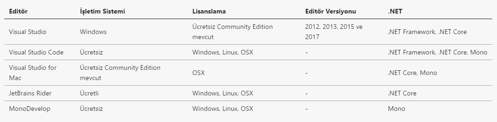

>İşletim sistemi bazında F# derleyicisi, .NET ve editör kurulumu ayrıntılarına fsharp.org web sistesindeki **Use** linkini kullanarak ulaşabilirsiniz.

>**İPUCU**
>
>Kitaptaki örneklerin çoğunu herhangi bir kurulum yapmadan (glot.io)[https://glot.io/new/fsharp] web sistesini kullanarak online olarak çalıştırabilirsiniz.


F# geliştirme bileşenleri açık kaynaklıdır ve bağımsız geliştirici topluluğu tarafından desteklenir. Ancak, Microsoft Windows üzerinde Visual Studio ile birlikte gelen F# derleyicisini ve etkileşimli ortamını açık kaynak araçlardan farklı ve ayrı bir paket olarak dağıtır. 

Her iki dağıtım da ücretsizdir ve komut satırında kullanılan derleyici ve yorumlayıcı komut isimleri dışında iki dağıtım arasında bizi etkileyecek ciddi bir fark yoktur. 

* Windows üzerindeki Microsoft dağıtımında derleyici komutu **fsc** etkileşimli ortam komutu ise **fsi**'dir
* Linux ve OSX üzerindeki açık kaynak F# araçlarının derleyici komutu **fsharpc** etkileşimli ortam komutu ise **fsharpi**'dir  


## 2.6 Merhaba F#

Örnek projemiz için aşağıdaki kurulumların yapılması gerekiyor. 

* [.NET Core](https://www.microsoft.com/net/download/core)
* [Visual Studio Code](https://code.visualstudio.com/download)

Visual Studio Code kurulumu tamamlayıp editörü açtıktan sonra **Ctrl+P** (OSX Cmd+P) kısayol tuş kombinasyonuna basıp **ext install Ionide-fsharp** komutu ile yardımcı bir araç olan Ionide'ın kurulumunu da yapmalısınız.


**Adım-1:** .NET Core kurulumunuzu kontrol etmek için komut satırı veya terminalde aşağıdaki komutu çalıştırın. Bu komut ekranına **2.0.0** benzeri bir versiyon değer yazdırmalı 
```bash
$ dotnet --version
```

**Adım-2:** Komut satırında proje'yi kaydedeceğiniz klasöre konumlanıp aşağıdaki komutu çalıştırın. Bu komut yeni bir F# projesi oluşturur.  

```bash
$ dotnet new console -lang F# -o Merhaba
```

Komutun çalışması bittikten sonra proje klasörünün altında **Merhaba** isimli yeni bir klasör oluşturulur. **Merhaba** isimli klasörün altında aşağıdaki dosya ve klasörleri göreceksiniz.

* **Merhaba.fsproj**, proje tanım dosyası
* **Program.fs**, konsol programımızın kodunun yer alacağı dosya
* **obj**, F# derleyicisinin oluşturduğu ara klasör
* **bin**, derleme sonrası konsol uygulamasının yer alacağı klasör (bu klasör ilk derlemeden sonra oluşacak)

**Adım-3:** Aşağıdaki **build** komut ile projemizi derleyip sonra da **run** komutu ile konsol uygulamamızı çalıştırıalım

```bash
$ dotnet build
```
```bash
$ dotnet run
```

**Adım-4:** Gelin şimdi örnek uygulamamızda Visual Studio Code kullanarak kod değişikliklerimizi yapalım. Bunun için Visual Studio Code editörünü açıp **File -> Open Folder** menüsünden proje klasörünüzü (Merhaba) seçin

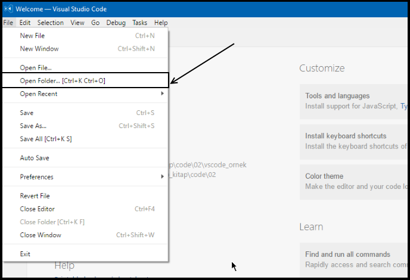

**Adım-5:** Proje klasörünüzü açtıktan sonra **Merhaba** klasörü altında **.vscode** isimli yeni bir klasör ve bunun altında da **launch.json** ve **tasks.json** isimli iki dosya ekleyin. 

**launch.json** dosyasının içeriğini aşağıdaki gibi oluşturun.

```json
/* launch.json */

{
    "version": "0.2.0",
    "configurations": [
        {
            "name": ".NET Core Launch (console)",
            "type": "coreclr",
            "request": "launch",
            "preLaunchTask": "build",
            "program": "${workspaceRoot}/bin/Debug/<insert-target-framework-here>/<insert-project-name-here>.dll",
            "args": [],
            "cwd": "${workspaceRoot}",
            "stopAtEntry": false,
            "console": "internalConsole"
        }
    ]
}
```
Bu dosyadaki 
* **\<insert-target-framework-here\>** ibaresini silip yerine **netcoreapp2.0** yazın
* **\<insert-project-name-here\>** ibaresini silip yerine **Merhaba** yazın

**tasks.json** dosyasının içeriğini de aşağıdaki gibi oluşturun
```json
{
    /* tasks.json */
    "version": "2.0.0",
    "tasks": [
        {
            "taskName": "build",
            "command": "dotnet build",
            "type": "shell",
            "group": "build",
            "presentation": {
                "reveal": "silent"
            },
            "problemMatcher": "$msCompile"
        }
    ]
}
```

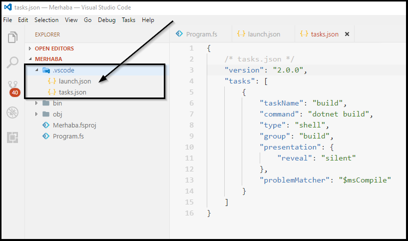


**Adım-6:** Visual Studio Code'da **F5** kısayol tuşuna basarak kodumuzu Debug modunda derleyip çalıştıralım. **DEBUG CONSOLE** panelinde **Hello world from F#** mesajını görebilirsiniz.

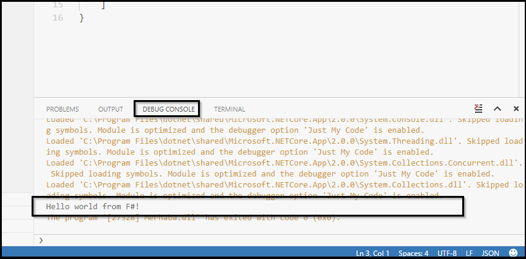

**Adım-7:** Konsol uygulaması projesine **Utils.fs** isimli yeni bir dosya ekleyip içeriğini de aşağıdaki gibi oluşturun

```fsharp
(* \code\02\vscode_ornek\Merhaba\Utils.fs *)

namespace Utils
    module Matematik = 
        // Kare fonksiyonu
        let kare x = x * x
        //Küp fonksiyonu
        let küp x = (kare x) * x
```

**Adım-8:** Utils.fs dosyasını oluşturduktan sonra üstüne çift tıklayarak açın ve **F1** kısayol tuşuna basın. Açılan alanda **F#** yazarak gelen listeden **"Add Current File to Project"** seçeneğini seçin. Utils.fs dosyasını projeye ekledikten sonra **F1** kısayol tuşu ile açılan alana tekrar **F#** yazarak gelen listeden **"Move File Up"** seçeneğini seçin.

**Adım-9:** Program.fs dosyasının içeriğini aşağıaki gibi değiştirip **Ctrl+Shift+B** (OSX'de Cmd+Shift+B) ile konsol uygulamanızı derleyin. 

```fsharp
(* \code\02\vscode_ornek\Merhaba\Program.fs *)

open System
open Utils

[<EntryPoint>]
let main argv =
    printfn "F# ile merhaba dünya"
    printfn "3'ün karesi %d" (Matematik.kare 3)
    printfn "3'ün küpü  %d" (Matematik.küp 3)
    
    0 // çıkış kodu
```

**Adım-10:** Komut satırına geçip **run** komutu ile uygulamayı çalıştırın
```bash
$ dotnet run
```
Ekran çıktısı aşağıdaki gibi olacaktır.
```bash
F# ile merhaba dünya!

C:\personalgit\fsharp_kitap\code\02\vscode_ornek\Merhaba>dotnet run
F# ile merhaba dünya
3'ün karesi 9
3'ün küpü  27
```

**Adım-11:** Konsol uygulamasının EXE dosyasını oluşturmak **Merhaba.fsproj** dosyasını açıp içeriğini aşağıdaki gibi değiştirmelisiniz.

```xml
<Project Sdk="Microsoft.NET.Sdk">
  <PropertyGroup>
    <OutputType>Exe</OutputType>
    <TargetFramework>netcoreapp2.0</TargetFramework>
    
    <!-- EXE oluşturmak için eklenen değerler -->
    <RuntimeIdentifier>win10-x64</RuntimeIdentifier>
    <RuntimeIdentifier>win7-x64</RuntimeIdentifier>
  
  </PropertyGroup>
  <ItemGroup>
    <Compile Include="Utils.fs" />
    <Compile Include="Program.fs" />
  </ItemGroup>
</Project>
```

**Adım-12:** Komut satırında **publish** komutunu çalıştırın.
```bash
$ dotnet publish -c Release
```

# 3.Bölüm : F# Temelleri
Bu bölümde önce F#'ın söz dizimi kurallarını formel olarak inceleyeceğiz. Daha sonra basit (int,string,bool) ve temel veri tiplerini (değer grubu, unit, listeler, diziler) ele alıp F#'ın yapı taşları olan fonksiyonların ayrıntılarına bakacağız. Son olarak kod organizasyonu ipuçları ile bölümü tamamlayacağız.

## 3.1 Söz dizimi kuralları
F#, göze hoş gelen, okunması kolay ve kodun çalışmasına doğrudan etkisi olmayan fazlalıklardan arındırılmış bir söz dizimine sahiptir. F# söz dizimi sade olmakla birlikte oldukça şıktır ve farklı dil yapılarını güzel bir şekilde ifade etmenizi sağlar. 

Gelin şimdi F# söz diziminin temelini oluşturan kavram ve kuralları inceleyelim

### Girinti Kullanımı (Indentation)
F#'da kod blokları, ya da daha doğru tabirle kod alanları (scope), girintiler (indentation) ile birbirinden ayrılır. Girintiler her zaman 4 karakter uzunluğundaki boşluklar ile verilmeli. Girintileri oluşturmak için TAB özel karekteri kullanılmaz. Ancak, tüm kod editörleri TAB tuşuna basınca TAB karakteri yerine belirli sayıda boşluk karakteri basacak şekilde ayarlanabilir, bu nedenle pratikte TAB tuşunu kullanmanızın önünde bir engel yoktur.

C,C++,C#,Java ve JavaScript gibi dillerde kod alanlarını belirlemek için süslü parantez olarak adlanrılılan {} karakter çifti kullanılırken F#'da özel bir karakter veya karakter çifti kullanımına gerek duyulmuyor. Kod alanlarının hangi satırda başlayıp hangi satırda bittiği girintiler ile belirlendiği için bitiş işaretçisi olarak noktalı virgül (;) veya farklı karakterler kullanılmaz.

```fsharp
(* 03_1_01.0.fsx*)

let sayı = 42

// Modül tanımı
module Modül1 = 
    // Aşağıdaki satırlar girinti verildiği için Modül1 alanına aittir
    let sayı' = 43
    let kırkÜçEkle x = sayı' + x

// Aşağıdaki satırda girinti yok o nedenle Modül1 ile aynı alana yani Global alana ait
let sayı'' = 44

// Modül1 alan adı ekleyerek kırkÜçEkle fonksiyonunu Global kod alanından kullanabiliriz
Modül1.kırkÜçEkle 44

// Global kod alanında fonksiyon tanımı
let birArttırVeKaresiniAl x =
    // Aşağıdaki satırlar girinti verildiği için birArttırVeKaresiniAl alanına aittir
    let t = x + 1
    t * t

// sayı'' değeri birArttırVeKaresiniAl fonksiyonu ile aynı yani Global kod alanında
birArttırVeKaresiniAl sayı''

// Global kod alanında fonksiyon tanımı
let çiftMiTekMi x = 
    // Fonksiyonun kod alanı içinde tanımlı kod
    if x % 2 = 0 then
        // If koşulu kod alanı
        true
    else
        // Else koşulu kod alanı
        false


// Yeni bir modül tanımı
module Modül2 = 
    // Modül alanı başlangıcı
    let çiftMiTekMi x = 
        // Fonksiyon alanı başlangıcı
        match x with
        // match alanı başlangıcı
        | a when a % 2 = 0 -> 
            // Koşul kod alanı 
            "Çift"
        | _ -> 
            // Koşul kod alanı
            "Tek"

// Müdül2 kod alanındaki çiftMiTekMi fonksiyon çağırısı
Modül2.çiftMiTekMi 12

// Global kod alanındaki çiftMiTekMi fonksiyon çağırısı
çiftMiTekMi 12

```

F#'da modül alan adları **ModüleAdı.** şeklinde kullanılarak modül içindeki değerlere ve fonksiyonlara erişilebilir. Aynı kod alanına ait ifadeler kendi yerel kod alanlarından bir üst seviyedeki (dışındaki) kod alanlarından ifadeleri kullanabilir.

```fsharp
(* 03_1_01.1fsx *)
// Global alanda tanımlı değer
let kırkİki = 42
 
// Global alanda tanımlı fonksiyon
let kırkİkiEkle x =
    // Global alandaki kırkİki değerii fonksiyon içinden kullanabiliriz
    kırkİki + x

// Modül tanımı
module Modül1 = 
    // bir değeri Modül1 kod alanında
    let bir = 1


// Modül1 alan adında yer alan bir değerine Modül1.bir şeklinde erişebiliriz
kırkİkiEkle Modül1.bir
```

### "let" Anahtar Kelimesi
F# fonksiyonel bir dil olduğu için **değişken**, **değişken tanımlama** ve **değişkenin değerini değiştirme** gibi kavramlar kullanılmaz. Tüm fonksiyonel dillerde olduğu gibi F#'ın dil yapısı **ifade** (expression) denilen kavram üzerine inşaa edilmiştir. İfadelerin değerleri değişkenlerde olduğu gibi program akışı sırasında değiştirilemez.

**"let"** anahtar kelimesi F#'da isimlendirilmiş değer ifadelerinin ve fonksiyonların (ki onlar da birer ifadedir) tanımlanması için kullanılır. Genel yapısı şöyledir

```fsharp

// Basit değer ifadesi (tek satır)
let değerAdı = değer

// Basit değer ifadesi (çoklu satır)
let değerAdı =
    değer

// Fonksiyon (tek satır)
let fonksiyonAdı girdi1 .... girdiN = fonksiyon kodu

// Fonksiyon (çoklu satır)
let fonksiyonAdı girdi1 .... girdiN =
    fonksiyon kodu

```
Şimdi gelin yukarıdaki kurallara göre **let** kullanarak bazı değer ifadeleri tanımlayalım

```fsharp
(* 03_1_01.fsx *)

// Basit değer ifadesi tanımlama
let sayı = 12
let metin = "F# ile fonksiyonel programlama"
let pi = 3.14
let cevap = true

// Tek satırda birden fazla değer ifadesi tanımlama
let a,b,c = 1,2,3

// Daha karmaşık değer grubu tipinden değerler de tanımlanabilir
let x,y,z = (42,"F# ile Fonksiyonel Programlama", 3.14)

// Fonksiyon tanımlama
let küp x = x * x * x

// Öz yinelemeli fonksiyon tanımlama
let rec fib n = if n <= 1 then n else fib(n - 1) + fib(n - 2)

```

"let" anahtar kelimesi ifadelere değerlerinin bağlanmasını (binding) sağlar, bu nedenle diğer dillerdeki gibi klasik anlamda bir atama imkanı sağlamaz. Basit değer ifadelerine bağlanan değer genelde int, string, bool gibi basit veri tipleridir. Fonksiyon ifadeleri için ise bağlanan değerler fonksiyonun kodunu oluşturan alt ifadelerdir.

"let" ile tanımlanan basit veya fonksiyon ifadelerinin mutlaka ama mutlaka bir değer olmalıdır.

```fsharp
// Hata! Herhangi bir değer bağlanmamış
let sayı

//Doğru
let sayı = 42

// Hata! Herhangi bir fonksiyon ifadesi bağlanmamış
let fonksiyon girdi 

// Doğru
let fonksiyon girdi = girdi + 1
```

"let" anahtar kelimesi modül seviyesinde, sınıf seviyesinde veya fonksiyon tanımı içinde kullanılabilir. İfadeler, tanımlandıkları satırdan sonra aynı kod alanı (scope) içinden (modül, sınıf veya fonksiyon tanımı içinden) veya alt kod alanları içinden kullanılabilir. 

```fsharp
(* 03_1_02.fsx *)

// Global alanda (Program) let ile değer tanımlama
let globalSayı = 42

// Global alanda (Program) let ile fonksiyon tanımlama
let kare x = x * x 

// Modül tanımı
module Modül1 =
    // Modül alanı içinde basit değer tanımlama
    let modülSayısı = 43

    // Modül alanı içinde fonksiyon tanımlama
    let kök x = (kare x) * x


// Fonksiyon alanında yerel değer ifadeleri tanımlama
let yerDeğiştir x y = 
    let ix = y
    let iy = x
    (ix,iy) // Değer grubu tipinden fonksiyon çıktısı


(* --- Kurgumuzu test edelim --- *)  

kare globalSayı

// modülSayısı global alandan erişilebilir değil
//kare modülSayısı

// modülSayısı değerine Modül1 alan adı eklenerek erişebiliriz
kare Modül1.modülSayısı

// Modül1 içindeki kök fonksiyonuna Modül1 alan adı eklenerek global alandan erişebiliriz
Modül1.kök 12

// yerDeğiştir fonksiyonu çağırısı
yerDeğiştir 1 2

// Hata! yerDeğiştir yerel alanında tanımlı ix ve iy sadece fonksiyon içinde erişelebilir
//let tx, ty = ix,iy
```
### "do" anahtar kelimesi

"do" anahtar kelimesi kullanılarak değer ifadesi veya fonksiyon tanımı olmasına ihtiyaç duyulmadan kod çalıştırılabilir. Program başlangıcında, modül tanımı başında veya sınıf tanımı içinde fonksiyon çağırısı yapılmadan otomatik çalışması istenen kod blokları "do" anahtar kelimesi kullanılarak çalıştırılabilir.

```fsharp
(* 03_1_03.fsx *)

do printfn "Program çalışmaya başladı"

// .... Program kodunuz
let kare x = x * x
printfn "2'nin karesi = %d" (kare 2)


module Modül1 =
    printfn "Modül çalışmaya baladı"
    let kare x = x * x
    printfn "Modül çalışması tamamlandı"

do printfn "Program sonlandı"
```   

"do" kullanımı opsiyoneldir. Örneğimizdeki Modül1 içinde **do printfn** şeklinde yazılan ifadelerinin başındaki "do" kaldırılsa bile **prinfn** çağırısı çalıştırılır. 

"do" kullanımı ile ilgili en önemli kısıtlama "do" sonrasında yazılan ifadenin dönüş değerinin **unit** tipinden olması zorunluluğudur. **unit** tipi F#'da özel bir tiptir ve **hiç birşey** anlamına gelir. Dolayısıyla, **do** ile başlayan ifadeler bir sonuç üretmemelidir.

> **BİLGİ**
>
> **unit** tipini C,C++,Java ve C# dillerindeki **void** tipine benzediğini varsayabilirsiniz.

```fsharp
(* 03_1_04.fsx *)

// Hatalı kullanım
// 1 + 1 ifadesinin sonucu tam sayı tipinde ve 2
do 1 + 1 

// Doğru kullanım.
// 1+1 sonucu olan 2 değeri ignore fonksiyonuna iletilir ve ignore unit tipinde çıktı verir 
do (1 + 1) |> ignore
```

> **BİLGİ**
>
> **ignore** F# standard kütüphanesi ile gelen bir fonksiyondur. Tek bir giriş parametresi alır ve bu parametrenin tipi ne olursa olsun her zaman **unit** tipinden bir çıktı üretir.

### Yorum Satırları

F#'da tek satırlı veya çok satırlı yorumlar kodun içine iki şekilde eklenir 

* Tek satırlık yorumlarınız için // karakterlerini kullanabilirsiniz
* Birden fazla satırlık yorumlarınız için ise (* *) çiftini kullanabilirsiniz

// karakterleri sonrasında ve (* *) arasında yer alan ifadeler F# derleyicisi tarafından derlenmez ve dolayısıyla programınızın bir parçası olarak çalıştırılmaz

```fsharp
(* 03_1_05.fsx *)

// Tek satırlık yorum
// let x = 12

(*
    Çok satırlı
    yorum
*)

(*
    let kare x 
        x * x
*)
```

### Koşullu Derleme
Koşullu derleme, özellikle birden fazla platformu destekleyen veya versiyonlama anlamında geriye dönük uyumluluğun sağlanması ihtiyacı olan programlar için kullanılan bir yöntemdir. 

Örneğin;
* Aynı uygulamanın mobil ve masaüstü versiyonlarının tek bir kod havuzunda geliştirilmesi 
* Tek bir uygulamanın aynı işletim sisteminin farklı versiyonlarında farklı işletim sistemi kütüphaneleri kullanması  

gibi durumlarda derleyiciye ipucu vermek için kod içinde koşullu derleme yapıları kullanılır. F#'da koşullu derleme için **#if #else #endif** derleyici makroları kullanılır.

```fsharp
(* 03_1_06.fsx *)

//------ ÖRNEK 1 ------//
#if v1
// v1 koşulunda çalışması istenen kod parçası
let kare x = x * x

#else 
// v1 koşulu haricinde çalışması istenen kod parçası
let kare x = sprintf "Kare %d" x

#endif

// v1 ortam değişkeni tanımlı olmadığı için çıktı "Kare 4" olacaktır
kare 2

//------ ÖRNEK 2 ------//

let osx = true
#if osx
// osx koşulunda çalışması istenen kod parçası
let ortam() = "OSX"

#else 
// osx koşulu haricinde çalışması istenen kod parçası
let ortam() = "OSX DEĞİL"

#endif

// osx değeri tanımlı ancak yine de çıktı "OSX DEĞİL" olacaktır
// Ortam değişkenlerini kodunuz içinde tanımlayamazsınız!
ortam()
```

Koşullu derleme ifadelerinin sınaması program derleme anında **ortam değişkenleri** kullanılarak yapılır ve değişken değeri derleyiciye parametre olarak sağlanır. Koşullu derleme kod çalıştığı sırada gerçekleşmez. Bu nedenle, ortam değişkenlerinin adı ile kod içinde tanımlanan sıradan değişkenler kullanılarak çalışma anında koşul sınaması yapılamaz.

F# derleyicisi ve F# interaktif için ortam değişkenlerini **--define** seçeneği ile aşağıdaki gibi tanımlayabilirsiniz.

* **fsharpc --define v1** 
* **fsharpi --define osx** 

### Tanımlayıcı ve Anahtar Kelimeler
Değer ifadeleri tanımlarken kullandığımız ifade isimlerini **tanımlayıcılar**, F#'in dili içinde tanımlı özel tanımlayıcılara da **anahtar kelimeler** diyoruz. 

```fsharp
(* 03_1_07.fsx *)

// sayı bir tanımlayıcı
// let ise anahtar bir kelime
let sayı = 42

```
F#'da anahtar kelimeler dışındaki tanımlayıcıları oluştururken aşağıdaki kurallara uyulmalıdır 

* Sadece herhangi bir **harf** veya **_** ile başlayabilir.
* **0-9 arasında** sayısal karakterler ile başlayamaz.
* Harfler, sayılar, **_** ,**'** karakterleri içerebilir.
* **Boşluk** (whitespace) veya **-** (tire) karakterini içeremez. Bu karakterler kullanılmak istenirse tanımlayıcı **\`\` \`\`** (iki ters kesme çifti) arasında yazılır.
* **\`\` \`\`** oluşturulan tanımlayıcı adında **TAB**, **satır başı** (New Line) veya **\`\`** (çift ters tırnak) karakterleri kullanılmaz.
* Tip isimleri, bileşim etiketleri (discriminated union), modül isimleri veya kod alanı (namespace) isimlerinde **'.'**, **'+'**, **'$'**, **'&'**, **'['**, **']'**, **'/'**, **'\\'**, **'*'***, **'\"'**, **'`' (ters tek tırnak)** karakterleri kullanılamaz.
* F#  anahtar kelimeleri **\`\` \`\`** çifti içinde tanımlayıcı olarak kullanılabilir, bunun dışında anahtar kelimeler tanımlayıcı olarak kullanılamaz. 


```fsharp
(* 03_1_08.fsx *)

// Doğru kullanım
let sayı = 42
//let -sayı = 42 // Hatalı

let _sayı = 42
//let 42sayısı = 42 // Hatalı

let mucize_sayı = 42
//let mucize-sayı = 42 // Hatalı

let kare x = x * x
//let -kare x = x * x // Hatalı

let _kare x = x * x
//let 42çarpıKare x = 42 * (x * x) // Hatalı

let kare_fonk x = x * x
//let kare-alma x = x * x // Hatalı

// Anahtar kelimenin tanımlayıcı olarak kullanımı
let ``let``= "Let ifadesi"
//let let = "Let ifadesi" // Hatalı

// Boşluklu tanımlayıcı ismi
let ``iki ile topla`` x = x + 2
//let iki ile topla x = x + 2 // Hatalı

//UTF-8 karakterlerin kullanımı
let çığırAçanSayı = 42
let π = 3.14
let cliché = "Klişe"

// f fonksiyonu
let f (x:float) = 2.0 * x + 4.0

// f' fonksiyonu, f fonksiyonun tersi
let f' (x:float) = 0.5 * x - 2.0
```

> **DİKKAT!**
> 
> F# derleyicisi kod dosyalarının karakter kodlamasının (encoding) UTF-8 olduğunu varsayar. 


> **Anahtar Kelimeler (4.1 versiyonu itibariyle)**
> 
>abstract and as assert base begin class default delegate do
done downcast downto elif else end exception extern false finally
for fun function global if in inherit inline interface internal
lazy let match member module mutable namespace new null of open or override private public rec return sig static struct then to true try type upcast use val void when while with yield

> **Rezerve Edilmiş Anahtar Kelimeler**
>
>*Gelecekte kullanılmak üzere aşağıdaki anahtar kelimeler F# tarafından rezerve edilmiştir. Bu anahtar kelimeler de ifadelerde tanımlayıcı olarak kullanılamaz*
>
> atomic break checked component const constraint constructor
continue eager fixed fori functor include measure method mixin object parallel params process protected pure recursive sealed tailcall trait virtual volatile


Tüm F# anahtar kelimelerini ve sembollerinin "Ek-1: Anahtar Kelimeler" ve "Ek-2 : Semboller" bölümünde bulabilirsiniz

### Shebang 
Kod veya script dosyalarının başında **#!** ile başlayan ve **shebang** (okunuşu şibenk) olarak adlandırılan özel bir karakter kombinasyonu kullanılabilir. Shebang ifadesi ile script dosyasındaki kodu çalıştırması istenen yorumlayıcı konumu tanımlanır. F# derleyicisi shebang satırlarını derlemez, bu satır Unix tabanlı işletim sistemlerinde **shell** tarafından yorumlanır.  

Örneğin F# script dosyanızın başına aşağıdaki shebang komutunu eklerseniz Unix,Linux ve OSX işletim sistemlerinde dosyanızı komut satırına yazar yazmaz F# yorumlayıcısı **fsharpi** dosyanızın içindeki kodu çalıştıracaktır. 

```fsharp
#!/bin/usr/env fsharpi --exec

(* 03_1_09.fsx *)
printfn "Merhaba Dünya!"
```

```bash
# Komut satırı
$ 03_1_09.fsx
```

## 3.2 Basit Veri Tipleri
Tüm programlama dillerinde herhangi bir verinin mutlaka bir tipi vardır. Sayı, metin, karakter ve evet/hayır şeklinde değer barındıran tiplere basit tipler denir. Programlama dilleri tasarımında tipler daha çok kavramsal büyüklükler olarak ele alınır ve asıl amaçları programlarımızdaki hataları derleme anında veya çalışma anında engellemektir. Tipler, program verisinin program akışı sırasında doğru kullanılmasını ve fonksiyonlar arasında veri aktarımının güvenli yapılmasını sağlar. Özetle; tipler ile ilgili tüm kaygı kavramsal seviyede veri dönüşümünün tutarlılığına odaklanmıştır.

F#'da basit tipler olarak adlandırdığımız 16 veri tipi vardır. F# bir .NET dili olduğu için tiplerden 15 tanesi doğrudan .NET tip sistemi tarafından tanımlanır.

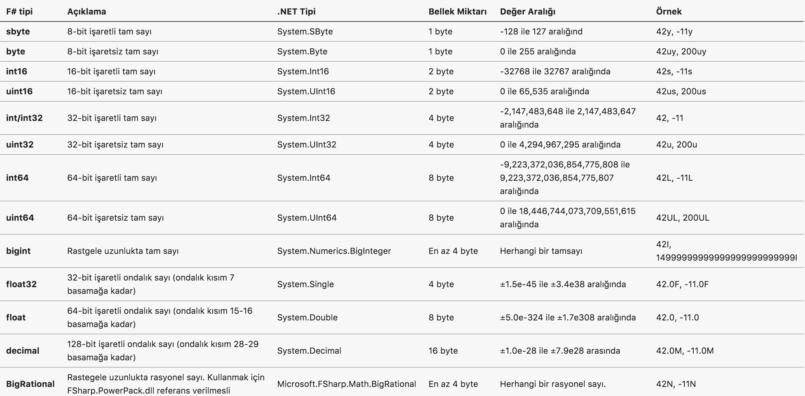


F#'da "let" ile basit değer ifadesi tanımlama formatı şöyledir

```
let <değer adı>:<değer tipi> = <değer>
````

```fsharp
let sayı:int = 42
let metin:string = "42"
```
Değer ifadelerinde tip kullanımı opsiyoneldir. Yukarıdaki ifadeler aşağıdaki gibi de yazılabilir, bu durumda F# **tip çıkarsama** (type inference) ile ifadeye verilen değerin tipini otomatik olarak çıkarsar.

```fsharp
let sayı  = 42 // sayı değer ifadesinin tipi int olarak çıkarsanır

let metin = "42" // metin değer ifadesini tipi string olarak çıkarsanır
```

Fonksiyon tanımlarında girdi parametrelerinin ve dönüş değerinin tipi aşağıdaki şablona göre yapılır.

```
let <fonksiyon adı> (girdi1:<girdi1 tipi>) (girdi2: <girdi2 tipi>): <sonuç tipi> = <fonksiyon kodu>
```

```fsharp
let topla (x:int) (y:int): string = 
    sprintf "%d + %d = %d" x y (x+y)

topla 42 0
```

Fonskiyon girdi parametrelerinin veya dönüş değerinin tipinin tanımlanması opsiyoneldir. Tipler kullanılmadan yukarıdaki örnek aşağıdaki gibi de yazılabilir, bu durumda F# **tip çıkarsama** ile doğru tipleri çıkarsar.

```fsharp
let topla x y = 
    sprintf "%d + %d = %d" x y (x+y)

let topla' (x:int) y = 
    sprintf "%d + %d = %d" x y (x+y)

let topla'' x (y:int) = 
    sprintf "%d + %d = %d" x y (x+y)

let topla''' x y : string = 
    sprintf "%d + %d = %d" x y (x+y)

topla 42 0
topla' 42 0
topla'' 42 0
topla'' 42 0
```

> **DİKKAT!**
>
>Fonksiyon girdi paremetrelerinin tanımında tipleri de tanımlamak isterseniz parametreleri **çift parantez ()** içine almalısınız. Çift parantez kullanmadan tipleri tanımlarsanız F# derleyicisi tanımınızı farklı bir şekilde yorumlayabilir. 

> **İPUCU**
>
>Özellikle basit değer ve fonksiyon ifadesi tanımlarıda değer tiplerini kullanmamanız tavsiye ediyoruz.

F#'da sayısal değer alan ifadeler 2'lik (binary), 8'lik (octal) ve 16'lık (hexadecimal) sayı tabanlarını kullanılarak da tanımlanabilir. 

```fsharp
// 2'lik (binary) ifade formatı
let değer_ifades = 0b[0 veya 1]

// 8'lik (ocatl) ifade formatı
let değer_ifades = 0o[0..7]

// 16'lık (hexadecimal) ifade formatı
let değer_ifadesi_adı = 0x[0..1 A..F]
```

```fsharp
(* 03_2_02.fsx *)

// 2'lik (binary) olarak 29
let ikilik = 0b11101

// 8'lik (ocatl) olarak 29
let değer_ifades = 0o35

// 16'lık (hexadecimal) olarak 29
let değer_ifadesi_adı = 0x1D
```

### Artimetik İşlemler
F#'da yer alan 16 basit veri tipinden 9'u sayısal değerleri tarif etmek için kullanılan tiplerdir. Bu sayısal veri tiplerini ve aşağıdaki artimetik operatörleri kullanarak F# ile aritmetik işlemler yapabilirsiniz.


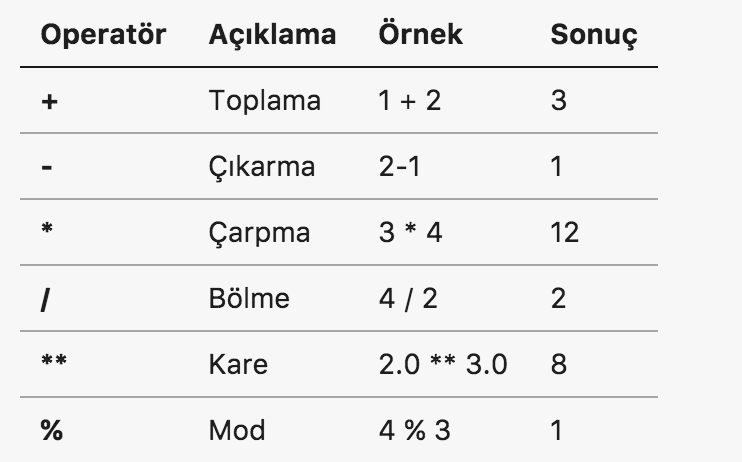


Artimetik operatörler ile işlem yapılırken değer aşımı durumu F# tarafından kontrol edilmez, bu nedenle herhangi bir hata almazsınız. Değer aşımı durumunu şöyle tanımlayabiliriz; örneğin 127y değerine sahip 8-bit işaretli bir tam sayıya 1y eklediğinizde 8-bit işaretli tam sayılar aralığında pozitif üst limit 127y olduğu için sonuç 128y olamaz. Üst limit aşımında sonuç negatif olacak alt limit aşımında ise sonuç pozitif olacaktır. Değer aşımı sadece toplama ve çıkarma işlemleri için diğer artimetik işlemler için de geçerlidir.

Bu durum sayıların 2'li sayı sistemindeki ifade şeklie ve 2'li sayı sistemi aritmetiğinin doğal sonucudur. Şöyle ki; 8-bit işaretli tam sayılar 2'li sayı sisteminde 8 bit ile temsil edilirler. Ancak bu 8 bit'den en soldaki 1. bit işaret bitidir. Pozitif sayılar için bu işaret bitinin değeri 0, negatif sayılar için de 1 olmalıdır. Buna göre

* 127y  = 01111111, soldan ilk bit 0 
* -128y = 10000000, soldan ilk bit 1

Aşağıda bu sonucun nasıl oluştuğu basit artimetik adımları şeklinde verilmektedir

```
2'li sayı sistemi aritmetiğinde    1 + 1 = 2  -> sonuç 0 elde var 1
10'lu sayı sistemi aritmetiğinde   1 + 9 = 10 -> sonuç 0 elde var 1

## Pozitif yönde aşım
 127y = 01111111
 1y   = 00000001
+ ----------------
        10000000  -> -128

## Negatif yönde aşım
-128y = 10000000
-1y   = 11111111
+ ----------------
        01111111 -> 127 

En soldaki 1 + 1 = 0 elde var 1 ancak temsil 8 bit ile yapıldığı için eldeyi daha solda aktarabileceğimiz basamak kalmaz, bu nedenle elde değeri göz ardı edilir

```

```fsharp
(* 03_2_03.fsx *)

// 8-bit işretli tam sayı -128 ile 127 aralığında değer alabilir
let sonuç1 = 127y + 1y // Sonuç -128y
let sonuç2 = -128y + (-1y) // Sonuç 127y


// 32 bit işaretli tam sayı -32768 ile 32767 aralığında değer alabilir
let sonuç3 = 32767s + 1s // Sonuç -32768s
let sonuç4 = -32768s + (-1s) // Sonuç 32767s

// Çarpma işleminde aşım 
let sonuç5 = -128y * 3y // Sonuç -128y

// 2'li sayı düzeninde ifadeler ve aşım
let a = 0b01111111y // 127y
let b = 0b00000001y // 1y
let sonuç6 = a + b  // -128y

let a' = 0b10000000y // -128y
let b' = 0b11111111y // -1y
let sonuç7 = a' + b' // 127y 
```

Toplama, çıkarma, çarpma, bölme, kare alma ve mod alma operatörlerine ilave olarak F# standard kütüphanesinde matematiksel işlemlerde kullanabileceğiniz aşağıdaki fonksiyonlar da yer alır

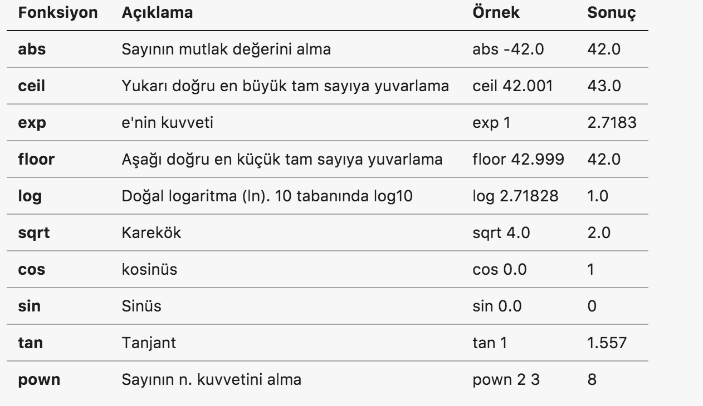

> **İPUCU**
>
>Daha gelişkin matemtiksel fonksiyonlara ihtiyacınız varsa .NET platformu için açık kaynaklı olarak geliştirilen ve F# ile de kullanabileceğiniz [Math.NET](https://numerics.mathdotnet.com) kütüphanesine göz atabilirsiniz.

### Tipler Arası Dönüşüm
F# güvenli tipli (safe type) bir dildir, bunun bir sonucu olarak 

* Her değerin tipi doğrudan veya tip çıkarsama ile derleme anından bilinmelidir
* Tipler arasındaki dönüşümler açık açık belirtilmelidir

Diğer bazı dillerde olduğu gibi F# derleyicisi, formel olarak bazı koşullarda yapabilecek olsa bile, derleme anında basit veri tipleri arasında otomatik dönüşüm yapmaz. Örneğin 32 bit işaretli bir tam sayıyı girdi olarak alan bir fonksiyona 8 bit işaretli bir tam sayıyı girdi olarak doğrudan göndermezsiniz.

```fsharp
(* 03_2_04.fsx *)

let kare x = x * x 
let sayı = 2y

// Aşağıdaki kullanım hatalı
// F# tip çıkarsama mekanizması kare fonksiyonun girdi olarak 32 bit 
// işaretli tam sayı beklediğini çıkarsadı
//let sonuç = kare sayı

// Doğru kullanım
let doğruSayı  = 2 // Tip çıkarsama doğruSayı değerinin tipini int olarak çıkarsadı
let sonuç = kare doğruSayı

// Fonksiyon girdi parametresinin tipini doğrudan tanımlayarak alternatif yaklaşım
let kare' (x:sbyte) = x * x
let sonuç' = kare' sayı 

// 8 bit işaretli sayısı 32 bit işaretli sayıya çevirerek kullanım
let sonuç'' = kare (int sayı)


// 64 bit işaretli tam sayı
let büyükSayı = System.Int64.MaxValue - 1L // 9223372036854775806L

// 32 bit işaretli tam sayıya çevirmek istediğimizde değer aşımı meydana gelir
let intSayı = int büyükSayı // -2
```


F# basit veri tipleri arasındaki dönüşüm işlemlerini sizin kodlamanızı bekler. Tip dönüşümü yaparken, özellikle sayısal tipler için, bölümün başındaki tabloda verilen değer aralıklarını kontrol etmelisiniz. Kaynak tip ile hedef tip aralıkları uyumlu değilse kaynak tipteki bir değer hedef tipteki geçerli aralığın dışında kalabilir. Değer uyumsuzluğu durumunda ise değer aşımı oluşur.

Aşağıdaki tabloda basit tipler arasındaki dönüşümler için kullanılan fonksiyonlara yer verilmiştir

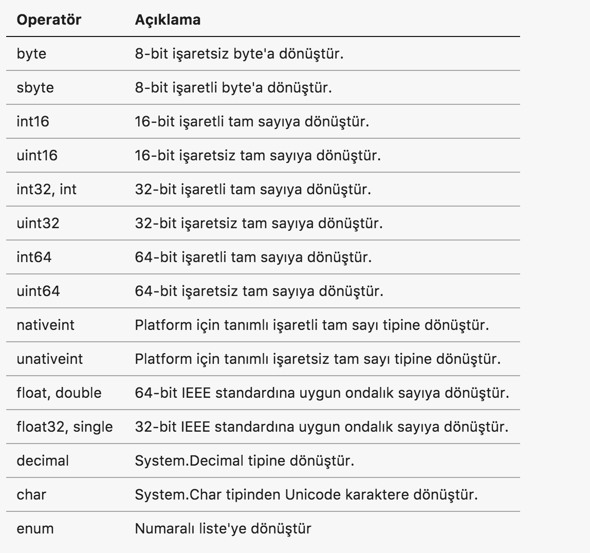

```fsharp
(* *3_2_4a.fsx *)

// işaretsiz byte
let sayı1= 42y

//işaretli byte
let sayı2 = byte sayı1

// 16-bit işaretli tam sayı
let sayı3 = int16 sayı1

// 16-bit işaretsiz tam sayı
let sayı4 = uint16 sayı1

// 32-bit işaretli tam sayı
let sayı5 = int sayı1

// 32-bit işaretli ondalık sayı
let sayı6 = float32 sayı1

// 64-bit işaretsiz ondalık sayı
let sayı7 = float sayı1

// Karakter sayısal koddan karakter elde etme
let char1 = char sayı1
```

> **İPUCU**
>
>Değer aşımlarının F# tarafından kontrol edilmesini ve aşım durumunda hata üretilmesini istiyorsanız F# standard kütüphanesinde yer alan **Checked** modülünü kullanmalısınız. Bu modülü kullanmak için kaynak kodu dosyanızın başında **open Checked** ifadesini yazmanız yeterlidir. Bu satırdan sonraki kod satırlarınız için F# **Checked** modülü içindeki artimetik operatör tip dönüşüm fonksiyonlarını kullanacaktır

```fsharp
(* 03_2_4b.fsx *)

open System

// İşaretsiz 16-bit tam sayı maksimum değeri 65,535
let işaretsiz_16_bit = UInt16.MaxValue

// İşaretli 16-bit tam sayıya dönüştürelim
// Değer aşımı nedeni ile sonuç -1s olacaktır.
// Çünkü, işaretsi 65,535 değeri işaretli tam sayı aralığı dışında
let işaretli_16_bit = int16 işaretsiz_16_bit

// Değer aşımlarında hata üretilmesi için Checked modülüne referans veriyoruz
open Checked

// Hata üretilir çünkü işaretsiz 65,535 değeri işaretli değer aralığının dışında
let işaretli_16_bit_checked = int16 işaretsiz_16_bit
```

### Karşılaştırma ve Eşitlik
Sayısal değerleri eşittir, eşit değildir, büyüktür, büyük eşittir,küçüktür ve küçük eşittir operatörleri ve **compare** standard kütüphane fonksiyonu ile karşılaştırabilirsiniz. Karşılaştırma operatörlerinin işlem sonucu her zaman **true** veya **false** mantıksal değerine eşittir. **compare** fonksiyonun dönüş değeri eşitlik durumunda 0, ilk girdi parametresi ikinciden küçük ise -1, ilk girdi parametresi ikinciden büyük ise 1 olur.

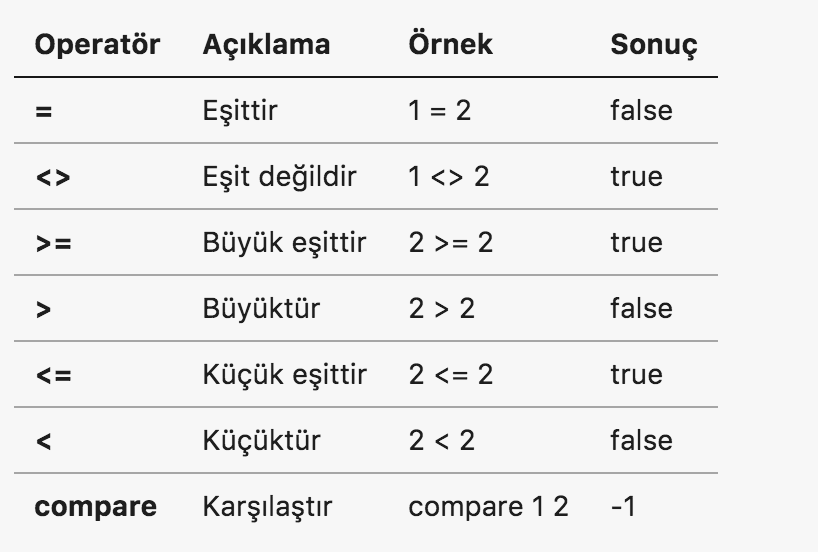

```fsharp
(* 03_2_4c.fsx *)

// Operatörler ile karşılaştırma
let kırkİkiİleKarşılaştır x = 
    if x > 42 then 
        printfn " %d > 42" x
    else if x < 42 then
        printfn " %d < 42" x 
    else 
        printfn " %d = 42" x 
    
    
// compare fonksiyonu ile karşılaştırma
let kırkİkiİleKarşılaştır' x = 
    let sonuç = compare x 42

    if sonuç = 0 then
        printfn " %d = 42" x
    else if sonuç = 1 then
        printfn " %d > 42" x
    else
        printfn " %d < 42" x

kırkİkiİleKarşılaştır 43
kırkİkiİleKarşılaştır 41
kırkİkiİleKarşılaştır 42

kırkİkiİleKarşılaştır' 43
kırkİkiİleKarşılaştır' 41
kırkİkiİleKarşılaştır' 42
```

### Bit Manipülasyonu

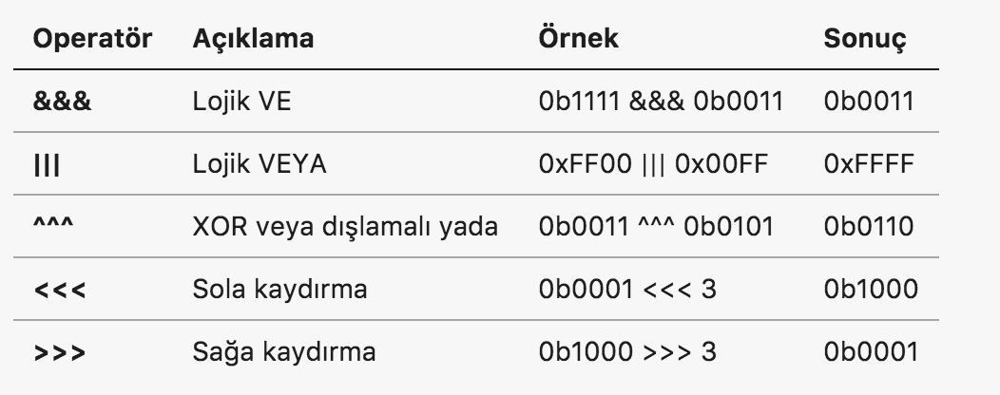

```fsharp
(* 03_2_4d.fsx *)

// VE
let sonuç1 = 0b1111 &&& 0b0011

// VEYA
let sonuç2 = 0xFF00 ||| 0xFFFF

// XOR
let sonuç3 = 0b0011 ^^^ 0b0101

// SOLA KAYDIR
let sonuç4 = 0b0001 <<< 3


// SAĞA KAYDIR
let sonuç5 = 0b1000 >>> 3

```

### Mantıksal/Lojik Değerler
F#'da mantıksal 1 ve 0 değerlerini tanımlamak için **bool** tipi kullanılır. Bool tipi **true** veya **false** şeklinde 1 bitlik iki değerden birini alabilir. Mantıksal **bool** tipindeki değerler ile VE, VEYA ve DEĞİL operatörleri kullanılarak **Bool Cebri** işlemleri yapılabilir.


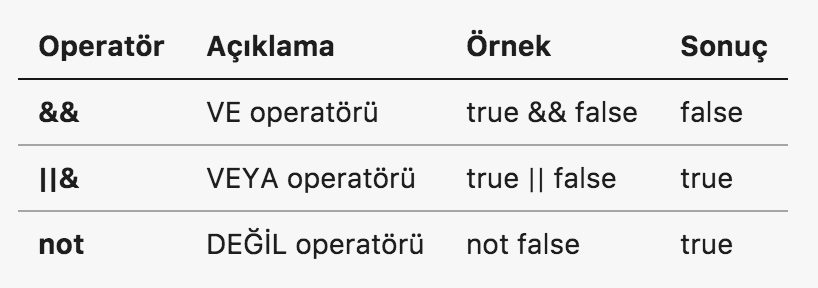

```fsharp
(* 03_2_4e.fsx *)

// VE
let ikisiDeKırkİkidenBüyük x y = (x > 42) && (y > 42)

// VEYA
let enAzBiriKırkİkidenBüyük x y = (x > 42) || (y > 42)

// DEĞİL
let ikisiDeKırkikidenBüyükDeğil x y = 
    not ( (x > 42) && (y > 42) )

ikisiDeKırkİkidenBüyük 43 44
ikisiDeKırkİkidenBüyük 42 43

enAzBiriKırkİkidenBüyük 40 43
enAzBiriKırkİkidenBüyük 40 41

ikisiDeKırkikidenBüyükDeğil 40 41
ikisiDeKırkikidenBüyükDeğil 43 44
```

> **POLEMİK**
>
>Bir teoriye göre evrendeki tüm karmaşık sistemler sadece lojik VE, VEYA ve DEĞİL basit devreleri kombine edilerek oluşturulabilir.

### Karakterler
F# karakter veri tipi desteği için .NET'in sağladığı imkanları kullanır. Karakterlerin tipi **char** olarak tanımlanır veya çıkarsanır. .NET'de karakterler 2 byte'lık unicode değerler olarak UTF-16 formatında ifade edilir. Basılabilir herhangi bir karakter tek tırnak çifti (**' '**) içinde yazılarak karakter değeri tanımlanır. Alternatif olarak tek tırnak çifti içine yazmak istediğiniz karakterin unicode kodunu yazarak da tanımlama yapılabilir.

>**İPUCU**
>
> Karakterlerin unicode ifadeleri ve UTF-8, UTF-16 ve UTF-32 gibi kodlama yöntemleri kitabın kapsamı dışında olduğu için bu konudaki ayrıntılara girmiyoruz. Ancak, isterseniz unicode karakter kodlarını https://unicode-table.com adresinden inceleyebilirsiniz.

```fsharp
(* 03_2_05.fsx *)

let üHarfi = 'ü'
let sesliHarfler = ['a';'e';'ı';'i';'o';'ö';'u';'ü']

// Unicode karakter kodları kullanımı
let üHarfiUnicode = '\u00FC'
let sesliHarflerUnicode = ['\u0061';'\u0065';'\u0131';'\u0069';'\u006F';'\u00F6';'\u0075';'\u00FC']
```
Alfabetik karakterler ilave olarak ASCII kod tablosunda kontrol karakteri olarak tanımlanan tab, yeni satır, satır başı gibi özel karakterler ile tek tırnak ('), çıft tırnak (") ve geri bölü (\) gibi F# dilinde özel anlamı olan karakterler de başlarına geri bölü (\) koyarak kullanılabilir.

```fsharp
(* 03_2_06.fsx *)
let tekTırnak = '\''
let çiftTırnak = '\"'
let geriBölü = '\\'
let tab = '\t'
let yeniSatır = '\n'
let satırBaşı = '\r'

printfn "tek tırnak %c, çift tırnak %c" tekTırnak çiftTırnak

// 'a' karakterinin sayısal unicode değeri 
// int dönüşüm fonksiyonu kullanılarak elde edilir
let a = int 'a'

// 'a' karakterinin 8 bitlik işaretsiz sayı karşılığı
// karakter tanımının sonuna B koyarak elde edilir
let bitmap = 'a'B
```

>**İPUCU**
>
> Bir karakterin sayısal karşılığını görmek için tip dönüşüm fonksiyonları kullanılabilir. Örneğin **let a = int 'a'** ifadesi ile "a" harfinin unicode kod tablosundaki sayısal karşılığı elde edilir. Ayrıca **let a = 'a'B** ifadesindeki gibi karakterin sonuna "B" tip tanımlayıcısını ekleyerek "a" harfinin 8 bit işaretsiz tam sayı karşılığı olan değeri bulabiliriz.


### Metinler
F#'da metin değerlerini ifade etmek için çift tırnak çiftini (**" "**) kullanırız. Metin değerlerinin tipi **string** olarak ifade edilir. Çift tırnak çifti arasına yazılan tüm karakterler bir metin oluşturur. .NET ve F#'da metinler için UTF-16 unicode kodlama yöntemini kullanılır. Metin oluşturmak için tüm alfabetik karakterler ve kontrol karakterleri kullanılabilir.

```fsharp
(* 03_2_07 *)

// Çift tırnak ile metin tanımlama, unicode ve kontrol karakterleri

let metin1 = "F# ile fonksiyonel programlama"

let metin2 = "ali özg\u00FCr" 
// Çıktı
// ali özgür

let metin3 = "\'Kitap Adı\' F# ile Fonksiyonel Programlama\n \"Yazar\" Ali Özgür"
// Çıktı
(*
'Kitap Adı' F# ile Fonksiyonel Programlama
 "Yazar" Ali Özgür
*)
```

Çift tırnak çiftine ilave olarak F#'da çift tırnak üçlüsü çifti (**""" """**) de metin değerleri tanımlamak için kullanılabilir. Bu alternatif kullanım sayesinde metin değerinin içindeki çift tırnak (") ve tek tırnak (') karakterleri geri bölü kullanmadan yazılabilir.

```fsharp
(* 03_2_07 *)

let metin4 = """ "Kitap Adı" F# ile fonksiyonel programlama, 'Yazar' Ali Özgür """
// Çıktı
// "Kitap Adı" F# ile fonksiyonel programlama, 'Yazar' Ali Özgür 
```

Çok uzun metinler tek satıra yazmak yerine birden fazla satır kullanarak da tanımlanabilir. Bu kullanım yönteminde metin normal olarak çift tırnak ikilisi veya çift tırnak üçlüleri arasına yazılır ve her satırın sonuna geri bölü **\\** karekteri konularak bir sonraki satırdan metne devam edilir. Çıktı oluşturulurken **\\** konulan satırdan sonra boşluk karakterleri göz ardı edilerek birden fazla satıra yayılmış olan metin tek satırda birleştirilir.

```fsharp
(* 03_2_07.fsx *)

// Çok satıra yayılmış metin
let çokSatırlıMetin = " 1, \
                        2, \
                        3, "
// Çıktı
// 1,2,3
```

Diğer bir alternatif metin tanımlama yöntemi **verbatim** (motomot) metinlerdir. Verbatim metin tanımlamak için metnin başlangıcını ifade eden çift tırnak çiftinin önüne **@** karakteri konulur. Verbatim kelimesinin Türkçe karşılığından da anlaşılacağı üzere verbatim metinler ile kontrol karakterlerini **\\** ile ifade etmeden birebir kullanabilirsiniz. 

```fsharp
(* 03_2_07.fsx *)

let metin = @"Yazar \ Ali Özgür. Kontrol karakterleri \r \n \t \\"
// Çıktı "Yazar \ Ali Özgür. Kontrol karakterlerimiz şunlar \r \n \t \\" olur
```


## 3.3 Fonksiyonlar
Fonksiyonlar F#'in temelini oluşturan yapılarıdır. Fonksiyonların bir adı, girdi parametreleri, gövdesi ve çıktısı vardır. F#, fonksiyonların değer olarak kullanılabilmesi, isimsiz fonksiyonlar, fonksiyon girdi değerlerinin kısmi uygulanması ve fonksiyon kompozisyonu gibi fonksiyonel programlamanın özünü oluşturan işlemleri destekler.

F#'da fonksiyon tanımı basit değer ifadelerinde olduğu gibi "let" anahtar sözcüğü kullanılarak aşağıdaki formata uygun olarak yapılır

```fsharp
let <fonksiyon adı> <girdi1> <girdi2> ... <girdi N> = 
    <fonksiyon gövdesi/kodu>

// Örnek fonksiyon tanımı
let topla x y = 
    x + y 
```  

Örneğimizde
* topla  : fonksiyonun adı
* x ve y : fonksiyonun girdi parametreleri
* x + y  : fonksiyonun kodu yani gövdesi
* x + y  ifadesinin sonucu : fonksiyonun çıktısı

Fonksiyon tanımı yapılırken girdi parametrelerinin ve çıktının tipinin tanımlanmasına genel olarak gerek duyulmaz, çünkü F# **tip çıkarsama** mekanizması sayesinde bu tipleri otomatik olarak çıkarsayabilir. Ancak, tipler kullanılmak istenirse fonksiyon tanımı aşağıdaki formata uygun olmalıdır.

```fsharp
let <fonksiyon adı> (<girdi1:tip>) ... (<girdi N:tip>) : <çıktı tipi> = 
    <fonksiyon gövdesi/kodu>

// Örnek fonksiyon tanımı
let topla (x:int) (y:int) : string =
    sprintf "x + y = %d" (x+y)
```

Fonksiyon tanımı yapılırken tiplerin kullanımı opsiyoneldir. Örneğin girdi parametrelerinden sadece birkaçının tipi tanımlanabilir veya girdi parametre tipleri tanımlanmadan sadece çıktının tipi tanımlanabilir.


```fsharp
let topla (x:int) y : string =
    sprintf "x + y = %d" (x+y)

let topla' x y : string =
    sprintf "x + y = %d" (x+y)
```

F#'da bir fonksiyonun çıktısını döndürmek için diğer bazı dillerde olduğu gibi **return** benzeri bir anahtar kelime kullanımına ihtiyaç duyulmaz. Fonksiyonların çıktısı her zaman fonksiyon gövdesindeki son ifadenin değeridir.

```fsharp
let toplaVeÜçEkle x y = 
    let yerel_değer = 3
    x + y + yerel_değer // Fonksiyon çıktısı, fonksiyon gövdesindeki son ifade
```

Fonksiyonların çıktısı her zaman gövdesindeki son ifade ise çıktısı olmayan ve sadece yan etkisi için tasarladığımız fonksiyonların çıktısı ve çıktı tipi ne olur? Bu tür durumlarda **unit** adı verilen özel bir tip kullanılır. Bu tip C,C++,C# ve Java gibi dillerdeki **void** tipine çok benzer.

**unit** tipinden bir değer ifade etmek için boş çift parantez (**()**) kullanılır.

```fsharp
let toplaVeSadeceBas x y = 
    let toplam = x + y
    printfn " İşlem sonucu x + y = %d" toplam
    ()
```
Yukarıdaki fonksiyon gövdesinde son ifade **()** olduğu için fonksiyonun çıktısı unit tipinden olacaktır. Aslında **()** ifadesi kaldırıldığında  **printfn** ifadesi de unit tipinden bir değer döndürdüğü için dolaylı olarak toplaVeSadeceBas fonksiyonunun dönüş tipi de unit olur.

Fonksiyon gövdesindeki son ifadenin dönüş değerini kullanmadan fonksiyonun **unit** dönmesini sağlamak için F# standard kütüphanesi ile gelen **ignore** fonksiyonunu kullanılır.

```fsharp

// ignore normal fonksiyon olarak kullanımı
let topla x y = 
    ignore (x+y)

// ignore |> operatörü ile kullanımı
let topla' x y = 
    x + y |> ignore

// Alternatif yazım
let topla'' x y =
    let m = x + y
    ()
    
// Hatalı yazım
let topla''' x y =
    x + y
    ()

```
Örneğimizde **x + y** ifadesi hesaplanmasına ve int tipinde çıktı vermesine rağmen sonuç **|>** operatörü ile **ignore** fonksiyonuna aktarılır. Bu durumda fonksiyon gövdenizdeki son ifade **ignore** fonksiyonu çağırısıdır ve dönüş değeri **unit** tipindendir.


### Fonksiyonların İmzası
Bir fonksiyonun imzası fonksiyonun girdi parametrelerinin ve çıktısının tiplerini tanımlamak için kullanılır. F#'da **->** simgesi fonksiyonları matematiksel açıdan ele aldığımız bölümde tanımını yaptığımız **Tanım Kümesi**'nden **Değer Kümesi**'ne olan dönüşümü simgelemek için kullanılır. F# derleyicisinin veya etkileşimli yorumlayıcısını (FSI) çıktılarında fonksiyon imzaları aşağıdaki formata uygun olarak gösterilir. 

**val fonksiyonAdı : tanım_kümesi -> değer_kümesi**  

```fsharp
// Tek parametreli fonksiyon
let kare x = sprintf "Karesi %f" (x**2.0)

// Çok parametreli fonksiyon
let topla x y = sprintf "Karesi %f" (x + y)

```
Yukarıdaki kod örneğinde ilk fonksiyon tanımını seçip Alt+ENTER kombinasyonu ile FSI'ya gönderdiğinizde 

**val kare : x:float -> string** şeklinde bir çıktı alacaksınız. 

Bu çıktı şu şekilde okunur; **kare** fonksiyonu **x** isimli **float** tipinden bir girdi parametresi alıp **string** tipinden bir çıktı üretir. 

İkinci fonksiyon tanımı için ise

**val topla : x:float -> y:float -> string** şeklinde bir çıktı üretilir. Dikkat ederseniz girdi parametre sayısının artması imzada önemli bir değişikliğe neden olmadı, ifadenin soluna sadece ilave bir parametre tanımı eklendi.

>**KURAL**
>
>Bu iki örneği genelleştirecek olursak; fonksiyon imzalarının en sağındaki tip fonksyionun çıktısının tipini gösterir, ifadenin solundaki diğer tipler ise girdi parametrelerini gösterir.

Şimdi gelin biraz daha karmaşık bir fonksiyon imzası örneği olarak  **List.map**  ifadesini FSI'da çalıştırdıktan sonra ürettiği çıktıyı inceleyelim. Çıktı olarak 

**val it : (('a -> 'b) -> 'a list -> 'b list)** 

şeklinde bir fonksiyon imzası ile karşılaşırsınız. Bu imzayı önce sağdan sola şöyle okuyalım;List.map öyle bir fonksiyondur ki 

* En sondaki **'b list** ifadesine istinaden; çıktı olarak 'b tipinden elemanlar içeren bir liste döndürür
* **('a -> 'b)** ifadesine istinaden; ilk girdi paremetresi olarak 'a tipinden girdi alıp 'b tipinden çıktı üreten bir fonksiyon tipinde değer
* **'a list** ifadesine istinaden; ikinci girdi parametresi olarak ise 'a tipinden değerler içeren bir liste alır

Fonksiyon imzalarında fonksiyon tipinden parametreler çift parantez ile gruplanarak gösterilir.  

>**İPUCU**
>
>Bir fonksiyonun girdi parametre sayısı imza ifadesindeki -> simgesi sayısı kadardır. -> simgeleri sayılırken () ile gruplanmış fonksiyon tipi ifadelerindeki -> simgeleri sayılmaz.

### Değer Tipi Olarak Fonksiyonlar
F#'da ve diğer tüm fonksiyonel programlama dillerinde fonksiyonler birinci sınıf vatandaştırlar ve diğer basit ve karmaşık tipler gibi değer ifadelerinde tip olarak kullanılıp fonksiyonların girdisi veya çıktısı olarak tanımlanabilirler.

Fonksiyon tipli bir değer ifadesi tanımlamak için bir önceki başlıkta ayrıntılı bir şekilde ele aldığımız fonksiyon imzalarının formatına çok benzeyen aşağıdaki format kullanılır.

```fsharp
let <değer_adı> : <tanım_kümesi> -> <değer_kümesi> = <>
```

Aşağıdaki örneğimizde **birArttır** isimli bir fonksiyon tanımlıyoruz. Bu fonksiyonun ilk parametresi string tipinden girdi alan ve hiçbirşey (unit) döndüren bir fonksiyon (string -> unit tanımına istinaden) ikinci parametresi de x isimli int tipinden bir değer. Fonksiyonun gövdesinde toplama ifadesinden önce ve toplama yapıldıktan sonra **loglayıcı** fonksiyonu çağırılarak loglama yapılır. 

```fsharp
(* 03_3_02.fsx *)
let birArttır (loglayıcı: string->unit) x = 
    loglayıcı "İşleme başladım"
    let s = x + 1
    loglayıcı "İşlem tamam"
    s
let ekranaLogla (x:string)  = 
    printfn "Log : %s" x

let dosyayaLogla (x:string) = 
    // Dosyaya loglama kodu
    ()
birArttır ekranaLogla 42
birArttır dosyayaLogla 42
// sonuç değeri 3 olur
```

**birArttır** fonksiyonun **loglayıcı** fonksiyonunu parametre olarak almasındaki tasarımsal amaç fonksiyon kodunu değiştirmeden farklı loglama mekanizmalarının parametre olarak geşilebilen fonksiyonlar ile desteklenebilmesidir. Bu amaca uygun olarak **ekranaLogla** ve **dosyayaLogla** isimli iki fonksiyon tanımlanıyor. Bu fonksiyonların imzası (aslında tipi de denilebilir) **string -> unit** şeklinde olup **birArttır** fonksiyonun ilk parametresi olarak kullanılmaya uygundur.

Fonksiyon tiplerinin nasıl tanımlandığını ve kullanıldığını öğrendiğimize göre standard kütüphanedeki List modülü içinde bulunan **map** fonksiyonunu kendimiz oluşturmayı deneyelim. List.map fonksiyonun imzası şöyledir

**val it : (('a -> 'b) -> 'a list -> 'b list)** 

Bu imzaya göre List.map fonksiyonu sonuç olarak da yeni bir liste döndürür ve ilk parametre olarak da bir fonksiyon alır. Bu imzada henüz değinmediğimiz tek konu **'a** ve **'b** şeklindeki ifadeler. Şimdilik bu ifadelerin **herhangi bir tip** veya **jenerik bir tip** anlamına geldiğini bilmeniz yeterlidir. 

```fsharp
(* 03_3_03.fsx *)

let map  (f:'a->'b) (liste : 'a list) : 'b list =    
    let sonuç = seq{for x in liste -> (f x)}
    sonuç |> List.ofSeq

[1..10] |> map (fun x -> x * x)
```
Yukarıdaki örneğimizde **map** fonksiyonu 
* **'a->'b** imzasına sahip ve **f** isimli bir fonksiyonu ilk parametre olarak alır.
* İkinci parametre **liste** isimli ve tipi **'a list** ('a herhangi bir tipte değer barındıran liste) olan bir değer
* Çıktısı ise **'b list** tipinden bir değerdir

Fonksiyonun gövdesinde **liste** içindeki tüm değerler için **f** fonksiyonu çalıştırılır ve  **f** fonksiyonunun çıktısının tipinde ('b) değerler barındıran yeni bir liste döndürülür.

>**İPUCU**
>
>Kitabımızın online Git deposundaki 03_3_03.fsx dosyası içinde map fonksiyonun öz yinelemeli bir fonksiyon olarak yazılmış halini inceleyebilirsiniz.


### Parametresiz Fonksiyon Tanımları

F#'da girdi parametresi almayan fonksiyonları tanımlarken çok dikkatli olmalısınız. Programlama dillerinin çoğunda girdi parametresi almayan bir fonksiyon oluştururken basitçe parametrelerin tanımlanmaması yeterlidir. Ancak, F#'da parametresiz fonksiyonlar oluşturulurken **unit** tipinden en az bir girdi parametresi tanımlanmalıdır. Parametresiz fonksiyonlar **fonksiyon_adı()** formatına uygun olarak unit tipinin değeri olan boş çift parantez ile çağırılmalıdır. 

Örneğimizde **kare** ve **ikininKaresiniAl** isimli iki fonkisyon tanımlandığını düşünelim.

```fsharp
let kare x = x * x
let ikininKaresiniAl = kare 2
```

Örnekteki iki satır Alt+Enter ile FSI'da seçip çalışçalıştırıldığında aşağıdaki gibi bir çıktı göreceksiniz

**val kare : x:int -> int**

**val ikininKaresiniAl : int = 4**

İlk ifade fonksiyon ifade formatına uygundur. Ancak, ikinci ifade bir fonksiyon ifadesi değildir. İkinci ifade bir değerin imzasıdır. 

Değer imzaları formatı 

**val değer_ifadesi_adı : değer_tipi = değer** formatındadır. 

Değer ifadelerinde fonksiyonel manada tanım ve değer kümeleri arasında bir dönüşüm yapılmadığı için **->** sembolü bulunmaz.

Gelin şimdi hatalı olan **ikininKaresiniAl** fonksiyonunu **unit** değerini kullanarak doğru bir şekilde tanımlayalım.

```fsharp
let kare x = x * x
let ikininKaresiniAl() = kare 2
ikininKaresiniAl() // Fonkisyon çağırısı
```

Bu ifadeleri FSI'da çalıştırdığımızda niyetimize uygun olarak aşağıdaki çıktıyı alırız

**val kare : x:int -> int**

**val ikininKaresiniAl : unit -> int**

**val it : int = 4**

**ikininKaresiniAl** fonksiyonunu unit değeri **()** kullanmadan FSI kullanarak çağırmayı deneyelim
```fsharp
ikininKaresiniAl
```
Yukarıdaki çağırı sonrasında FSI aşağıdaki çıktıyı üretir

**val it : (unit -> int) = <fun:it@11-6>** 

Bu çıktı fonksiyon imzasına benziyor ama aynı zamanda değer ifadesi imzasını da andırıyor değil mi? Gerçekte bu ifade bir fonksiyon değerinin ifadesidir, çünkü F#'da fonksiyonlar da birer değer ifadesi olarak kullanılabilir yani dilin birinci sınıf vatandaşlarıdır. Bu ifadede 

* **it** otomatik üretilen ve varsayılan bir değerin adını ifade eder
* **(unit -> int)** ifadesi değer tipinin girdi olarak unit alan çıktı olarak da int döndüren bir fonksiyon tipi olduğunu belirtir
* **<fun:it@11-6>** ifadesi ise **ikininKaresiniAl** fonksiyonun bellekteki adresini simgeleyen otomatik üretilmiş bir yer tutucu değerdir

Gördüğünüz gibi F#'da hiç bir girdi parametresi almayan fonksiyonları hem tanımlarken hem de kullanırken çok dikkatli olmalısınız. Aksi durumda derleyicinin veya FSI'in verdiği kriptik hata mesajlarını çözümlemeye çalışarak zaman kaybedebilirsiniz. Daha da kötüsü derleyici veya FSI herhangi bir hata mesajı vermeyeceği için hatalı çalışan kod yazmış olabilirsiniz.

### İsimsiz/Anonim Fonksiyonlar (Lambda İfadeleri)
Girdi parametresi olarak başka bir fonksiyonu alabilen yüksek dereceli fonksiyonları çağırırken basit hesaplamalar için isimsiz fonksiyon ifadelerini parametre olarak kullanabilirsiniz. Bu tür isimsiz fonksiyonlara **anonomi** fonksiyonlar denir. 

Anonim fonksiyonlar aşağıdaki formata uygun oluşturulur
```fsharp
fun <girdi1> <girdi2> ... <girdiN> -> <fonksiyon gövdesi> 
```
Ananonim fonksiyonlarda girdi değerleri ve çıktı değerinin tiplerinin kullanılması ile ilgili kurallar isimli fonksiyonlar ile aynıdır.

```fsharp
(* 03_3_01.fsx *)

// 1.0 ile 10.0 arasındaki sayıların listesi
let list = [1.0..10.0]

// Kare fonksiyonu
let kare x = x**2.0

// Kare fonksiyonu kullanarak listedeki elemanların karesini alma
list |> List.map kare

// Anonim fonksiyon kullanarak listedeki elemanların karesini alma
list |> List.map (fun x -> x**2.0)
```

List modülündeki **map** fonksiyonu yüksek dereceli bir fonksiyondur çünkü ilk girdi parametresi olarak başka bir fonksiyon alır ve ikinci girdi parametresi olarak verilen listedeki tüm elemanları için ilk girdi parametresi olan fonksiyonu çalıştırır.

## 3.4 Fonksiyonların İleri Seviye Kullanımı

### Fonksiyon İçinde Fonksiyon Tanımı 
F#, fonksiyonlarınızın içinde yerel fonksiyonlar tanımlamanıza izin verir. Bu tür fonksiyon tanımlarına **iç içe fonksiyon** (nested function) denir. İç içe tanımlanan fonksiyonlar doğrudan kabuk fonksiyonun girdi parametrelerine ve kabuk fonksiyon içinde tanımlı yerel değer ifadelerine erişebilirler. 

Bir fonksiyon içinde tekrar eden ve sadece o fonksiyona özgü kodu yerel bir fonksiyon tanımlayarak farklı yerlerde çağırabilirsiniz. F# dil seviyesinde bize sunduğu bu imkanı aslında arka planda derleyici seviyesinde kendisi de otomatik olarak kullanır. Şöyle ki; F#'da derleyici seviyesinde tüm fonksiyonlar tek parametreli fonksiyonlar olarak yeniden düzenlenir. Tanımladığımız birden fazla parametreli fonksiyonlar derleyici tarafından tek parametreli kabuk bir fonksiyon ve bunun içinde yer alan birden fazla yerel fonksiyon olarak yeniden organize edilip o şekilde derlenir. Bu reorganizasyon yeteneğini mümkün kılan ise iç fonksiyonların kabuk fonksiyonun tüm parametre ve yerel değerlerine erişebiliyor olmasıdır.

```fsharp
(* 03_3_04.fsx *)

// küp fonksiyonu ana fonksiyonumuz
let küp x = 
    // küp içinde kare isimli yerel bir fonksiyon tanımlıyoruz
    let kare() = 
        printfn "Yerel fonksiyon : Kare hesaplanıyor"
        x * x
    printfn "Ana fonksiyon : Küp hesaplanıyor"
    // yerel küp fonksiyonunu ana fonksiyon içinden çağırıyoruz
    kare() * x

küp 2

//Hatalı kullanım, kare fonksiyonu küp içindeki yerel bir fonksiyon
//kare()
```
Yukarıdaki örneğimizde **küp** fonksyionu içinde **kare** isimli parametresiz bir fonksiyon tanımlayıp **küp** içinden bunu kullanıyoruz. Yerel bir fonksiyon olan **kare** fonksiyonunu ana fonksiyon olan **küp** dışındaki bir kod alanında kullanamayız.

### Currying
**Currying** teriminin tam olarak Türkçe bir karşılığı yok, çünkü bu terim fonksiyonel programlama dillerinin ortaya çıkmasına ve gelişmesine önemli katkıları olan ünlü matematikçi **Haskell Curry**'nin anısına ortaya atılmış bir terimdir. 

Currying denilen yöntem istisnasız tüm fonksiyonel programlama dilleri tarafından hem dil hem de derleyici/yorumlayıcı seviyesinde uygulanan bir yöntemdir. 

Bu yöntem aşağıdaki prensipler sayesinde mümkündür 

1. Çok parametreli fonksiyonlar tek parametreli ana bir fonksiyon ve iç içe geçmiş tek parametreli fonksiyonlar olarak düzenlenebilir
2. Fonksiyonlar başka fonksiyonlara girdi parametresi olarak geçilip çıktı olarak döndürülebilir
3. Yerel fonksiyonlar ana fonksiyonun parametrelerine erişebilir
4. Ana fonksiyonun çıktısı tek parametre alan yerel bir fonksiyon olabilir


Şimdi gelin iki parametreli bir fonksiyonu Currying yöntemi ile nasıl ifade edebileceğimizi görelim

```fsharp
(* 03_3_05.fsx *)

// İki parametreli fonksiyon tanımı
let ikiDeğeriEkranadaGöster x y = 
    printfn "Değerler x=%d, y=%d" x y

// Test
ikiDeğeriEkranadaGöster 1 2

// Tek parametreli fonksiyon olarak tanımlama
let tekDeğeriEkrandaGöster x = 
    // Yerel fonksiyon
    let _ikiDeğeriEkrandaGöster y =
         printfn "Değerler x=%d, y=%d" x y
    
    // Yerel fonksiyonu ana fonksiyonun çıktısı olarak dön
    _ikiDeğeriEkrandaGöster

// Test

// Aşağıdaki ifadenin sonucu (int->unit) imzalı bir fonksiyon
// 1 parametresi tekDeğeriEkrandaGöster çıktısı olan fonksiyona gömülür 
let  ikiDeğeriEkrandaGöster' = tekDeğeriEkrandaGöster 1

// ikiDeğeriEkrandaGöster' tek parametre alan bir fonksiyon
// 2 parametresi ile çağırırsak sonuç ikiDeğeriEkranadaGöster ile aynı olur
ikiDeğeriEkrandaGöster' 2
```
Yukarıdaki kod parçasında önce **ikiDeğeriEkranadaGöster** isimli iki parametreli normal bir fonksiyon tanımlanır. Daha sonra da normal fonksiyonun yaptığı işlemin tek parametreli fonksiyonlar ile nasıl yapılacağını gösteren **tekDeğeriEkrandaGöster** ana fonksiyonu ve **ikiDeğeriEkrandaGöster'** fonksiyon değeri tanımlanıyor.

*  **tekDeğeriEkrandaGöster** tek parametreli bir fonksiyondur
* tekDeğeriEkrandaGöster içinde **_ikiDeğeriEkrandaGöster** isimli parametreli yerel bir fonksiyon tanımlanır
* **_ikiDeğeriEkrandaGöster** yerel fonksiyonu ana fonksiyonun **x** parametresine doğrudan erişebilir. Bu nedenle ekrana basma işlemini bu fonksiyona yaptırıyoruz.
* Ana fonksiyonun dönüş değeri **_ikiDeğeriEkrandaGöster** fonksiyonu olarak tanımlanır
* **ikiDeğeriEkrandaGöster'** isimli bir değer ifadesi tanımlanır. Bu değer ifadesi **tekDeğeriEkrandaGöster 1** çağırısının sonucu olan fonksiyon değerini tutar.  Dikkat ederseniz bu çağırı **tekDeğeriEkrandaGöster** yerel fonksiyonunu çalıştırmaz onu çıktı olarak döndürür
* **ikiDeğeriEkrandaGöster'** fonksiyonu **2** parametresi ile tekrar çağırılır. Bu durumda yerel **tekDeğeriEkrandaGöster** fonksiyonu 2 parametresi ile çalıştırılır ve ekrana görmek istediğimiz ifade çıkar

Gelin şimdi bu yöntem ile 3 parametreli bir fonksiyonu tek parametreli fonksiyonlar şeklide nasıl ifade edebileceğimizi de görelim

```fsharp
(* 03_3_06.fsx *)

// Ana fonksiyon
let üçSayıyıÇarp x =
    // Ana fonksiyon içinde yerel fonksiyon
    let çarp' y = 
        // Yerel fonksiyon içinde yerel fonksiyon
        let çarp'' z = x * y * z  
        // Yerel fonksiyon kendi içindeki yerel fonksiyonu döndürür
        çarp''
    // Ana fonksiyon kendi içindeki yerel fonksiyonu döndürür
    çarp'

// İlk çağırı, val çarp' : (int -> int -> int) imzalı 
// fonksiyon döndürür. çarp' 3 değerini içinde barındırır
let çarp' = üçSayıyıÇarp 3

// İkinci çağırı. val çarp'' : (int -> int) imzalı
// fonksiyon döndürür. çarp'' hem 3 hem de 4 değerini içinde barındırır
let çarp'' = çarp' 4

// Son çağırı. çarp'' 3 ve 4 değerini içinde barındırıyor
// 5 değeri de verilince sonuç olarak 120 hesaplanıyor
çarp'' 5

// Üç parametreli normal bir fonksiyon tanımı
let üçSayıyıÇarp' x y z = x * y * z
```
**Curried fonksiyonların imzası**

Üç sayının çarpımı örneğinde **üçSayıyıÇarp** fonksiyonun imzası FSI tarafından şu şekide ifade edilir

**val üçSayıyıÇarp : x:int -> (int -> int -> int)**

Bu imza **üçSayıyıÇarp** fonksiyonunun **int** tipinden tek girdi parametresi olan ve çıktı olarak da **(int -> int -> int)** imzasına istinaden 
* İki tane **int** parametre alan ve 
* Çıktı olarak **int**  döndüren bir fonksiyon 

döndürdüğünü ifade eder.

Örneğimizdeki **üçSayıyıÇarp'** isimli 3 parametreli normal fonksiyon tanımını FSI'da çalıştırdığımızda ise şöyle bir fonksiyon imzası görürüz

**val üçSayıyıÇarp' : x:int -> y:int -> z:int -> int**

Bu imzanın **üçSayıyıÇarp** imazasından tek farkı () ile gruplanmış 3 parametrelik bir ifadenin varlığıdır. Pratikte parantezlerin olması ile olmaması arasında önemli bir fark yoktur. Ancak, kod yazarken hatalı kullanıma mahal vermemek için () ile gruplanmış ifadelerin girdinizin veya çıktınızın basit tipli bir değer değil fonksiyon değeri olduğunu belirttiğini unutmayın.

> **DİKKAT!**
>
>Çok parametreli fonksiyonları eksik parametre ile çağırmanız durumunda F# derleyicisi derleme anında hata vermez. Ancak programınız çalışma anında eksik parametreli çağrılarınız nedeni ile hata durumuna düşebilir. Bu nedenle çok parametreli fonksiyon çağrıları yaparken dikkatli olmalısınız. 
>
> Çok parametreli fonksiyonlar eksik parametre ile çağırıldığında sonuç olarak basit bir değer değil bir fonksiyon değeri döndürülür.

```fsharp
(* 03_3_07.fsx *)
(* Eksik parametreli fonksiyon çağırlarına DİKKAT *)

// Fonksiyon tanımı
let sayılarıEkrandaGöster x y z = printfn " x = %d, y=%d, z=%d" x y z

// Fonksiyonu eksik iki parametre ile çağırdık.
// 2 sayısı ekranda gösterilmez bunun yerine FSI aşağıdaki gibi bir çıktı üretir
// val it : (int -> int -> unit)
// Bu çıktıya göre "sayılarıEkrandaGöster 2" çağırısı iki int girdi
// parametresi alıp int tipinden bir sonuç döndüren bir fonksiyon döndürür
// Ekrana hiç birşey basılmaz
sayılarıEkrandaGöster 2
```

### Fonksiyonlarda Kısmi Uygulama Yöntemi 
F#, fonksiyonel programlama dillerinin hepsinde olduğu gibi, bir fonksiyonun bazı parametrelerini sabitleyip yeni bir fonksiyon oluşturmak için **kısmi uygulama** (partial application) desteği sunar. Kısmi uygulama önceki başlıkta ele aldığımız Currying sayesinde mümkündür. 

```fsharp
(* 03_3_08.fsx *)

let ekle x y = x + y

// İmzası 
// val birEkle : (int -> int) olur
// int çıktı veren ve int girdi alan bir fonksiyon
let birEkle = ekle 1
birEkle 42

let çarp x y = x * y

// İmzası 
// val ikiİleÇarp : (int -> int) olur
// int çıktı veren ve tek int girdi alan bir fonksiyon
let ikiİleÇarp = çarp 2

ikiİleÇarp 42
```

Örneğimizde, **birEkle** değeri **ekle** fonksiyonunun tek bir parametre ile çağırılması sonucunda oluşturulan bir fonksiyondur. **ekle 1** şeklindeki ifade ile iki parametreli **ekle** fonksiyonun birinci parametresini **1** değeri ile sabitleyip ikinci parametreyi boşta bırakıyoruz. Bu durumda **birEkle** fonksiyonunun imzası **(int -> int)** olur. **birEkle** int bir parametre alıp int çıktı üreten bir fonksiyondur.

Kısmi uygulama ile basit tipli fonksiyon parametrelerini sabitleyebildiğimiz gibi fonksiyon tipinde parametreleri de sabitleyebiliriz.

```fsharp
(* 03_3_09.fsx *)


// Basit bir "kare" fonksiyonu
let kare x = x * x


// List.map fonksiyonun ilk parametresi "kare" fonksiyonu
// ikinci parametresi olan liste verilmemiş

// kareleriniAl imzası şöyle olur 
// "val kareleriniAl : (int list -> int list)"
// kareleriniAl girdi olarak int değer listesi alıp çıktı olarak 
// int değer listesi döndüren bir fonksiyondur
let kareleriniAl = List.map kare 

// "kareleriniAl" [1..10] listesi parametresi ile çağırılır 
kareleriniAl [1..10]
```
Bu örneğimizde önce **kare** isimli basit bir fonksiyon tanımladık. Daha sonra da **List.map** fonksiyonun ilk parametresi olarak bu **kare** fonksiyonunu geçerek sabitledik, List.map'in beklediği ikinci parametreyi vermedik. Sonuçta **kareleriniAl** isimli girdi olarak int listesi alıp çıktı olarak da int listesi döndüren bir fonksiyon değeri oluşturduk. **kareleriniAl** fonksiyonunu [1..10] listesini parametre olarak kullanarak çalıştırdık.

**Kısmi Uygulama Uyumlu Fonksiyon Tasarımı**

Kısmi uygulama yönteminin alameti farikası bazı girdi parametrelerinin değerlerinin sabitlenmesi geri kalanının ise hiç belirtilmemesidir. Kısmi uygulama ile var olan fonksiyonlardan daha özelleşmiş yeni fonksiyonlar oluşturulabilir. 

Esnek kullanımı hedefleyen fonksiyonlar kodlarken aşağıdaki iki soruya odaklanıp kodumuzu bu soruları cevaplayacak şekilde yazmalıyız.

1. Fonksiyonun kendi başına yaptığı çok önemli iş nedir
2. Fonksiyon, bu çok önemli işi yapması için dışarıdan hangi veri ve fonksiyonlara ihtiyaç duyar

Örneğin F# standard kütüphanesindeki **List** modülünü bir fonksiyonu olan **map** fonksiyonu için bu iki sorunun cevabını şöyle verebiliriz

1. Fonksiyonun yaptığı önemli iş bir liste üzerinde her bir elemanı sırasıyla ziyaret ederek bir fonksiyon çalıştırmaktır
2. Bu önemli işi yaparken de üzerinde döneceği bir liste ve bu liste üzerinde dönerken çalıştıracağı bir fonksiyona ihtiyaç duyar

Fonksiyonun girdi parametrelerinin ne olduğu kadar sıralaması da önemlidir, çünkü kısmi uygulama yönteminde sabitlenen parametreler fonksiyonun soldan sağa ilk parametreleridir geveşek bırakılan parametreler ise fonksiyonun son parametresidir. Bu kısıtlama çerçevesinde hangi parametrelerin başta hangisinin sonda geleceğini neye göre ve nasıl belirlenir? 

* Static parametreler, yani değeri değişmeyen parametreler başta
* Özelleşmiş veri tipleri veya liste gibi birden çok eleman barındıran dinamik tipli parametreler de bunlardan sonra 

gelecek şekilde fonksiyon tanımı yapılmalıdır. Bu iki kuralı aklınızda tutamazsanız kısa yol olarak şöyle basit bir yaklaşım uygulayabilrisiniz; **|>** (ileri aktarım) operatörünün solunda olması istenen parametreler her zaman fonksiyon tanımında son parametre olarak yer almalıdır.

Gelin şimdi **List.map** fonksiyonunun tanımına ve bu fonksiyonun kısmi uygulama uyumlu olduğunu gösteren kod örneklerimize bakalım

```fsharp
(* 03_3_10.fsx *)

(*
    List.map fonksiyonun imzası şöyledir;
    val it : (('a -> 'b) -> 'a list -> 'b list)
    Bu fonksiyon ilk parametre olarak bir fonksiyon ikinci parametre olarak
    ise bir liste alır
*)

// "küp" fonksiyonumuz
let küp x = x * x * x

// test listemiz 1 ile 10 arasındaki değerleri barındırır
let liste = [1..10]

// List.map fonksiyonun normal kullanımı
List.map küp liste

// List.map fonksiyonun ileri akatrım operatörü ile kullanımı
liste |> List.map küp

// List.map fonksiyonunndan faydalanan hepsininKüpünüAl isimli
// yeni bir fonksiyonu List.map'i kısmi uygulayarak oluşturuyoruz
// Kısmi uygulamada List.map fonksiyonu için ilk parametreyi "küp"
// fonksiyonu olacak şekilde sabitledik ikinci parametre belirtilmedi

let hepsininKüpünüAl = List.map küp

//Türettiğimiz hepsininKüpünüAl fonksiyonun imzası şöyledir
// "val hepsininKüpünüAl : (int list -> int list)"

// Bu yeni fonksiyon bir int listesi alır ve 
// sonuç olarak bir int listesi döner
hepsininKüpünüAl liste

// İleri aktarım operatörü ile çağırıyoruz 
liste |> hepsininKüpünüAl
```

Şimdi gelin kendi geliştireceğimiz iki adet **map** fonksiyonu ile kısmi uygulama uyumluluğunun neden önemli olduğunu inceleyelim. 

```fsharp
(* 03_3_11.fsx *)

let küp x = x * x * x
let liste = [1..10]

//------ KISMİ UYGULAMA UYUMLU OLMAYAN YAKLAŞIM ------//
// Paremetreleri kısmi uygulama için uygun sıralanmamış
// map' fonksiyonu tanımı
// İlk parametre bir liste
// Son parametre bir fonksiyon
let map' liste f =    
    let sonuç = seq{for x in liste -> (f x)}
    sonuç |> List.ofSeq


// map' fonksiyonunu kullanarak bir listenin tüm değerlerinin
// küpünü alacak yeni bir fonksiyonu aşağıdaki gibi türetemiyoruz
// let hepsininKüpünüAl = map' küp

// map' fonksiyonun kullanarak ancak aşağıdaki gibi bir
// hepsininKüpünüAl fonksiyonu oluşturabiliriz
let hepsininKüpünüAl liste = map' liste küp

hepsininKüpünüAl liste
liste |> hepsininKüpünüAl

//------ KISMİ UYGULAMA UYUMLU YAKLAŞIM ------//

// Paremetreleri kısmi uygulama için uygun sıralanmış
// map'' fonksiyonu tanımı. 
// İlk parametre bir fonksiyon
// Son parametre bir liste
let map'' f liste =    
    let sonuç = seq{for x in liste -> (f x)}
    sonuç |> List.ofSeq

// map'' fonksiyonunu kullanarak bir listenin tüm değerlerinin
// küpünü alacak şekilde yeni bir fonksiyonu aşağıdaki gibi 
// türetebiliriz
let hepsininKüpünüAl' = map'' küp

hepsininKüpünüAl' liste
liste |> hepsininKüpünüAl'
```

### Öz Yinelemeli Fonksiyonlar
Kendi kendini çağıran fonksiyonlara **öz yinelemeli** fonksiyonlar denir. F#'da öz yinelemeli bir fonksiyon tanımlamak için **rec** anahtar kelimesi kullanılır. Öz yinelemeli fonksiyon tanımı **rec** kullanımı dışında  normal fonksiyon tanımlama şablonu ile aynı şekildedir.

>let **rec** fonksiyon_adı girdi1 ... girdiN = fonksiyon_kodu

Öz yinelemeli fonksiyonlar için **fibonacci sayıları** ve  **faktöriyel** hesaplaması klasik örnekler olarak literatürde kendilerine yer edinmiştir. Şimdi gelin bu iki kavramı tanımlayıp fonksiyonlarını F# ile oluşturalım.

**Fibonacci Sayıları:** Her bir Fibonacci sayısının kendinden önceki iki Fibonacci sayısının toplamı olduğu pozitif tam sayı dizisidir. Formel olarak; n. Fibonacci sayısı **Fₙ = Fₙ₋₁ + Fₙ₋₂** şeklinde ifade edilir. Örneğin; 1, 1, 2, 3, 5, 8 şeklinde devam eden dizi Fibonacci Sayıları dizisidir ve 4. Fibonacci sayısının değeri olan 3 kendinden önceki 2 ve 1'in toplamına eşittir.

```fsharp
(* 03_3_12.fsx *)

// Fibonacci Sayısı 
// Fₙ = Fₙ₋₁ + Fₙ₋₂
let rec fibonacci n = 
    if n <= 1 then 
        n
    else 
        fibonacci (n-1) + fibonacci(n-2) 

// TEST : 4. fibonacci sayısının değeri
fibonacci 4

// TEST : 1 ile 10 arasındaki Fibonacci sayıları
[1..10] |> List.iter ( fun x -> printfn "%d. fibonaci sayısı = %d" x ( fibonacci x))
```

**Faktöriyel Hesaplama:** Bir sayının faktöriyeli 1 ile kendisi arasındaki pozitif tam sayıların çarpımının sonucudur ve **n!** olarak ifade edilir. Örneğin; 5! = 5\*4\*3\*2\*1 = 120 olarak hesaplanır. 

```fsharp

(* 03_3_12.fsx *)

// Faktöriyel Hesaplama
// n! = n * (n-1) * (n-2) * .... * 1
let rec faktöriyel n = 
    if n < 1 then
        1
    else 
        n * faktöriyel(n-1)

// TEST : 6'nın faktöriyeli
faktöriyel 6
 
// TEST : 1 ile 10 arasındaki sayıların faktöriyeli
[1..10] |> List.iter ( fun x -> printfn "%d! = %d" x ( faktöriyel x))
```

İç içe fonksiyon çağırılarında program akış kontrolü, fonksiyon girdi parametreleri ve fonksiyon dönüş değerleri işletim sistemi tarafından **yığın** (stack) adı verilen veri yapısı kullanılarak takip edilir. Örneğin A fonksiyonu B fonksiyonunu çağırsın. A fonksiyonu çalışmaya başlayıp B'nin çağırıldığı satıra gelindiğinde işletim sistemi yığına 

1. B'nin çalışması bittiğinde A'nın nereden devam edeceğini hatırlatmak için bir **işaretçi değeri** ve  
2. A'nın B'ye geçtiği **girdi parametrelerinin** değerlerini  

koyar. B çalışıp sonlandığında ise yığına sonuç değeri konulur. B'nin çalışmasının bitmesi ile birlikte işletim sistemi A fonksiyonunu yığındaki işaretçinin gösterdiği yerden itibaren çalıştırmaya devam eder. 

```fsharp
let B x = 
    printfn "B fonksiyonu, değer = %d" x

let A() = 
    printfn "A fonksiyonu başladı"
    B 12 // B fonksiyonu çağırılıyor
    printfn "A fonksiyonu tamamlandı"

// A çağırılıyor
A()
```
Öz yinelemeli fonksiyonlar tanımları gereği kendilerini çağırırlar ve her çağrı ile birlikte bir önceki çağrının nereden devam edeceğini gösteren işaretçi değeri yığın'a eklenir. Yığın veri yapısının boyutu genel anlamda tüm işletim sistemlerinde kısıtlıdır. Örneğin, 64-bit Windows için yığın boyutu 4 MB iken çoğu Linux dağıtımı için bu değer 8 MB olarak tanımlıdır. Yığın boyutunun sabit ve kısıtlı olması yığına konulabilecek değerlerin, başka bir ifadeyle iç içe çağırılabilecek fonksiyon sayısının, sonlu olduğu anlamına gelir. Yığın ile ilgili boyut kısıtlaması normal fonksiyonların birbirini çağırması gibi durumlarda soruna neden olmaz, çünkü yığında kısıtlı boyutuna rağmen pratikte ulaşılması zor olan miktarda fonksiyon çağırısı takip edilebilir. 

Öz yinelemeli fonksiyonlarda fonksiyonun bitiş koşulunun varlığı çok önemlidir, çünkü bu fonksiyonlar eğer bir bitiş koşulu olmazsa sonsuz döngü şeklinde kendi kendini çağırırı ve yığın'ın tüm kapasitesini tüketebilir. Bu nedenle, öz yinelemeli fonksiyonlarda girdi parametreleri tarafından belirlenen ve fonksiyonun kendini çağırmadığı bir sonlanma koşulu tanımlanmalıdır.

Fibonacci sayısını hesaplayan fonksiyon örneğimizde girdi parametresinin değeri 1 veya daha küçük bir sayı ise fonksiyon kendini çağırmaz ve bir değer döndürür. Fonksiyonun sonlanma koşulu yoksa veya mümkün olmayan bir koşul kodlandıysa fonksiyon çağırısı yığın kapasitesinin tükenmesi nedeni ile **yığın taşma** (stack overflow) hatası verir ve program sonlanır.    

```fsharp
// Sonlanma koşulu olmayan hatalı öz yinelemeli fonksiyon
let rec fibonacci' n = 
    fibonacci (n-1) + fibonacci(n-2) 

fibonacci' 2147483647 //En büyük işaretli 32-bit tam sayı 
```
**Döngü Yapıları Olarak Öz Yinelemeli Fonksiyon Kullanımı**

Prosedürel dillerde döngü oluşturmak için kullanılan **for** ve **while** yapılarını fonksiyonel programlama ilkelerine uygun olarak kolayca kurgulayabilirsiniz.


Önce C#'da (prosedürel .NET dillerinden birisi) basit bir **for** döngüsünu nasıl tanımlayabileceğimize bir göz atalım.

```csharp
// C# for döngüsü
void Main()
{

	for(int i=5; i>=0;i--) // döngü ve i sayacı 
	{
   		// Döngü gövdesi başlangıcı
		
		Console.WriteLine("Döngü, sayaç = {0}", i); 
   		
		// Döngü gövdesi bitişi
	}
}
```

Şimdi de F# kullanarak C#'daki **for** döngü yapısını nasıl oluşturabileceğimizi inceleyelim.

```fsharp
(* 03_3_144.fsx *)

// Öz yinelemeli döngü fonksiyonu
let rec döngü f sayaç = 
    
    if sayaç = 0 then 
        () // Bitiş koşulu, sayaç sıfır ise unit döndür
    else
        //Girdi olarak verilen fonksiyonunu
        // sayaç değeri ile çağır
        f(sayaç) // f fonksiyonunu sayaç parametresi ile çağır
        döngü f (sayaç-1) // tekrar döngü çağır


// TEST
let sayaç = 5
döngü (fun i-> printfn "Döngü, sayaç = %d" i) sayaç
```
Örneğimizde **döngü** isimli bir öz yinelemeli fonksiyon tanımlıyoruz. Bu fonksiyonun ilk parametresi her bir dönüşte çalıştırılması istenen kodu temsil eden bir **f** fonksiyonu, ikinci parametre ise bitiş koşulunu kontrol eden **sayaç** değeridir. Fonksiyonel dillerde iafdelerin değerleri değişmez (immutable) olduğu için C#'da yaptığımız gibi bir **i** sayaç değişkenin değerini azaltmak yerine öz yinelemeli fonksiyon çağırısında **sayaç** değerinin bir eksiğini bir sonraki çağırıya parametre olarak geçiyoruz.   

Aşağıda yine C# için **while** koşullu döngü yapısını nasıl kullanıldığını görebilirsiniz. **while** döngüsü koşul sağlandığı sürece döngü gövdesindeki kodun çalışmasını sağlamak için kullanılır.

```csharp
// C# while döngüsü
void Main()
{
	Func<DateTime,bool> üçSaniyeBittiMi = (x) => {
		return System.DateTime.Now - x <= System.TimeSpan.FromSeconds(3);
	};
	
    var başlangıçZamanı  = System.DateTime.Now;	
	while(üçSaniyeBittiMi(başlangıçZamanı)) // döngü ve koşul cümlesi
	{
   		// Döngü gövdesi başlangıcı
		
		Console.WriteLine("Koşullu döngü, başlangıç = {0}, şu an = {1}",başlangıçZamanı,System.DateTime.Now); 
		// Döngü gövdesi bitişi
	}
}
```
Şimdi de F# kullanarak **while** koşullu döngü yapısını nasıl oluşturabileceğimizi inceleyelim.

```fsharp
(* 03_3_144.fsx *)

// Koşullu döngü öz yinelemeli fonksiyonu
let rec koşulluDöngü koşul f =     
    if koşul() then // Koşul doğru ise
        f() // Önce fonksiyonu çağır
        koşulluDöngü koşul f // Tekrar koşulluDöngü çağır
    else
        () // Koşul doğru değil unit dön ve sonlan

// TEST
// Yardımcı fonksiyonlarımız
let şuAn() = System.DateTime.Now
let üçSaniyeBittiMi x = 
    şuAn() - x <= System.TimeSpan.FromSeconds(3.0) 

let  başlangıçZamanı  = şuAn()
// Koşullu döngü çağırısı
koşulluDöngü 
    ( fun() -> üçSaniyeBittiMi başlangıçZamanı ) 
    ( fun() -> 
        printfn "Koşullu döngü, başlangıç = %A, şu an = %A" başlangıçZamanı System.DateTime.Now
    )
```
Örneğimizde **koşulluDöngü** isimli bir öz yinelemeli fonksiyon tanımlıyoruz. Bu fonksiyonun ilk parametresi her bir dönüşte kontrol edilmesi istenen koşulu hesaplayan bir **koşul** fonksiyonu, ikinci parametre de koşul doğru ise çalıştırılacak olan **f** fonksiyonudur. 


>**DİKKAT!**
>
>Öz yinelemeli fonksiyonlar algoritmaları pratik bir şekilde kodlamak için oldukça kullanışlı yapılardır. Ancak, bu yapıları kullanırken performans karakteristikleri iyi analiz edilmeli ve bitiş koşulunun çalışması garanti altına alınmalıdır. Ayrıca, öz yinelemeli fonksiyonların okunması ve anlaşılması normal fonksiyonlara göre biraz daha zahmetlidir.
>

### Kuyruk Öz Yinelemeli Fonksiyonlar
Kuyruk öz yinelemeli fonksiyonlar, öz yinelemeli fonksiyonların özel bir halidir. Öz yinelemeli fonksiyon çağırılarında akış kontrolünün yığın'da tutulan bir dönüş işaretçisi ile sağlandığından bahsetmiştik. Kuyruk öz yinelemeli fonksiyonlarda bu ekstra işaretçiye gerek duyulmaz, çünkü gerçekleşen son çağırı kendisine yaptığı çağırıdır ve dönüş işaretçisi olmasa bile akış kaldığı yerden devam edebilir. Bu sayede zaten kısıtlı olan yığın kapasitesi daha verimli bir şekilde kullanılarak yığın aşımı durumunun oluşması engellenir. 

Daha önce oluşturuduğumuz faktöriyel öz yinelemeli fonksiyonunu bu ilave bilgler ile gelin şimdi tekrar inceleyelim.

```fsharp
(* 03_3_12.fsx *)

// Faktöriyel Hesaplama
// n! = n * (n-1) * (n-2) * .... * 1
let rec faktöriyel n = 
    if n < 1 then
        1
    else 
        n * faktöriyel(n-1) 
```
Faktöriyel fonksiyonun son ifadesi **n\* faktöriyel(n-1)** şeklindeki ifadedir. Bu ifadeyi soldan sağa okudunuzda **faktöriyel** çağırısının son çağrı olduğunu düşünebilirsiniz, ancak bu ifadedeki son çağırı **\*** (çarpma) işlemidir, çünkü F# derleyicisi **n\* faktöriyel(n-1)** ifadesini **(\*) n faktöriyel(n-1)** olarak derler. Bu durumda son çağrı fonksiyonun kendisine değildir ve faktöriyel kuyruk öz yinelemeli bir fonksiyon olarak değerlendirilemez.

>**BİLGİ**
>
>F#'da **\***,**+** ve **-** gibi operatörler isimleri **(\*)**,**(+)** ve **(-)** olan fonksiyonlar olarak tanımlıdır.
>Derleyici ifadeleri değerlerken bu operatörlerin fonksiyonlarını kullanır.   
>```fsharp
>let sonuç = (+) 2 3 // 2 + 3
>let sonuç' = (-) 5 4 // 4 * 5
>```

Öz yinelemeli fonksiyonları kuyruk öz yinelemeli hale getirebilmek için genel olarak iki yöntem kullanılır

1. Biriktirici Yöntemi (Accumulator Pattern)
2. Uzantılar (Continuations)

**Biriktirici Yöntemi (Accumulator Pattern)**

Biriktirici yönteminde temel prensip fonksiyona ilave bir biriktirici parametresi tanımlamak ve bir önceki hesaplanana değeri bir sonraki fonksiyon çağırısına birikirici parametre vasıtasıyla iletmektir.

Gelin şimdi faktöriyel hesaplama fonksiyonumuzun kuyruk öz yinelemeli olarak biriktirici yöntemi ile nasıl yazılabileceğini inceleyelim

```fsharp
(* 03_3_15.fsx *)

// Kuyruk Öz Yinelemeli Faktöriyel Hesaplama
// n! = n * (n-1) * (n-2) * .... * 1
let faktöriyel n = 
    let rec _faktöriyel n bakiye = 
        if n <=1 then 
            bakiye
        else 
            _faktöriyel (n-1) (n*bakiye)
    _faktöriyel n 1

// TEST : 6'nın faktöriyeli
faktöriyel 6

 
// TEST : 1 ile 10 arasındaki sayıların faktöriyeli
[1..10] |> List.iter ( fun x -> printfn "%d! = %d" x ( faktöriyel x))

```
Kuyruk öz yinelemeli **faktöriyel** fonksiyonu normal bir kabuk fonksiyon olarak tanımlanıyor. Ancak, bu fonksiyonun içinde **_faktöriyel** isimli öz yinelemeli bir yerel fonksiyon tanımlanmıştır. Yerel fonksiyon faktöriyeli hesaplanacak olan **n** parametresini ve önceki çağırının sonucunu taşıyan **bakiye** isimli parametreyi girdi olarak alır. Sonlanma koşulu olan **if n<= 1** durumunda da bakiye olarak biriktirilen sonuç değeri döndürülür.

**Uzantılar (Continuations)**

Bu yöntem prensip olarak biriktirici yöntemine benzer, farklı olarak biriktirici parametresi yerine bir fonksiyon ifadesi parametre olarak kullanılır. Bu yönteme **uzantı** (continuation) denilmesinin nedeni parametre olarak geçilen fonksiyonların işlem zincirinde bir sonraki işlemi ifade etmek için kullanılmasıdır. 

Faktöriyel hesaplama fonksiyonu uzantılar (parametre olarak fonksiyonla) kullanılarak aşağıdaki gibi yeniden yazılabilir.

```fsharp

// Uzantıların Kullanımı 
// n! = n * (n-1) * (n-2) * .... * 1
let faktöriyel' n = 
    let rec _faktöriyel n f = 
        if n <=1 then 
            f()
        else 
            _faktöriyel (n-1) ( fun() -> n * f())
    _faktöriyel n ( fun() -> 1)

// TEST : 6'nın faktöriyeli
faktöriyel' 6
```

Uzantıları kullanarak oluşturulan **faktöriyel'** fonksiyonu normal bir fonksiyon şeklinde tanımlanır. Bu kabuk fonksiyon içinde **_fonksiyon** isimli öz yinelemeli yerel bir fonksiyon tanımlanır. Bu fonksiyonun ikinci parametresi başka bir fonksiyondur (uzantı) ve sonlanma koşulu olan **if n<= 1** durumunda bu fonksiyon çağırılarak sonucu bir önceki çağırıya geri döndürülür. 

### Karşılıklı Öz Yinelemeli Fonksiyonlar
Bazı fonksiyonlar kontrollü bir şekilde ve karşılıklı olarak birbirini çağırabilir. Bu tür fonksiyonlara **karşılıklı öz yinelemeli** (mutually recursive) fonksiyonlar denir.

F#'da dosyaların ve dosyalar içindeki fonksiyon, tip ve modül tanımlarının sırası önemlidir. Örneğin, bir fonksiyonun başka bir fonksiyon tarafından çağırılabilmesi için çağırıldığı kod satırından önce tanımlanmış olması gerekir. Aşağıdaki örneğimizde **A** fonksiyonu içindeki **B()** çağırısı geçersizdir, çünkü **B** fonksiyonu o noktada henüz tanımlı değildir.


```fsharp
(* 03_3_13.fsx *)

// -------------------  HATALI TANIM  ------------------- 
(* 
    Aşağıdaki karşılıklı öz yinelemeli fonksiyon tanımı.
    hatalıdır. Derleyici bu fonksiyonların tanımını 
    derlemez hata verir.
*)

// A fonksiyonu
let A() = 
    B()

// B fonksiyonu
let B() = 
    A()
```

Karşılıklı öz yinelemeli fonksiyonlar şöyle oluşturulur; birinci fonksiyon tanımı 

>**let rec** fonksiyon_adı parametreler =

yapısı ile başlar ve normal bir öz yinelemeli fonksiyon olarak tanımlanır. İlk fonksiyon dışındaki fonksiyonlar ise 

>**and** fonksiyon_adı parametreler = 

şablonuna uygun olarak tanımlanır.

```fsharp

(* 03_3_13.fsx *)
// -------------------  DOĞRU TANIM  ------------------- 
let rec Çift x = 
    if x = 0 then
        true
    else
        Tek (x-1)
and Tek x = 
    if x = 0 then 
        false
    else 
        Çift (x-1)

// TEST
Çift 1
Çift 2

Tek 3
Tek 4
``` 
Örneğimizde karşılıklı öz yinelemeli **Çift** ve **Tek** fonksiyonları tanımlanmıştır. **Çift** fonksiyon tanımı

**let rec Çift x =** 

şeklinde başlar ardından da **Tek** fonksiyonu 

**and Tek x =** 

şeklinde tanımlanır. 

```
Tek 3 
  Çift 2  
     Tek 1 
        Çift 0 -> true

Çift 4
    Tek 3
        Çift 2 
            Tek 1 
                Çift 0 -> true

```

>**DİKKAT!**
>
>Öz yinelemeli fonksiyonlar tanımlanırken birinci fonksiyondan sonraki fonksiyon tanımları ilk fonksiyon tanımı ile aynı miktarda girintili olarak hizalanıp yapılır. F#'da girintiler ile hizalamanın kod alanlarını belirlediğini unutmayın.

## 3.5 Temel Veri Tipleri

Basit veri tipleri (tam sayı, ondalık sayı, metin, karakter vs) ile bir çok işlem yapılabilir. Ancak, sadece bu tipler kullanılarak daha karmaşık programların yazılması mümkün değildir. F#'da bu basit veri tiplerine ilave olarak aşağıdaki **temel tipler** de bulunur.

* **unit**
* **tuple** (Değer Grubu)
* **list** (Liste) 
* **option** (opsiyon) 

### Unit

F# ile ister basit bir değer ifadesi tanımlayın isterseniz bir fonksiyon tanımlayın istisnasız tüm ifadelerin bir değeri olmalıdır. İlk bakışta bu çok kısıtlayıcı bir kural gibi görünür, çünkü değeri olmayan veya hiç bir değer döndürmeyen fonksiyonların tanımlanmasını imkansız kılar. Ancak, biliyoruz ki **printfn** gibi bazı standard kütüphane fonksiyonları herhangi bir değer döndürmez ve yalnızca yan etkileri için kullanılır. 

F#'da **hiç bir şey** değerini ifade etmek için adı **unit**, değeri **()** (çift parantez) olan bir tip kullanılır. **unit** tipini C, C++, Java veya C# gibi prosedürel dillerdeki **void** tipine benzetebiliriz. Programlama dillerinde tipler kavramsal modelleme için kullanılır, bu nedenle **hiç birşeyi** modellemek için **unit** gibi bir tipin olması sizi şaşırtmamalı.

>**AÇIKLAMA**
>
>printfn fonksiyonunun yan etkisi standard giriş/çıkış birimine (genelde ekrana) verilen metni yazmasıdır. 

```fsharp
(* 03_5_01.fsx *)

// Değeri unit tipinden olan basit bir değer ifadesi
let değer = ()

// unit döndüren bir fonksiyon
let fonksiyon1 x = 
    printfn "x'in değeri = %d" x
    ()

// Dolaylı olarak unit döndüren fonksiyon
// Son çağrı printfn'e ve printfn'in dönüş değeri unit
let fonksiyon1' x = 
    printfn "x'in değeri = %d" x


// Parametresiz fonksiyon
// Aslında bu fonkisyon tipi unit olan 
// tek parametreli bir fonksiyon
let fonksiyon2 () =
    printfn "Parametresiz fonksiyon"
    42

// Parametre değerlerini toplayan ancak 
// sonucu yutan ve dönüş değeri olmayan bir fonksiyon
let fonksiyon3 x y =
    x + y |> ignore // toplama sonucu yutuldu
    printfn "Toplama yapıldı ancak sonuç yutuldu"
 
// Son parametresi unit tipinde olan fonksiyion
let fonksiyon4 x y z:unit = 
    x + y |> ignore // toplama sonucu yutuldu
    printfn "Toplama yapıldı ancak sonuç yutuldu"

// TEST
fonksiyon1 42
fonksiyon1' 42

fonksiyon2()
fonksiyon3 42 0
fonksiyon4 42 0 ()
```
### Null
F#'da doğrudan **null** değerler tanımlamak mümkün değildir. Ancak, eğer başka bir .NET dili ile geliştirilmiş bir kütüphane kullanıyorsanız ilgili kütüphaneden yapacağınız fonksiyon çağırıları **null** değer döndürebilir. Benzer şekilde diğer .NET dilleri ile geliştirlmiş kütüphane fonksiyonlarına parametre olarak **null** değerini gönderebilirsiniz.

```fsharp
(* 03_5_01_null*)

// Kişi isimli kayıt tipi tanımı
type Kişi = {Ad:string;Soyad:string}

// Yeni bir kişi oluşturma
let kişi = {Kişi.Ad="Ali"; Kişi.Soyad = "Özgür"}

// kişi' ifadesine null değer vermek mümkün değil 
//let kişi':Kişi = null

let tarihiÇözümle (str: string) =
    let (success, res) = DateTime.TryParse(str, null, System.Globalization.DateTimeStyles.AssumeUniversal)
    if success then
        Some(res)
    else
        None

tarihiÇözümle "2017-09-25 10:00:00"
```
Örneğimizdeki **tarihiÇözümle** fonksiyonu standard .NET kütüphanesindeki **DateTime** sınıfı için tanımlı olan **TryParse** fonksiyonunu kullanıyor. Bu fonksiyonun ikinci parametresi olan **provider:IFormatProvider** parametresinin değeri olarak null geçiliyor.


Eğer F# içinden oluşturduğunuz tiplerin değerlerinin **null** olmasına izin vermek istiyorsanız tipinizi **AllowNullLiteralAttribute** özelliği ile dekore etmeniz gerekir.

```fsharp
(* 03_5_01_null*)

// Araba isimli sınıf tanımı
[<AllowNullLiteral>]
type Araba (marka:string,model:string,modelYılı:int) = 
    member this.Marka = marka
    member this.Model = model
    member this.ModelYılı = modelYılı

let hondaCrv = Araba(marka="Honda",model="CRV",modelYılı=2017) 
let hondaHrv:Araba = null
```

Örnekte **null** değerlere **\[\<AllowNullLiteral\>\]** ile dekore ederek izin verdiğimiz **Araba** isimli bir sınıf tanımlanıyor. Bu sınıftan oluşturulan ilk değer (hondCrv) normak bir değer, ikinci değer (hondaHrv) ise null. 

null değerlere izin verilen F# tiplerinde veya .NET standard kütüphanesindeki fonksiyonların **null** olabilen dönüş değerleri için **null** değer kontrolü F#'da normal tip ve değerler için yapılan kontroller ile aynı şekilde yapılır. 

```fsharp
(* 03_5_01_null*)

// Araba sınıfında null değerlere izin verdik
let markayıGetir (a:Araba) : string = 
    if a = null then 
        "Geçerli bir araba örneği verilmemiş!"
    else 
        a.Marka


markayıGetir hondaCrv
markayıGetir hondaHrv
```

Eğer fonksiyonunuza geçilecek paramerenin değerinin null olup olamayacağını net olarak bilmiyorsanız ve **null** için özel davranış kodlamanız gerekiyorsa F# standard kütüphanesindeki **box** fonksiyonunu veya F# 4 kullanıyorsanız **isNull** fonksiyonun aşağıdaki gibi kullanabilirsiniz.

```fsharp
(* 03_5_01_null*)

let nullMu değer = box değer = null
let nullMu' değer = isNull değer

nullMu hondaCrv
nullMu hondaHrv

nullMu' hondaCrv
nullMu' hondaHrv
```

>**BİLGİ**
>
>**box** fonksiyonu F#'daki herhangi bir değeri referans tipinden bir nesneye dönüştürmek için kullanılır. Örneğin tam sayı değeri **1** basit bir değerdir, **box 1** ifadesi ile referans tipinden bir nesneye dönüştürüldü. Referans tipinden nesnelerin değeri **null** olabileceği için null kontrolünde box yöntemi kullanılabilir. **box** fonksiyonunun tersi işlem yapmak için de **unbox** fonksiyonu kullanılabilir.   


### Tuple (Değer Grubu)
Farklı tiplerde değerleri gruplamak için kullanılan tipe **değer grubu** (tuple) denir. F#'da değer gruplar virgül ile ayrılmış değerler şeklinde aşağıdaki formata uygun olarak tanımlanır. 

**let değer_adı = (değer1,değer2,değer3)**

>**İPUCU**
>
>Değer grupları tanımlarken parantez kullanımı opsiyoneldir, ancak kod okunaklılığı açısından parentezleri kullanmanızı öneririm.

Değer gruplarının tipi **değer1_tipi \* değer2_tipi \* değer3_tipi** şeklinde yazılır. Örneğin; **int \* string \* float** şeklindeki ifade ilk değeri **int**, ikinci değeri **string** üçüncü değeri **float** tipinden olan bir değer grubun tipini ifade eder.

```fsharp
(* 03_5_02.fsx *)

let yazar = ("Ali","Özgür",1979,9)
// Değer grubunun imzası şöyledir
// val yazar : string * string * int * int

// Değer tipleri tanımlı değer grubu
let kardeş : string * string = ("Ersel","Özgür")
```

Değer grupları başka değer gruplarını da barındırabilir. Aşağıdaki örnekte **baba** isimli değer grubunun 3. elemanı yine bir değer grubudur.

```fsharp
let baba = ("Ali","Özgür", ("Arda","Özgür"))
```

Sadece iki değeri olan grupların elemanlarının değerlerini sökmek için **fst** ve **snd** standard kütüphane fonksiyonları kullanılabilir.

```fsharp
(* 03_5_02.fsx *)

let çocuk = ("Arda","Özgür")
let çocukAd = fst çocuk 
let çocukSoyad = snd çocuk
``` 

Değer grubundaki tüm elemanların değerleri tek bir satırda aşağıdaki gibi sökülerek ayrı ayrı ifadelere atanabilir. Değer grubunun bazı elemanları değer sökme işlemi sırasında göz ardı edilmek isteniyorsa da **_** simgesini kullanılır.

```fsharp
(* 03_5_02.fsx *)

// Tüm değerleri ayrı ayrı birer ifadeye atayalım
let babaAd,babaSoyad,doğumYılı,doğumAyı = yazar

// Bazı değerleri _ ile sökme sırasında görmezden gelelim
let kişiAd,kişiSoyad,_ = baba
let kişiAd',_,çocuğu = baba
```

Değer grubunun eleman sayısından daha az veya daha fazla eleman sökülmek istenirse derleyici hata verir.

```fsharp
let kişiAd,kişiSoyad = baba
// Derleyici aşağıdaki hatayı verir
(*
Error FS0001: Type mismatch. Expecting a
    'string * string'
but given a
    'string * string * (string * string)'
The tuples have differing lengths of 2 and 3
*)
```

Değer gruplarını fonksiyonlara girdi parametresi olarak geçip fonksiyonlardan da değer grubu döndürülebilir.

```fsharp
(* 03_5_02.fsx *)

// Değer grubu parametresi alan fonksiyon
let topla (x,y) = x + y

topla (43,-1)

// Değer grubu parametresi alıp 
// değer grubu döndüren fonksiyon
let topla' (x,y) = 
    let t = x + y
    (t,sprintf "%d + %d = %d" x y t)

let toplam,metin = topla'(43,-1)
```

Değerlerinin tipi olmayan değer gruplarının imzası **'a \* 'b** şeklindedir

```fsharp

let değerleriYazdır (x,y) = 
    printfn "Değerler x=%A, y=%A" x y
// Fonksiyonun imzası şöyledir
// val değerleriYazdır : x:'a * y:'b -> unit

değerleriYazdır (baba,çocuk)
değerleriYazdır (42,0)
```

>**DİKKAT!**
>
>Parametre olarak değer grubu alan fonksiyonların çağırılarında çok dikkatli olmalısınız, çünkü **f(1,2)** çağırısı ile **f 1 2** çağırıları eş çağırılar değildirler. İlk çağrı girdi olarak iki elemanlı bir değer grubu alırken ikinci çağırıdaki fonksiyon iki ayrı girdi parametresi alır. 

F#'da fonksiyonlarınız tasarlarken girdi parametrelerini tanımlamak için mümkün ise değer gruplarını kullanmayın, çünkü **let f (a,b) = ...** şeklinde (a,b) değer grubunu girdi parametresi olarak alan bir fonksiyon için **kısmi uygulama** yapılamaz. Fonksiyon parametresi olarak değer grupları eğer değer grubu gerçekten bir şeyi modelliyorsa kullanılmalıdır.


İfadelere, fonksiyon girdi parametresi veya dönüş değerlerine değer grubu tiplerini tanımlamak için aşağıdaki şablona uygulmalıdır.

**(ifade1,ifade2): değerTipi1 \* değerTipi2**

```fsharp
(* 03_5_02.fsx *)

// Değer tipleri tanımlı değer grubu parametresi
let çarp ( (x,y):int*int ) : int * string = 
    let ç = x * y
    (ç,sprintf "%d * %d = %d" x y ç)
    
çarp (42,1)
```
Örneğimizdeki **çarp** fonksiyonuna bakarsanız **( (x,y):int * int )** ile iki değeri de tam sayı olan bir değer grubunu parametre olarak aldığını **:int * string**  ile de ilk elemanı tam sayı (int) ikinci elemanı metin (string) olan bir değer grubu döndürdüğünü anlarız.

>**ALIŞTIRMA**
>
>Aşağıdaki fonksiyon tanımlarını yaparak imzalarını karşılaştırın.
>
>let topla(x,y) = x + y
>
>let topla' x y = x + y
>

**Eşitlik**

İki değer grubu eleman sayısı, elemanlarını tipleri ve elemanlarının değerleri aynı ise birbirine eşittir. Elaman sayısı farklı olan veya eleman sayısı aynı olan ancak tipleri farklı olan değer grupları karşılaştırılamaz, derleyici hata verir. 

```fsharp
(1,2) = (1,2) // true
(1,2) = (2,1) // false
(1,"Ali") = (1,"Arda") // false
(1,2,3) = (1,2) // Derleyici hata verir
(1,2) = ("1",2) // Derleyici hata verir
```


### List (Liste)
Aynı tipten elemanları barındıran tipe **liste** (list) denir. F#'da listeler sıralıdır ve içerikleri değiştirilemez (immutable).

Liste oluşturmak için aynı tipten elemanları köşeli parantezler arasında noktalı virgül ile ayırarak yazarız. Alternatif olarak liste elemanlarının her birini yeni bir satıra yazarak noktalı virgül kullanmandan da liste oluşturulabilir. 

```fsharp
(* 03_5_03.fsx *)

let liste1 = [1;2;3]

let liste2 = [
    1
    2
    3]
```

Listelerin tipleri **<elemanların_tipi> list** şeklinde yazılır. Örneğin; **int list** elemanlarının tipi **int** olan bir liste tipin ifade eder.  

```fsharp
// elemanları int tipinden olan liste
let liste1' : int list = [1;2;3] 

// elemanları string tipinden olan liste
let liste2': string list= [
    "1"
    "2"
    "3"]
```

Boş bir liste tanımlamak için liste değeri olarak **[]** kullanılır. Boş listelerin imzası **val it :'a list** şeklindedir. **'a** ibaresi listenin elemanlarının herhangi bir tipten olabileceği anlamına gelir. 

```fsharp
let boşListe = []
// val boşListe : 'a list

```

>**İPUCU**
>
>F#'da tipi belli olmayan herhangi bir tipteki değerleri tanımlamak için 'a,'b,'c şeklindeki simgeler kullanılır. Tek tırnak ve bir harf şeklinde bir ifade gördüğünüzde bilin ki değerin tipi herhangi bir tip olabilir.


Elemanlarının değeri belirli bir aralıkta olan listeler aralık operatörü (**..**) kullanılarak tanımlanabilir.

```fsharp
(* 03_5_03.fsx *)

// Elemanları 1 ile 10 arasındaki sayılar olan liste
let liste3 = [1..10]

// Elemanları 1 ile 20 arasında olan
// 1'den itibaren 2'şer artan sayılar
// olan liste
let liste4 = [1..2..20]

// Elemanları 1 ile 20 arasında olan
// 1'den itibaren 0.5'er artan sayılar
// olan liste
let liste5 = [1.0..0.5..20.0]

// Elemanları 100 ile 0 arasında 
//2'şer azalan sayılar olan liste
let liste6 = [100..-2..0]
```

>**DİKKAT!**
>
>F#'da listeler içeriği değiştirilemeyen (immutable) yapılardır. Liste içeriğinde değişiklik yapan tüm fonksiyon ve operatörler yeni bir liste döndürecektir.

Liste'lerin elemanlarına pozisyon numaraları (index) kullanılarak erişilebilir. Liste elemanlarının pozisyon numaraları 0'dan başlar; 3 elemanlı bir listenin birinci elemanının pozisyonu 0, son elemanının pozisyonu da 2'dir. Listenin herhangi bir elemanına erişmek için aşağıdaki şablon kullanılır

**liste_adı.[eleman_indeksi]**

```fsharp
let liste = [1..10]
let birinciElaman = liste.[0]
let sonEleman = liste.[9]

let sonEleman' = liste.[10]
// Çalışma zamanı hatası!
// Liste elemanları 0'dan başlanarak indekslenir
// The index was outside the range of elements in the list.

// = operatörü karşılaştırma operatörü
// 1. elemanın değeri değiştirilemez
liste.[0] = 100

// Derleyici hatası. <- operatörü ile elemanın değeri
// değiştirilemez.
liste.[0] <- 100
```

>**BİLGİ**
>
> Değişkenler **mutable** anahtar kelimesi kullanılarak tanımlanır ve değerlerini değiştirmek için **<-** atama operatörü kullanılır. F#'da **=** atama operatörü değil, mantıksal karşılaştırma operatörüdür.
>
>```fsharp
> let mutable değer = 1 // değişken tanımı
>
> değer <- 0 // Değişken değerini değiştir
>```

**Eleman Ekleme Operatörü ::**

Bir listenin önüne listenin elemanları ile aynı tipte yeni elemanlar eklemek için **::** (cons, prepend) operatörü kullanılır. Bu operatör ile bir veya daha fazla değer listenin başına eklenir ve yeni bir liste döndürülür. **::** operatörü ile yapılan ekleme işleminin karmaşıklığı O(1)'dir, yani ekleme yapılan listenin uzunluğu ne olursa olsun yeni bir eleman ekleme performansı her zaman sabittir.

```fsharp
(* 03_5_03.fsx *)

// Boş liste
let liste7 = []

// 1,2,3,4 ekleniyor
let liste8 = 1::2::3::4::[]


// Elemanları 1,2,3 olan liste
let liste9 = [1;2;3]

// Listenin başına -1 ve 0 eklenir
let liste10 = -1::0::liste7
```
**::** sağdan bileşmeli bir operatördür (right-associative operagtor), bu nedele listenin sonuna eleman eklemek için kullanılamaz. **::** ile sadece listenin başına yeni elemanlar eklenebilir.

```fsharp
let liste = [1;2;3]
// Hatalı :: kullanımı
let liste' = liste :: 4 :: 5 
```

**Brileştirme Operatörü @**

Elemanlarının tipleri aynı olan iki liste **@** (append) operatörü kullanarak birleştirilebilir. Birleştirme işlemi sonrasında yeni bir liste döndürülür.

```fsharp
(* 03_5_03.fsx *)

let liste11 = [1..10]
let liste12 = [-10..0]

let liste13 = liste12@liste11
```
Liste birleştirme işleminin performans karakteristiği ilk listenin uzunluğu tarafından belirlenir, çünkü F# birleştirme sonrasında yeni listeyi oluşturuken sağdaki listeyi olduğu gibi korur ve soldaki listenin elemanlarını kopyalar. Yani, soldaki listenin elemanları sağdaki listenin önüne kopyalanarak yeni bir liste oluşturulur.

**İfadeler İle Liste Oluşturma (List Comprehension)**

Listelerimizin elemanlarını ve değerlerini her zaman kodu yazdığımız anda bilmeyebiliriz. Aslında çoğu programda liste içeriği dinamik olarak bazı hesaplamalar yapılarak oluşturulur. Bu tip durumlarda daha karmaşık akışlar ile listeler oluşturmak için **değer kavrama** (list comprehension) ifadeleri kullanılır. Bu yöntem ile  **[]** (çift parantez) içine F# kodu yazılır ve listenin elemanları fonksiyon veya değer ifadelerinin dönüş değerlerinin **yield** anahtar kelimesi tarafından kavranması ile oluşturulur.

```fsharp
(* 03_5_04.fsx *)

let sayı = 2.0

// list comprehension
let liste = [
    yield sayı // sayının kendisi
    yield sayı ** 2.0 // sayının karesi
    yield sayı ** 3.0  // sayının küpü
]
```
Yukarıdaki örneğimizde **sayı** değerinin kendisi, karesi ve küpünü içeren bir listeyi **yield** ile ifadelerin değerlerini kavrayarak oluşturuyoruz.

Değer kavrama ifadelerinin içinde yerel fonksiyonlar, **for** döngüsü, **if/else** koşul kontrolü, öz yinelemeli fonksiyonlar gibi nerdeyse tüm temel F# yapıları kullanılabilir. 

```fsharp
(* 03_5_04.fsx *)

// Listedeki sayıların karesini liste olarak
// olarak döndüren fonksiyon.
// Listenin ilk yarısında çift sayıların karesi,
// ikinci kısmında da tek sayıların karesi yer alır
let kareleriAl x = 
    [
        // yerel kare fonksiyonu
        let kare m = m * m
        
        // Çift sayıların karesi
        for i in x do
          if i % 2 = 0 then
            yield kare i
        
        // Tek sayıların laresi
        for i in x do
         if i % 2 = 1 then
            yield kare i
    ]

kareleriAl [1..10]

```

**for** döngüsü kullanan değer kavrama ifadelerinde **for do yield** yapısına alternatif olarak daha kısa olan **for ->** yapısı da kullanılabilir.

```fsharp
let liste = [
    for i in 1..10 -> // do
        i // yield i
]
```

>**DİKKAT!**
>
>Değer kavrama ifadelerinde listenin tamamı bellekte yaratılır. Bu nedenle, çok fazla elemanı olan listeler **list** yerine daha performanslı **Seq** veri yapısı kullanarak oluşturulmalıdır.

Daha önce .NET üzerinde C# ile kodlama yaptıysanız F#'ın **list** tipi ile C#'ın **List** tiplerini birbiri ile karıştırmayın. Bu iki tip hem kullanım hem de performans karakteristikleri açısından aynı tipler değildirler. 

**Eşitlik**

Elemanlarının tipi, eleman sayısı ve pozisyon pozisyon tüm elemanlarının değeri aynı olan listeler eşittir.

```fsharp

let liste1 = [1;2;3]
let liste2 = [1..3]
liste1 = liste2 // true

let liste3 = [1;3]
liste1 = liste3 // false

let liste4 = ['A';'B';'C']
// Derleyici hatası elemanların tipleri aynı değil
liste1 = liste4 

let liste5 = [1..10]
liste1 = liste5 // false
```

### Array (Dizi)
Diziler de listeler gibi aynı tipten birden fazla eleman barındıran yapılardır. Ancak diziler bazı işlemlerde listelere göre daha yüksek performans sunar ve listelerden farklı olarak dizilerin elemanları değiştirilebilir. Eğer eleman sayısını önceden biliyorsanız ve elemanların değerlerini değiştirme ihtiyacınız varsa liste yerine dizi kullanmalısınız.

Diziler de listelere çok benzer şekilde ve yöntemler ile tanımlanır. Dizi tanımlamak için elemanların noktalı virgül ile ayrılmış bir şekilde **[| |]** çifti arasına yazılması gerekir

```fsharp
(* 03_5_05.fsx *)

let dizi1 = [|1;2;3|]

let dizi2 = [|
    1
    2
    3|]

let boşDizi = [| |]

// Elemanları 1 ile 10 arasındaki sayılar olan dizi
let dizi3 = [|1..10|]

// Elemanları 1 ile 20 arasında olan
// 1'den itibaren 2'şer artan sayılar
// olan dizi
let dizi4 = [|1..2..20|]

// Elemanları 1 ile 20 arasında olan
// 1'den itibaren 0.5'er artan sayılar
// olan dizi
let dizi5 = [|1.0..0.5..20.0|]

// Elemanları 100 ile 0 arasında 
//2'şer azalan sayılar olan dizi
let dizi6 = [|100..-2..0|]
```

Dizilerin tipleri **<elemanların_tipi> []=** şeklinde ifade edilir. Örneğin; **int[]** elemanları **int** tipinden olan bir dizi tipini ifade eder.

```fsharp

// elemanları int tipinden olan dizi
let dizi1': int[] = [|1;2;3|]

// elemanları string tipinden olan dizi
let dizi2': string[] = [|
    "1"
    "2"
    "3"|] 

```

Diziler için **::** (eleman ekleme) ve **@** (birleştirme) operatörleri **kullanılmaz**.

```fsharp
let dizi = [|1;2;3|]
let dizi' = 0::[1;2;3] // HATALI

let dizi1 = [1;2;3]
let dizi2 = [4;5;6]

let diziBirleşimi = dizi1 @ dizi2 // HATALI

```

Diziler de listeler gibi **değer kavrama** ifadeleri ile oluşturulabilir.

```fsharp
(* 03_5_05.fsx *)

// --- DEĞER KAVRAMA İLE DİZİ OLUŞTURMA ---
let dizi = [|
    yield sayı // sayının kendisi
    yield sayı ** 2.0 // sayının karesi
    yield sayı ** 3.0  // sayının küpü
|]


// Dizideki sayıların karesini liste olarak
// olarak döndüren fonksiyon.
// Dizinin ilk yarısında çift sayıların karesi,
// ikinci kısmında da tek sayıların karesi yer alır
let kareleriAl x = 
    [|
        // yerel kare fonksiyonu
        let kare m = m * m
        
        // Çift sayıların karesi
        for i in x do
          if i % 2 = 0 then
            yield kare i
        
        // Tek sayıların laresi
        for i in x do
         if i % 2 = 1 then
            yield kare i
    |]

kareleriAl [|1..10|]
```

Dizi'lerin elemanlarına pozisyon numaraları (index) kullanılarak erişilebilir. Dizi elemanlarının pozisyon numaraları 0'dan başlar; 3 elemanlı bir dizinin birinci elemanının pozisyonu 0, son elemanının pozisyonu da 2'dir. Dizinin herhangi bir elemanına erişmek için aşağıdaki şablon kullanılır

**dizi_adı.[eleman_indeksi]**

```fsharp
let sayılar = [|1..5|]
for i in 0..4 do
    printfn "sayılar[%d] = %d" i sayılar.[i]

// Ekran çıktısı aşağıdaki gibi olacaktır
(*
sayılar[0] = 1
sayılar[1] = 2
sayılar[2] = 3
sayılar[3] = 4
sayılar[4] = 5
*)

// Dizilerin indeksi 0'dan başlar.
// 5. elemanın indeksi 4 olmalıdır. 
// Eğer 5. elemanı 5 indeksi ile almaya çalışırsak 
// aşağıdaki çalışma zamanı hatası oluşur

printfn "sayılar[5] = %d" sayılar.[5]
// Index was outside the bounds of the array.
```
>**BİLGİ**
>
>Dizilerin elemanlarına sıra numaraları (indeks) ile rastgele erişim listelere göre daha hızlıdır, çünkü diziler eleman sayısı sabit ardışıl bellek blokları olarak oluşturulur. Dizilerin elemanlarına sıra numarası ile erişim kaçıncı elemana erişilirse erişilsin sabit zamanlıdır ve karmaşıklığı O(1)'dır.  

Dizilerin en güçlü taraflarında birisi, fonksiyonel programlama ilkelerine zıt olmakla birlikte, eleman içeriklerinin değiştirilebilir olmasıdır. Dizinin elemanlarına sıra numaraları ile erişim **<-** operatörü kullanarak değerlerini değiştirebiliriz.

```fsharp
let asalSayılar = [|1;3;5;7;11|]
for i in 0..4 do
    // i. elemanın değerini -1 ile çarparak değiştir
    asalSayılar.[i] <- asalSayılar.[i] * -1
```

**Kesit Alma**

Diziler ile çalışırken dizinin sadece belli bir kesitindeki elemanlar ile işlem yapılmak istenirse aşağıdaki şablon kullanılarak kesit alma işlemi yapılır.

* **diziAdı.[a..b]**, a ile b pozisyonları arasındaki elemanlardan yeni bir dizi oluştur.
* **diziAdı.[..b]**, 0. pozisyon ile b. pozisyon arasındaki elemanlardan yeni bir dizi oluştur.
* **diziAdı.[a..]**, a. pozisyon ile son eleman arasındaki elemanlardan yeni bir dizi oluştur.
**diziAdı.[*]**, dizinin tüm elemanlarını yeni bir dizi olarak kopyla

```fsharp
// ---- KESİT ALMA ----
let çiftSayılar = [|2..2..20|]
//[|2; 4; 6; 8; 10; 12; 14; 16; 18; 20|]

let  onİkiVeOnSekizArasındakiler= çiftSayılar.[5..8]
//[|12; 14; 16; 18|]

let dörttenBüyükler = çiftSayılar.[2..]
//[|6; 8; 10; 12; 14; 16; 18; 20|]

let onDörttenKüçükler = çiftSayılar.[..5]
//[|2; 4; 6; 8; 10; 12|]

let çiftSayılar' = çiftSayılar.[*]
//[|2; 4; 6; 8; 10; 12; 14; 16; 18; 20|]
```

**Çok Boyutlu Diziler (Multi-Dimensional Arrays)**

F#'da matris benzeri çok boyutlu diziler oluşturulabilir. Çok boyutlu dizi oluşturmak için Array2D, Array3D ve Array4D modüllerinde tanımlı olan **create**, **zeroCreate** ve **init** fonksiyonlar kullanılabilir.

```fsharp
(* 03_5_06.fsx *)

// ------------ Array2D Modülü ------------

// 3 satır ve 3 sütünlu matris oluştru.
// Hücre değerleri float tipinden
let floatMatrisi = Array2D.create<float> 3 3

// 3 satır ve 3 sütünlu matris oluştur.
// Hücre değerlerinin tipi int ve ilk değerleri 0
let intMatrisi = Array2D.zeroCreate<int> 3 3

// 3 satır ve 3 sütünlu matris oluştur.
// Hücre değerlerinin tipi metin (string) ve hücre
// içeriği fonksiyon tarafından oluşturulur
let metinMatrisi = Array2D.init<string> 3 3 (fun r c -> sprintf "satır: %d, sütün: %d" r c)

```
* **Array2D.create** fonksiyonu satır ve sütün sayısı parametrelerini alan ve boş hücre değerleri olan çok boyutlu bir dizi oluşturmak için kullanılır
* **Array2D.zeroCreate** fonksiyonu satır ve sütün sayısı parametrelerini alan ve hücre veri tipinin varsayılan değeri ile hücreleri oluşturur. Örneğin hücre değerleri tipi **int** ise ilk değerleri 0 olur, hücre değer tipi **string** ise ilk değerleri **null** olur.
* **Array2D.init** fonksiyonu ilk iki parametre olarak satır ve sütün sayısını son parametre olarak da değerleri oluşturmak için kullanılabilecek bir fonksiyon alır. Hücre değerleri son parametre olan fonksiyon ile oluşturulabilir. 

>**BİLGİ**
>
>F#'da jenerik fonksiyonların parametrelerinin tipleri veya dönüş değerlerinin tipleri  fonksiyon adının hemen ardından yazılan **<>** çifti arasında belirtilir. Örneğin aşağıdaki gibi jenerik bir fonksiyon tanımı yapılabilir
>
>```fsharp
>let ekrandaYazdır<'T> (x:'T) (y:'T)=
>   printfn "x = %A, y = %A" x y
>
>ekrandaYazdır<string> "A" "B"
>```


Tek boyutlu dizilerde olduğu gibi **[| |]** çifti arasında değerler vererek çok boyutlu diziler doğrudan oluşturulamaz. Bunu yerine **array2D** operatörü kullanılmalıdır.

```fsharp
(* 03_5_06.fsx *)

// ------------ array2D operatörü ------------
let metinMatrisi1 = array2D [
    ["satır: 0, sütün 0";"satır: 0, sütün: 1";"satır: 0, sütün: 1"]
    ["satır: 1, sütün 0";"satır: 1, sütün: 1";"satır: 1, sütün: 1"]
    ["satır: 2, sütün 0";"satır: 2, sütün: 1";"satır: 2, sütün: 1"]]

```

İki boyutulu dizilerin tipi **<değer tipi> [,]**, üç boyutluların tipi **<değer tipi> [,,]** ve dört boyutluların tipi de **<değer tipi> [,,,]** şeklinde ifade edilir. Örneğin; **int [,]** ifadesi hücre değerleri int tipinden olan çok boyutlu bir dizi tipini ifade eder. 

2 boyutlu dizilerin hücre değerlerini satır ve sütün pozisyonlarını **<dizi adı>.[satır,sütün]** söz dizimini kullanarak sökebilirsiniz. Kesit almak için ise tek boyutlu dizilerdeki aralık verme yöntemi her iki boyut içinde aşağıdaki gibi kullanılabilir. 

* **[a..b,c..d]**, a ve b pozisyonları arasındaki satırlar ile c ve  d pozisyonları arasındaki sütünlardan kesit al
* **[a..b,*]**, a ve b pozisyonları arasındaki satırlar ile tüm sütünlardan kesit al
* **[*,c..d]**, tüm satırlar ile c ve  d pozisyonları arasındaki sütünlardan kesit al
* **[..b,*]**, b. pozisyona kadar tüm satırlar ile tüm sütünlardan kesit al
* **[a..,*]**, a. pozisyondan sonraki tüm satırlar ile tüm sütünlardan kesit al
* **[a,*]**, a. satırı dizi olarak sök
* **[*,c]**, c. sütünu dizi olarak sök


>**DİKKAT!**
>
>F#'da listeler ve dizilerin elemanlarının pozisyonları 0 ile başlar. İlk eleman pozisyonu **0** son eleman pozisyonu da **uzunluk - 1** olmalıdır. Çok boyutlu dizilerde de **[0,0]** ilk hücreyi, **[0,0,0]** ilk noktayı temsil eder.  
 

```fsharp
(* 03_5_06.fsx *)


// ------------ 2 Boyutlu Dizi Hücre Erişimi ve Kesit Alma ------------
// 1. satır, 1. sütündaki hücrenin değerini sök
metinMatrisi.[1,1]

// tüm satırlar, sadece 0. ve 1. sütünlar 
metinMatrisi.[*,0..1]

// Tüm sütünlar, sadece 0. ve 1. satırlar
metinMatrisi.[0..1,*]

// 1. sütündan sonraki tüm sütünlar, tüm satırlar
metinMatrisi.[1..,*]

// 1. sütüna kadarki tüm sütünlar, tüm satırlar
metinMatrisi.[..1,*]

// 1. ve 2. satır, 0. ve 1. sütünlar
metinMatrisi.[1..2,0..1]

// 1. satır'ı dizi olarak sök
metinMatrisi.[1,*]

// 1. sütün'u dizi olarak sök
metinMatrisi.[*,1]

```
**Düzensiz  Diziler (Jagged Arrays)**

F#'da elemanları başka dizilerden oluşan diziye **düzensiz dizi** (jagged array) denir. Düzensiz dizilerin tipi **<değer tipi>[][]** şeklinde ifade dilir. Örneğin; **string [][]** elemanları string değerleri içeren diziler olan düzensiz bir dizi tanımlar

```fsharp
(* 03_5_06.fsx *)

let düzensizSayıDizsi = [|
    [|1;2|]
    [|3;4;5|]
|]

let düzensizMetinDizisi: string[][] = [| [|"A";"B"|] ; [|"C";"D";"E"|] |]

let düzensizMetinDizisi': string[][] = [|
    [|"A";"B"|]
    [|"C";"D";"E"|] |]
```

Düzensiz diziler normal diziler gibi **değer kavrama** ifadeleri kullanılarak oluşturulabilir.

```fsharp
(* 03_5_06.fsx *)


// ------------ Düzensiz Diziler - Değer Kavrama İfadeleri  ------------

let düzensizDizi1 = [|
    for i in 1..5 do   
        yield [|
            for k in 1..i do 
                yield k
          |]
|]

let düzensizDizi2 = [|
    for i in 1..5 do   
        yield Array.init<string> i ( fun i -> sprintf "Değer %d" i)
|]
```

**Eşitlik**

Elemanlarının tipi, eleman sayısı ve pozisyon pozisyon tüm elemanlarının değeri aynı olan diziler eşittir.

```fsharp

let dizi1 = [|1;2;3|]
let dizi2 = [|1..3|]
dizi1 = dizi2 // true

let dizi3 = [|1;3|]
dizi1 = dizi3 // false

let dizi4 = [|'A';'B';'C'|]
// Derleyici hatası elemanların tipleri aynı değil
dizi1 = dizi4 

let dizi5 = [|1..10|]
dizi1 = dizi5 // false
```

### Option (Opsiyon)
Bazı durumlarda belirli bir değeri olmayan ifadeler veya belirli bir değer döndürmeyen fonksiyonlar yazılması gerekebilir. Bu tip durumlarda **option** (opsiyon) tipi kullanılabilir. Opsiyon tipinin iki olası değeri vardır; **None** değer olmadığını ifade eder, **Some('a)** ise 'a tipinden bir değeri ifade eder. **Some('a)** opsiyon değerini  güvenli tipleme için asıl değeri çevreleyen bir kabuk tip olarak da düşünebiliriz.

```fsharp
(* 03_5_07.fsx *)

// ----- option tipinden değer tanımlama ----- 

let değer1 = Some(5)
let değer2 = None
let değer3 : int option = Some(5)

let değer4 : int option = None

let değer5 : (int list) option = None
```

Opsiyon tipi **<değer tipi> option** olarak ifade edilir. Örneğin **int option** tam sayı opsyonu, **string option** metin opsiyonu ve **int list option** tam sayı listesi opsiyonu ifade eder.

Opsiyonların değer barındırıp barındırmadığı **Option** modülü içindeki **isSome** ve **isNone** fonksiyonları kullanarak kontrol edilebilir. Opsiyon bir değer barındırıyorsa, yani None değilse, çevrelediği asıl değer **Option** modülü içindeki **get** fonksiyonu ile sökülebilir. Değeri **None** olan bir opsiyon için **get** fonksiyonu çağırısı **ArgumentException** tipinden bir istisna fırlatılır. 

```fsharp
(* 03_5_07.fsx *)
// ----- option tipinden parametre kullanımı ----- 

// Araba isimli kayıt tipi
type Araba = {Marka:string;Model:string}

// None kontrolü ve Option.get kullanımı 
let arabaBilgisiniVer (a: Araba option):string = 
    if a = None then
        "Araba nesnesi belirtilmemiş"
    else
        let araba = Option.get a
        sprintf "Marka = %s, Model = %s" araba.Marka araba.Model

// Option.isNone ve Option.get kullanımı
let arabaBilgisiniVer' (a: Araba option):string = 
    if Option.isNone a then
        "Araba nesnesi belirtilmemiş"
    else
        let araba = Option.get a
        sprintf "Marka = %s, Model = %s" araba.Marka araba.Model


// Option.isSome ve Option.get kullanmı
let arabaBilgisiniVer'' (a: Araba option):string = 
    if Option.isSome a then
        let araba = Option.get a
        sprintf "Marka = %s, Model = %s" araba.Marka araba.Model
    else
        "Araba nesnesi belirtilmemiş"

let araba1 = None
let araba2 = Some({Marka="Honda";Model="CRV"})

arabaBilgisiniVer araba1
arabaBilgisiniVer araba2

arabaBilgisiniVer' araba1
arabaBilgisiniVer' araba2

arabaBilgisiniVer'' araba1
arabaBilgisiniVer'' araba2
```

Opsiyonlar fonksiyonlardan **null** değeri kullanılmadan bazı koşullarda bir değer bazı koşullarda da  ***hiç bir değer** döndürmemek için kullanılabilir. 

Örneğin bölme işleminde 0'a bölme tanımsız bir işlemdir. **bölüm'** fonksiyonunun bölüm parametresi olan **y** için 0 değeri geçildiğinde fonksiyonun dönüş değeri **None** olur.  

```fsharp
(* 03_5_07.fsx *)
// ----- option tipinden değer döndürme ----- 

let bölüm' (x:float) (y:float) = 
    match y with
    | 0.0 -> None // 0'a bölme işlemi tanımsız
    | _ -> Some(x / y)


bölüm' 5.0 0.0 // Sonuç : None
bölüm' 5.0 2.0 // Sonuç : Some(2.5)
``` 

**Eşitlik**

Opsiyon değerleri çevreledikleri tipin değeri eşit ise birbirine eşittir. Aynı tipten değerleri çevreleyen **Some** değerleri eşitlik için kontrol edilebilir, farklı tipleri çevreleyen **Some** değerlerinin eşitlik kontrolüne derleyici izin vermez.  

```fsharp
(* 03_5_07.fsx *)
// ----- option eşitliği ----- 

None = None // true
Some(1) = Some(1) // true
Some(1) = Some(2) // false
Some(1) = Some("1") // Derleyici hatası, çevrelenen tipler farklı
```

## 3.6 Yapısal Eşitlik

F#'da değer grupları (tuple), listeler (list), opsiyonlar (option), diziler (array), kayıtlar (record), bileşimler (union) ve çatılar (struct) gibi tipler otomatik olarak **yapısal eşitlik** (structural equality) denilen yaklaşımı destekler. F#'daki yapısal eşitlik yaklaşımı  C++, Java ve C# gibi dillerdeki eşitlik yaklaşımından farklıdır, çünkü bu dillerde nesnelerin işaretçi eşitliği ile içerik eşitliği birbirinden farklı olarak ele alınır ve karşılaştırma kodunu sizin yazmanız beklenir. F#'da ise temel tiplerin hepsi için herhangi bir kodlama yapılmadan içerik eşitliği otomatik olarak tespit edilebilir.   


Yapısal eşitliğin ne olduğunu daha iyi anlamak için önce C#'da referans eşitliği ve içerik eşitliği kontrolünün nasıl yapıldığına bakalım. İlk C# örneğimizde **Kişi** isimli bir sınıf tanımlıyoruz. Bu sınıfın **Ad** ve **Soyad** isimli iki özelliği var. Main metodu içinde **Ad** ve **Soyad** özelliklerinin değeri aynı olan **Kişi** tipinden **kişi1** ve **kişi2** isimli iki değişken tanımlıyoruz. İlave olarak **kişi3** isimli bir değişken tanımlayıp değrini **kişi1** değişkeni olarak atıyoruz. 


```csharp
public class Kişi
{
    public string Ad{get;set;}
    public string Soyad{get;set;}
}

void Main()
{
    var kişi1 = new Kişi{Ad = "Ali", Soyad = "Özgür"};
    var kişi2 = new Kişi{Ad = "Ali", Soyad = "Özgür"};
    var kişi3 = kişi1;

    Console.WriteLine("kişi1 == kişi2 : {0}", kişi1 == kişi2);
    // Çıktı : "kişi1 == kişi2 : False"
	
    Console.WriteLine("kişi1 == kişi3 : {0}", kişi1 == kişi3);
    // Çıktı : "kişi1 == kişi3 : True"
}
```

C#'da **==** operatörü karşılaştırma için kullanılır ve sınıflar için varsayılan olarak işaretçi referanslarını yani değişkenlerin bellekteki adreslerini karşılaştırır. Bu nedenle içerikleri eşit olan ancak bellek adresleri farklı olan kişi1 ve kişi2 değişkenleri **kişi1 == kişi2** şeklinde karşılaştırılınca sonuç **False** olurken aynı bellek adresini (aynı nesneyi) işaret eden kişi1 ve kişi3 değişkenleri **kişi1 == kişi3** şeklinde karşılaştırıldığında sonuç **True** olur. 

Özetle, C# ve benzeri dillerde aynı sınıftan nesnelerin içeriği otomatik olarak karşılaştırılabilir değildir. C#'da içerik karşılaştırması yapabilmek için **Kişi** sınıfının atası olan **System.Object**'den devraldığı **Equals** metodunu karşılaştırma mantığımıza uygun olarak kodlamamız gerekiyor. Ancak, **Equals** metodunu kodlasak bile hala **==** operatörünü karşılaştırma için kullanamayız bu nedenle içerik karşılaştırmasını **Equals** metodunu kullanarak yapmamız gerekir.

```csharp
public class Kişi
{
    public string Ad{get;set;}
    public string Soyad{get;set;}
	
    /*
        Equals Sytem.Object tipinin metodu
        C#'da System.Object tüm sınıfların atası, o nedenle
        Kişi sınıfında da Eeuals metodunu override ederek kendi
        kodumuzu yazabiliriz
    */
    public override bool Equals(object kişi)
    {
        var k = kişi as Kişi;
        return k == null 
            ? false 
            : this.Ad == k.Ad && this.Soyad == k.Soyad;
    }
}

void Main()
{
    var kişi1 = new Kişi{Ad = "Ali", Soyad = "Özgür"};
    var kişi2 = new Kişi{Ad = "Ali", Soyad = "Özgür"};
    var kişi3 = kişi1;
	
    // İçerik eşitliği
    Console.WriteLine("kişi1 == kişi2 : {0}", kişi1.Equals(kişi2));
    // Çıktı : "kişi1 == kişi2 : True"
	
    Console.WriteLine("kişi1 == kişi3 : {0}", kişi1.Equals(kişi3));
    // Çıktı : "kişi1 == kişi3 : True"

    // İşaretçi referansı eşitliği
    Console.WriteLine("kişi1 == kişi2 : {0}", kişi1 == kişi2);
    // Çıktı : "kişi1 == kişi2 : False"
    
    Console.WriteLine("kişi1 == kişi3 : {0}", kişi1 == kişi3);
    // Çıktı : "kişi1 == kişi3 : True"
}
```

>**BİLGİ**
>
>Kitabımız C# kitabı olmadığı için C#'daki eşitlik ve karşılatırma yöntemlerinin hepsinden bahsetmiyoruz. **Equals** metodu ile sağlanan eşitlik kontrolü imkanı basit yöntemlerden sadece birisidir, bunun dışında C#'da **==** operatörünün yeniden kodlanması, farklı kütüphane sınıflarına özel eşitlik ve karşılaştırma işlemlerinin kodlanması gibi yöntemler de uygulanabilir. 

C# örneğimizi F# ile tekrarladığımızda içerik eşitliği kontrollerini ilave kodlama yapmadan otomatik olarak sağlanan **yapısal eşitlik** sayesinde yapılabildiğini görüyoruz.

```fsharp
(* 03_6_03.fsx *)

// Kişi isimli kayıt tipi
type Kişi = {Ad:string;Soyad:string}

// kişi1, kişi2 ve kişi3 değerler
let kişi1 = {Ad="Ali";Soyad="Özgür"}
let kişi2 = {Ad="Ali";Soyad="Özgür"}
let kişi3 = kişi1

let kişi4 = {Ad="Arda";Soyad="Özgür"}


printfn "kişi1 = kişi2 : %b" (kişi1 = kişi2)
// Çıktı : kişi1 = kişi2 : true

printfn "kişi1 = kişi3 : %b" (kişi1 = kişi3)
// Çıktı : kişi1 = kişi3 : true

printfn "kişi2 = kişi3 : %b" (kişi2 = kişi3)
// Çıktı : kişi2 = kişi3 : true

printfn "kişi1 = kişi4 : %b" (kişi1 = kişi4)
// Çıktı : kişi1 = kişi4 : false
```

Yapısal eşitlik ile sadece eşitlik/farklılık kontrolü değil aynı zamanda büyüklük/küçüklük karşılaştırması da otomatik olarak yapılabilir. Büyüklük/küçüklük karşılaştırması yapılırken öncelikle aşağıdaki koşulların sağlanması gerekir.

* Liste ve dizi gibi tiplerin eleman tipleri ve eleman sayısı aynı olmalı.
* Değer gruplarının değer tipleri ve sayıları aynı olmalı. Örneğin: **int * string * float** ile **int * int * float** tipinden değerler içeren gruplar karşılaştırılamaz.
* Some('a) şeklinde tanımlanan opsiyonların çevreledikleri **'a** tipi aynı olmalı. Örneğin **Some(1)** ile **Some("1")** karşılaştırılmaz.
* Kayıt (record), çatı (struct) ve bileşimlerin (union)  karşılaştırılabilmesi için karşılaştırılan değerlerin tipleri aynı olmalıdır.

Bu koşullar derleyici tarafından kontrol edilir, eğer bir uyumsuzluk varsa derleyici hata üretir. Bu koşullar sağlandığında ise her bir tip için aşağıdaki kurallara göre büyüklük/küçüklük karşılaştırması yapılır.

* Liste ve dizi gibi tiplerde aynı pozisyondaki elemanlar karşılaştırılarak büyüklük/küçüklük kararı verilir. İlk farklı olan pozisyondaki eleman değerlerine göre karar verilir. Örneğin **let a = [1;2;3]** listesi ile **let b = [1;3;3]** listesi için **a > b** karşılaştırması yapılırken değerleri eşit olmayan ilk elemanları 2. elemanlardır . Bu nedenle, **a > b** karşılaştırması **a.[1] > b.[2]** olarak yorumlanır ve sonucu **false**'dır. Örneğimizde bu karşılaştırmanın sonucu **false** olacaktır.

* Değer grupları için de diziler ve listelerdeki gibi grubu oluşturan değerler pozisyon pozisyon karşılaştırılır. Örneğin **let a = (1,2,3)** değer grubu ile **let b = (1,3,3)** değer grubu için **a > b** karşılaştırması yapılırken değerleri eşit olmayan ilk değerler 2. elemanlardır. Bu nedenle **a > b** karşılaştırması **2 > 3** olarak yorumlanır ve sonucu **false**'dır.

* Some('a) şeklinde tanımlanan opsiyonlar için çevreledikleri değerler karşılaştırılır. Örneğin **let a = Some(1)** ve **let b = Some(2)** için **a > b** karşılaştırması **1 > 2** olarak yorumlanır ve sonucu **false**'dır.

* Kayıt (record) ve çatı (struct) tiplerinde karşılaştırma özellik özellik yapılır. İlk farklı olan özelliğin değerine göre de karar verilir. Örneğin **let a = {Ad="Ali";Yaş=37}** kaydı ile **let b = {Ad="Ali";Yaş=45}** kaydı için **a > b** karşılaştırması yapılırken değerleri eşit olmayan ilk özellik **Yaş** özelliğidir. Bu nedenle,**a > b** karşılaştırması **37 > 45** olarak yorumlanır ve ve sonucu **false**'dır.

* Bileşimler için karşılaştırma yapılırken ise bileşim değerinin bileşim tip tanımındaki sırası dikkate alınır. Örneğin **type Şehir = Adana|Bursa|İstanbul** şeklindeki bir bileşim tanımına göre **İstanbul > Adana** karşılaştırmasının sonucu **true**, **Adana > Bursa** karşılaştırmasının sonucu ise **false** olur. 


```fsharp
(* 03_6_04.fsx *)

// ---- Değer Grupları (tuple) Eşitliği ve Karşılaştırma ---- 
let değerGrubu1 = (1,2)
let değerGrubu2 = (1,2)
let değerGrubu3 = (2,1)
let değerGrubu4 = (2,3)

değerGrubu1 = değerGrubu2 // true
değerGrubu1 = değerGrubu3 // false

değerGrubu1 < değerGrubu3 // true
değerGrubu4 > değerGrubu3 // true


// ---- Liste (list) Eşitliği ve Karşılaştırma ---- 
let liste1 = [1..5]
let liste2 = [1..5]
let liste3 = [
    for i in 1..5 do
        if i = 1 then
            yield 2
        else if i = 2 then 
            yield 1
        else 
            yield i
]

let liste4 = [
    for i in 1..5 do
        if i = 2 then
            yield 0
        else 
            yield i
]

liste1 = liste2 // true
liste1 = liste3 // false
liste3 > liste1 // true
liste4 > liste1 // false

// ---- Dizi (Array) Eşitliği ve Karşılaştırma ---- 
let dizi1 = [1..5]
let dizi2 = [1..5]
let dizi3 = [
    for i in 1..5 do
        if i = 1 then
            yield 2
        else if i = 2 then 
            yield 1
        else 
            yield i
]

let dizi4 = [
    for i in 1..5 do
        if i = 2 then
            yield 0
        else 
            yield i
]


dizi1 = dizi2 // true
dizi1 = dizi3 // false
dizi3 > dizi1 // true
dizi4 > dizi1 // false


// ---- Opsiyon (option)  Eşitliği ve Karşılaştırma ---- 
let opsiyon1 = Some(1)
let opsiyon2 = Some(1)
let opsiyon3 = Some(2)

opsiyon1 = opsiyon2 // true
opsiyon1 = opsiyon3 // false
opsiyon3 > opsiyon1 // true


// ---- Kayıt (Record) Eşitliği ve Karşılaştırma ---- 
type Kişi = {Ad:string;Soyad:string;DoğumYılı:int}

// kişi1, kişi2 ve kişi3 değerler
let kişi1 = {Ad="Ali";Soyad="Özgür";DoğumYılı=1979}
let kişi2 = {Ad="Ali";Soyad="Özgür";DoğumYılı=1979}
let kişi3 = {Ad="Ali";Soyad="Özgür";DoğumYılı=1980}
let kişi4 = {Ad="Arda";Soyad="Özgür";DoğumYılı=1979}

kişi1 = kişi2 // true
kişi1 = kişi3 // false

kişi1 < kişi3 // true 
kişi1 < kişi4 // true

// ---- Çatı (struct)  Eşitliği ve Karşılaştırma ---- 

type Nokta = 
    struct
        val x: float
        val y: float
        new(x,y) = {x=x;y=y}
    end

let nokta1 = Nokta(1.0,0.0)
let nokta2 = Nokta(1.0,0.0)

let nokta3 = Nokta(1.0,2.0)
let nokta4 = Nokta(2.0,0.0)

let nokta5 = Nokta(0.0,2.0)

nokta1 = nokta2 // true
nokta1 = nokta3 // false
nokta1 = nokta4 // false
nokta3 > nokta1 // true
nokta4 > nokta1 // true
nokta5 > nokta1 //false

// ---- Bileşimler (union)  Eşitliği ve Karşılaştırma ---- 

type Şehir = Adana|Bursa|İstanbul

let bursa = Bursa
let bursa' = Bursa
let adana = Adana
let istanbul = İstanbul

bursa = bursa' // true
bursa = adana // false
bursa = istanbul // false
bursa > adana // true
adana > istanbul // false

```


## 3.7 Kod Organizasyonu
* Proje/Solution
* Dosyaların Sırası, Type/Name resolution
* Modüller

# Terimler Sözlüğü

* **array** -> dizi
* **async** -> asenkron
* **applicative** -> uygun
* **applicative order** -> uygun sıralı 
* **application** -> uygulama
* **binary operator** -> iki operand ile çalışan operatör 
* **bitwise operators** -> bit bit işlem yapan operatörler
* **class** -> sınıf
* **comment** -> yorum
* **community** -> topluluk
* **compiler** -> derleyici
* **concurrent** -> eş zamanlı
* **CPU** -> **C**entral **P**rocessing **U**nit kısaltması. **Türkçe:** Merkezi İşlem Birimi, İşlemci
* **declarative** -> bildirimsel
* **discriminated union** -> ayrışık bilişim
* **enumeration** -> numaralı liste
* **evaluate** ->  değerleme
* **evaluation order** -> değerleme sırası
* **execute** -> çalıştırmak
* **flow** -> akış
* **function** -> fonksiyon
* **garbage collection** -> Çöp toplama; .NET sanal ortamında programların artık ihtiyacı duymadıkları bellek alanını temizleyip sanal ortam havuzuna geri veren mekanizma   
* **heap** -> alt yığın
* **higher order function** -> yüksek mertebeli fonksiyon
* **imperative** -> prosedürel
* **indentation** -> girinti
* **input** -> girdi
* **interactive** -> etkileşimli
* **interpreter** -> yorumlayıcı
* **jagged array** -> düzensiz dizi
* **keyword** -> anahtar kelime
* **operator** -> operatör
* **lazy evaluation** -> gevşek değerleme
* **library** -> kütüphane
* **memoization** -> belleme
* **multi** -> çoklu
* **multi-dimensional** -> çok boyutlu
* **nested function** -> iç içe fonksiyonlar 
* **paradigm** -> paradigma, yaklaşım
* **partial application** kısmi uygulama
* **recursive** -> öz yinelemeli
* **REPL** -> **R**ead **E**valuate **P**rint **L**oop kısaltması. **Türkçe:**oku-değerle-yazdır döngüsü
* **object oriented** -> nesne tabanlı, nesne yönelimli
* **open source** -> açık kaynak
* **output** -> çıktı
* **overflow** -> aşım, taşma
* **parameter** -> parametre
* **pipe forward** -> ileri aktarım
* **pure function** -> saf fonksiyon
* **queue** -> kuyruk
* **record** -> kayıt
* **repository** -> depo
* **safely typed** -> güvenli tipli
* **sentence** -> tümce
* **sequence** -> sekans, silsile, gevşek dizi
* **scope** -> alan, kod alanı
* **side effect** -> yan etki
* **stack** -> yığın
* **stack overflow** -> yığın taşması
* **sync** -> senkron
* **syntax** -> söz dizimi
* **tail recursion** -> kuyruk öz yinelemeli
* **tuple** -> değer grubu
* **type** -> tip 
* **type safety** -> tip güvenliği
* **type inference** -> tip çıkarsama
* **unary operator** -> tek operand ile çalışan operatör
* **value** -> değer ifadesi
* **verbatim** -> motomot, kelimesi kelimesine, harfi harfine
* **VM virtual machine** -> sanal ortam, sanal makine

